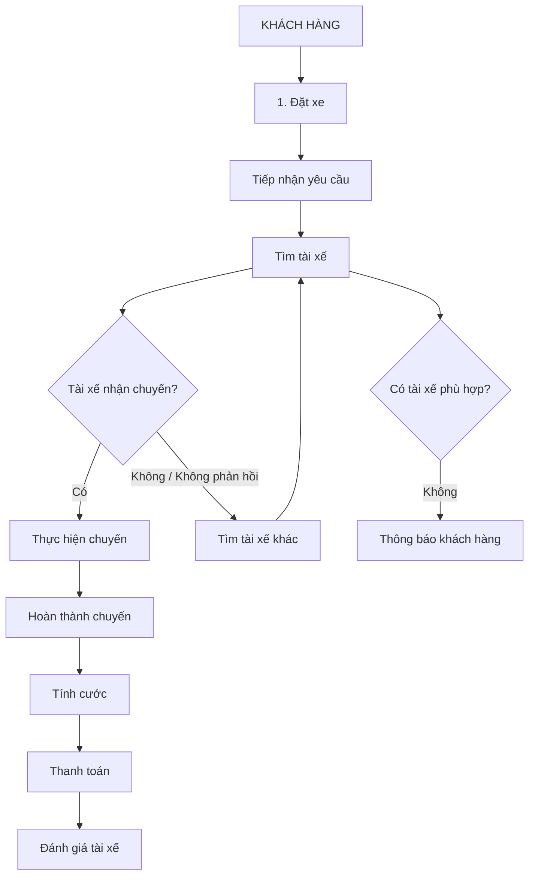
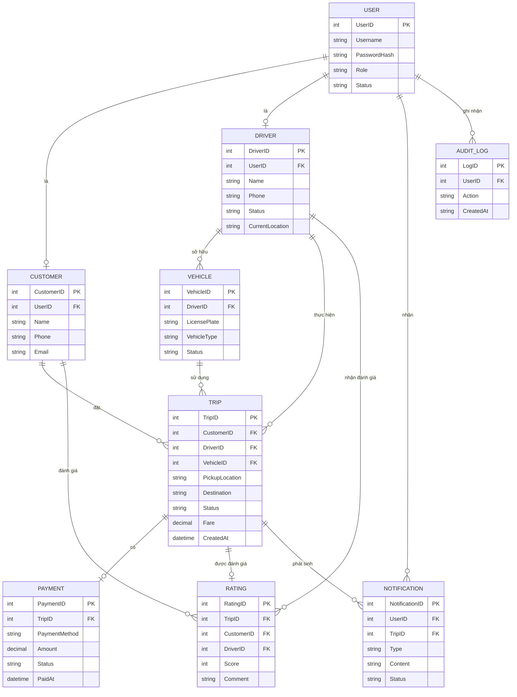
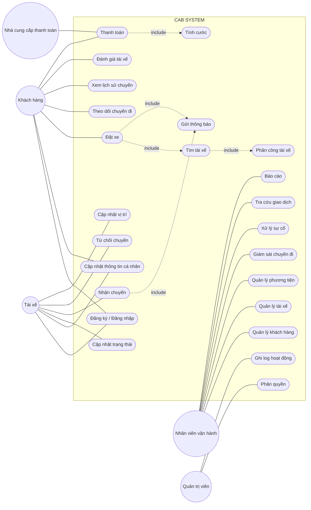

# CÁC BƯỚC CẦN THỰC HIỆN
# Bước 1: - đọc và phân tích yêu cầu: hiểu về bussiness contesxt và bussiness problem
        - trả lời câu hỏi: khách hàng muốn giải quyết vấn đề gì
        - vì sao k thể đáp ứng, ai sử dụng ht này,
        - giá trị sau khi tạo ra 
# Bước 2: Xác định các stackeholders (các bên liên quan trong hệ thống): 
- Bảng danh sách: cột đầu tiên là stackeholders, cột 2 là vai trò
- Vẽ ma trận stackeholders metric (cho biết mức độ ảnh hưởng của các vai trò )
# Bước 3: Xác định Business Goal
# Bước 4: Xác định scope (phạm vi)
# Bước 5: Thiết kế Business Requirement
# Bước 6: Business Process
# Bước 7: Phân rã yêu cầu chức năng
# Bước 8: Business rules and Exceptions (Những nguyên tắc nghiệp vụ và ngoại lệ)
# Bước 9: Mô hình hoá dữ liệu (Data modeling)
# Bước 10: Xác định Non-Functional Requirement
# Bước 11: Vẽ usecase(UC)
# Bước 12: Tạo đặc tả usecase
# Bước 13: Acceptance criteria (Tiêu chí chấp nhận AC)
# Bước 14: Truy xuất nguồn gốc yêu cầu (REQUIREMENTS TRACEABILITY MATRIX - RTM)


# --------------------------------------------------------------------
# BƯỚC 1: 
1.1. Business Context

- Công ty ABC là doanh nghiệp cung cấp dịch vụ đặt xe trực tuyến. Hiện tại, khách hàng có thể yêu cầu xe thông qua tổng đài hoặc một ứng dụng đơn giản. Tuy nhiên, hệ thống hiện tại chưa đáp ứng tốt nhu cầu vận hành khi số lượng khách hàng và tài xế tăng lên.

- Quy trình đặt xe hiện còn phụ thuộc nhiều vào thao tác thủ công, đặc biệt là việc tìm kiếm và phân công tài xế. Bên cạnh đó, thông tin về trạng thái chuyến đi, thanh toán và hoạt động của tài xế chưa được quản lý tập trung.

- Doanh nghiệp mong muốn xây dựng một nền tảng CAB System có khả năng số hóa và quản lý xuyên suốt toàn bộ quy trình đặt xe, đồng thời có khả năng mở rộng để đáp ứng nhu cầu phát triển trong tương lai.

1.2. Business Problem

- Phân công tài xế còn thủ công
- Việc tìm kiếm và phân công tài xế chưa được tự động hóa hiệu quả.
- Khó lựa chọn tài xế phù hợp và gần khách hàng.
- Khi tài xế từ chối hoặc không phản hồi, việc tìm tài xế khác gặp nhiều khó khăn.
- Khách hàng thiếu khả năng theo dõi chuyến đi
- Khách hàng khó biết hệ thống đang tìm tài xế hay đã có tài xế nhận chuyến.
- Chưa thuận tiện trong việc theo dõi trạng thái chuyến và thời gian dự kiến tài xế đến.
- Quản lý thanh toán chưa tập trung
- Thông tin thanh toán và giao dịch chưa được quản lý thống nhất.
- Chưa có cơ chế tích hợp linh hoạt với các nhà cung cấp thanh toán bên ngoài.
- Việc xử lý giao dịch thất bại cần được chuẩn hóa.
- Quản lý vận hành còn hạn chế
- Nhân viên vận hành gặp khó khăn khi theo dõi các chuyến đang diễn ra.
- Khó kiểm tra trạng thái tài xế, lịch sử giao dịch và xử lý các trường hợp chuyến bị lỗi.
- Khả năng báo cáo và đánh giá hiệu quả hoạt động còn hạn chế.
- Khó mở rộng hệ thống
- Hệ thống hiện tại chưa được thiết kế phù hợp cho việc mở rộng số lượng khách hàng và tài xế.
- Khó bổ sung loại dịch vụ, phương thức thanh toán hoặc kênh thông báo mới.
- Một lỗi ở một thành phần như thanh toán hoặc thông báo có nguy cơ ảnh hưởng đến hoạt động chung của hệ thống.

1.3. Khách hàng muốn giải quyết vấn đề gì?

- Tự động hóa quy trình tìm kiếm và phân công tài xế.
- Giúp khách hàng đặt xe và theo dõi chuyến đi theo thời gian thực.
- Quản lý tập trung thông tin khách hàng, tài xế, phương tiện, chuyến đi và giao dịch.
- Tự động tính cước và hỗ trợ nhiều phương thức thanh toán.
- Cung cấp hệ thống thông báo cho khách hàng và tài xế.
- Hỗ trợ nhân viên vận hành giám sát và xử lý các chuyến đi.
- Cung cấp dữ liệu và báo cáo phục vụ quản lý.
- Đảm bảo hệ thống có thể mở rộng và bổ sung chức năng mới trong tương lai.

1.4. Vì sao hệ thống hiện tại không thể đáp ứng?

Một số hạn chế:
| Hạn chế                                           | Tác động                                            |
| ------------------------------------------------- | --------------------------------------------------- |
| Phân công tài xế thủ công                         | Tốn thời gian, khó tối ưu việc tìm tài xế           |
| Thiếu cơ chế tự động tìm tài xế thay thế          | Khách hàng phải chờ lâu hoặc có nguy cơ không có xe |
| Theo dõi chuyến đi hạn chế                        | Khách hàng thiếu thông tin về trạng thái chuyến     |
| Quản lý thanh toán chưa tập trung                 | Khó kiểm soát và tra cứu giao dịch                  |
| Thông báo chưa được thiết kế linh hoạt            | Khó bổ sung thêm kênh thông báo                     |
| Quản lý vận hành hạn chế                          | Nhân viên khó giám sát và xử lý sự cố               |
| Khả năng mở rộng thấp                             | Khó đáp ứng lượng người dùng tăng cao               |
| Phụ thuộc giữa các chức năng                      | Lỗi một thành phần có thể ảnh hưởng đến hệ thống    |
| Chưa đáp ứng đầy đủ yêu cầu bảo mật và phân quyền | Tăng rủi ro đối với dữ liệu và thao tác quản trị    |

1.5. Ai sử dụng hệ thống?

- Khách hàng
- Tài xế
- Nhân viên vận hành
  
1.6. Giá trị sau khi xây dựng hệ thống

Việc xây dựng CAB System mang lại giá trị cho cả khách hàng và doanh nghiệp.

Đối với khách hàng
- Đặt xe nhanh chóng và thuận tiện hơn.
- Biết được trạng thái xử lý yêu cầu đặt xe.
- Theo dõi được tài xế và chuyến đi.
- Minh bạch thông tin cước phí và thanh toán.
- Có thể xem lại lịch sử chuyến đi.
- Có thể đánh giá chất lượng dịch vụ.
Đối với tài xế
- Nhận chuyến phù hợp một cách nhanh chóng.
- Giảm thời gian chờ nhận chuyến.
- Có công cụ quản lý trạng thái và chuyến đi.
- Hỗ trợ điều phối dựa trên vị trí.
Đối với doanh nghiệp
- Giảm sự phụ thuộc vào thao tác thủ công.
- Tăng hiệu quả điều phối tài xế.
- Quản lý tập trung dữ liệu khách hàng, tài xế, chuyến đi và giao dịch.
- Nâng cao khả năng giám sát hoạt động.
- Có dữ liệu để xây dựng báo cáo và đánh giá hiệu quả.
- Giảm ảnh hưởng dây chuyền khi một thành phần gặp sự cố.
- Dễ dàng mở rộng dịch vụ, phương thức thanh toán và kênh thông báo.
- Tạo nền tảng kỹ thuật để phát triển các tính năng mới trong tương lai.

1.7. Business Value tổng quát

CAB System không chỉ giải quyết bài toán "đặt xe" mà hướng đến việc xây dựng một nền tảng quản lý toàn bộ vòng đời của một chuyến xe


# BƯỚC 2: XÁC ĐỊNH VÀ PHÂN TÍCH CÁC BÊN LIÊN QUAN (STAKEHOLDERS)

---

### 1. Danh sách các Stakeholders và Vai trò

| Stakeholders                               | Vai trò                                                                                                                    |
| ------------------------------------------ | -------------------------------------------------------------------------------------------------------------------------- |
| **Khách hàng**                             | Người sử dụng dịch vụ để đặt xe, theo dõi chuyến đi, thanh toán và đánh giá tài xế.                                        |
| **Tài xế**                                 | Người tiếp nhận và thực hiện chuyến xe, cập nhật trạng thái chuyến đi và vị trí.                                           |
| **Nhân viên vận hành**                     | Theo dõi hoạt động đặt xe, điều phối và hỗ trợ xử lý các vấn đề phát sinh trong quá trình vận hành.                        |
| **Quản trị viên hệ thống**                 | Quản lý tài khoản, phân quyền và các cấu hình quan trọng của hệ thống.                                                     |
| **Ban lãnh đạo**                           | Theo dõi tình hình hoạt động, doanh thu, hiệu quả vận hành và sử dụng báo cáo để đưa ra quyết định.                        |
| **Bộ phận tài chính/kế toán**              | Theo dõi doanh thu, giao dịch và đối soát các khoản thanh toán.                                                            |
| **Nhà cung cấp thanh toán**                | Cung cấp dịch vụ thanh toán điện tử và xử lý các giao dịch thanh toán của khách hàng.                                      |
| **Nhà cung cấp dịch vụ thông báo**         | Cung cấp các kênh gửi thông báo đến khách hàng và tài xế.                                                                  |
| **Đội ngũ phát triển và bảo trì hệ thống** | Phân tích, xây dựng, triển khai, vận hành và bảo trì CAB System.                                                           |
| **Business Analyst (BA)**                  | Thu thập, phân tích và làm rõ yêu cầu từ các bên liên quan, đồng thời chuyển đổi nhu cầu nghiệp vụ thành yêu cầu hệ thống. |

### 2. Ma trận Stakeholder (Stakeholder Power/Interest Matrix)

```text
                                MỨC ĐỘ QUAN TÂM
                  Thấp        Trung bình          Cao
              ┌──────────┬────────────────┬─────────────────────┐
              │          │                │                     │
       Cao    │          │ Quản trị viên  │ ★ Ban lãnh đạo      │
              │          │ hệ thống       │ ★ Nhân viên vận hành│
              │          │                │ ★ BA                │
              │          │                │ ★ Đội phát triển    │
 MỨC ĐỘ       ├──────────┼────────────────┼─────────────────────┤
 ẢNH HƯỞNG    │          │                │                     │
       TB     │          │ Tài chính/Kế   │ ★ Khách hàng        │
              │          │ toán           │ ★ Tài xế             │
              │          │                │                     │
              ├──────────┼────────────────┼─────────────────────┤
       Thấp   │ Nhà cung │                │                     │
              │ cấp      │                │                     │
              │ thanh    │                │                     │
              │ toán     │                │                     │
              │ Nhà cung │                │                     │
              │ cấp      │                │                     │
              │ thông báo│                │                     │
              └──────────┴────────────────┴─────────────────────┘

              Thấp          Trung bình              Cao
                    MỨC ĐỘ QUAN TÂM

```


# BƯỚC 3: XÁC ĐỊNH MỤC TIÊU KINH DOANH (BUSINESS GOALS)

---

### Mục tiêu Tổng quát (Strategic Vision)

Xây dựng và triển khai thành công nền tảng **CAB System** trong vòng **7 tuần**, chuyển đổi từ mô hình vận hành thủ công sang hệ thống đặt xe tự động hóa hoàn toàn. Hệ thống mới đảm bảo khả năng mở rộng linh hoạt, hoạt động ổn định ở tải cao, bảo mật dữ liệu giao dịch và tạo tiền đề để doanh nghiệp phát triển thêm các dịch vụ mới trong tương lai.

---

### Danh sách Mục tiêu Kinh doanh

| STT      | Business Goal                                         | Mô tả                                                                                                                                                     |
| -------- | ----------------------------------------------------- | --------------------------------------------------------------------------------------------------------------------------------------------------------- |
| **BG01** | **Nâng cao trải nghiệm khách hàng**                   | Cung cấp quy trình đặt xe nhanh chóng, thuận tiện và minh bạch; cho phép khách hàng theo dõi trạng thái chuyến, tài xế, cước phí và thanh toán.           |
| **BG02** | **Tự động hóa việc tìm và phân công tài xế**          | Tự động tìm kiếm và ưu tiên tài xế phù hợp dựa trên vị trí, trạng thái sẵn sàng và các tiêu chí vận hành.                                                 |
| **BG03** | **Tăng hiệu quả vận hành**                            | Giảm các thao tác thủ công trong việc điều phối, theo dõi và xử lý chuyến đi; hỗ trợ nhân viên vận hành quản lý tập trung.                                |
| **BG04** | **Quản lý tập trung dữ liệu**                         | Tập trung quản lý thông tin khách hàng, tài xế, phương tiện, chuyến đi, thanh toán và lịch sử giao dịch.                                                  |
| **BG05** | **Nâng cao hiệu quả quản lý doanh thu**               | Chuẩn hóa quy trình tính cước, thanh toán và tra cứu giao dịch, đồng thời hỗ trợ báo cáo doanh thu.                                                       |
| **BG06** | **Đảm bảo hệ thống hoạt động ổn định**                | Đảm bảo các chức năng quan trọng như đặt xe, thanh toán và thông báo có khả năng hoạt động độc lập, hạn chế ảnh hưởng dây chuyền khi xảy ra sự cố.        |
| **BG07** | **Tăng khả năng mở rộng của hệ thống**                | Cho phép hệ thống phục vụ số lượng lớn khách hàng và tài xế, đồng thời có thể mở rộng khi nhu cầu tăng cao.                                               |
| **BG08** | **Tăng khả năng phát triển sản phẩm trong tương lai** | Cho phép bổ sung loại dịch vụ, phương thức thanh toán, nhà cung cấp thông báo và các thành phần kỹ thuật mới mà không phải xây dựng lại toàn bộ hệ thống. |
| **BG09** | **Đảm bảo an toàn và bảo mật dữ liệu**                | Bảo vệ thông tin cá nhân, dữ liệu vị trí, thông tin phương tiện và dữ liệu giao dịch; kiểm soát quyền truy cập đối với các chức năng quản trị.            |
| **BG10** | **Cải thiện khả năng ra quyết định**                  | Cung cấp báo cáo về số lượng chuyến, doanh thu, tỷ lệ hoàn thành, tỷ lệ hủy và hiệu quả hoạt động của tài xế để hỗ trợ ban lãnh đạo.                      |


# BƯỚC 4: XÁC ĐỊNH PHẠM VI DỰ ÁN (PROJECT SCOPE)

### 1. Phạm vi Thực hiện Dự án (In-Scope - 7 Tuần)

| Hạng mục / Module | Phạm vi Chức năng Chi tiết (In-Scope) |
|---|---|
| **Quản lý Tài khoản & Hồ sơ** | - Đăng ký, đăng nhập, quản lý thông tin tài khoản cho Khách hàng, Tài xế và Nhân viên Vận hành.<br>- Cập nhật hồ sơ tài xế, thông tin phương tiện và trạng thái hoạt động.<br>- Cấu hình phân quyền truy cập quản trị theo vai trò. |
| **Đặt xe & Điều phối Ghép chuyến** | - Nhập điểm đón, điểm đến, chọn loại xe và gửi yêu cầu đặt xe.<br>- Thu thập vị trí GPS thời gian thực của tài xế.<br>- Tự động tìm và gợi ý tài xế phù hợp theo vị trí và trạng thái sẵn sàng.<br>- Xử lý tự động chuyển sang tài xế khác nếu tài xế được đề xuất từ chối hoặc không phản hồi.<br>- Thông báo rõ ràng cho khách hàng khi không tìm thấy tài xế. |
| **Cập nhật & Theo dõi Tiến trình** | - Cập nhật trạng thái chuyến đi (*Đã nhận chuyến, Đã đến điểm đón, Đã đón khách, Đang di chuyển, Hoàn thành*).<br>- Khách hàng theo dõi vị trí tài xế và trạng thái chuyến đi theo thời gian thực.<br>- Lưu trữ dữ liệu lịch sử vị trí GPS của tài xế. |
| **Tính cước & Thanh toán** | - Tự động tính cước dựa trên loại dịch vụ và thông tin chuyến đi.<br>- Hỗ trợ thanh toán bằng Tiền mặt.<br>- Tích hợp 01 Cổng thanh toán điện tử bên ngoài (Payment Gateway).<br>- Tuân thủ bảo mật: Không lưu trực tiếp thông tin thẻ/tài khoản ngân hàng nhạy cảm trên hệ thống CAB.<br>- Xử lý ngoại lệ khi thanh toán điện tử thất bại (thông báo và cho phép xử lý lại/chuyển tiền mặt). |
| **Hệ thống Thông báo (Notifications)** | - Gửi thông báo đa kênh (Push Notification / SMS) cho Khách hàng và Tài xế về các sự kiện chuyến đi và kết quả thanh toán.<br>- Kết nối với 01 Nhà cung cấp dịch vụ thông báo bên ngoài. |
| **Đánh giá & Lịch sử Chuyến đi** | - Khách hàng tra cứu lịch sử chuyến đi và số tiền đã thanh toán.<br>- Khách hàng thực hiện đánh giá tài xế sau khi hoàn thành chuyến đi. |
| **Quản trị & Báo cáo (Admin)** | - Giao diện Admin quản lý Khách hàng, Tài xế, Phương tiện và Chuyến đi.<br>- Giám sát các chuyến đi đang diễn ra và kiểm tra trạng thái tài xế thời gian thực.<br>- Hỗ trợ nhân viên can thiệp, xử lý sự cố chuyến đi và tra cứu lịch sử giao dịch.<br>- Báo cáo thống kê: Số lượng chuyến, doanh thu, tỷ lệ hoàn thành/hủy chuyến, hiệu quả hoạt động của tài xế. |

---

### 2. Định hướng Mở rộng Tương lai (Future Roadmap)

Nhằm đảm bảo mục tiêu **triển khai thành công trong 7 tuần**, hệ thống được thiết kế theo kiến trúc linh hoạt (Loosely Coupled) để sẵn sàng mở rộng các tính năng sau trong tương lai mà không phải xây dựng lại toàn bộ ứng dụng:

- **Bổ sung loại hình dịch vụ mới:** Mở rộng thêm dịch vụ giao hàng, xe đi chung, đặt xe đường dài.
- **Tích hợp thêm phương thức thanh toán:** Kết nối thêm các cổng thanh toán mới, ví điện tử (Momo, VNPay, ZaloPay).
- **Mở rộng kênh thông báo:** Thêm nhà cung cấp dịch vụ SMS/OTT mới để tối ưu chi phí vận hành.
- **Nâng cấp thuật toán ghép chuyến:** Cấu hình linh hoạt các tiêu chí ưu tiên tài xế và điều chỉnh thời gian phản hồi theo thời điểm.


# BƯỚC 5: THIẾT KẾ YÊU CẦU NGHIỆP VỤ CHI TIẾT (BUSINESS REQUIREMENTS)

---

### 1. Danh sách Yêu cầu Chức năng (Functional Requirements - FR)

| Mã YC | Module | Tác nhân chính | Mô tả Chức năng Nghiệp vụ |
|---|---|---|---|
| **FR-01** | Quản lý Tài khoản | Khách hàng, Tài xế, Admin | Cho phép đăng ký, đăng nhập, cập nhật thông tin cá nhân. Tài xế bổ sung thông tin phương tiện, hồ sơ hành nghề. |
| **FR-02** | Quản lý Trạng thái | Tài xế | Cho phép tài xế chuyển đổi trạng thái Hoạt động/Sẵn sàng nhận chuyến hoặc Tạm ngưng làm việc. |
| **FR-03** | Đặt xe | Khách hàng | Khách hàng nhập điểm đón, điểm đến, chọn loại xe và gửi yêu cầu đặt xe lên hệ thống. |
| **FR-04** | Định vị GPS | Tài xế, Hệ thống | Hệ thống thu thập và lưu vết dữ liệu vị trí GPS của tài xế theo thời gian thực. |
| **FR-05** | Ghép chuyến Tự động | Hệ thống | Tự động tìm kiếm và ưu tiên đề xuất chuyến đi cho tài xế phù hợp dựa trên khoảng cách GPS và trạng thái sẵn sàng. |
| **FR-06** | Xử lý Bỏ qua/Từ chối | Hệ thống, Tài xế | Cho phép tài xế chấp nhận hoặc từ chối chuyến. Nếu tài xế từ chối/không phản hồi, hệ thống tự động chuyển sang tài xế tiếp theo mà khách không cần thao tác lại. |
| **FR-07** | Theo dõi Tiến trình | Khách hàng, Tài xế | Cập nhật và hiển thị trạng thái chuyến đi (*Đã nhận chuyến, Đã đến điểm đón, Đã đón khách, Đang di chuyển, Hoàn thành*). Khách hàng xem vị trí tài xế thực tế. |
| **FR-08** | Tính cước | Hệ thống | Tự động tính tổng tiền chuyến đi dựa trên loại dịch vụ và thông tin quãng đường sau khi hoàn thành chuyến. |
| **FR-09** | Thanh toán | Khách hàng, Hệ thống | Hỗ trợ thanh toán Tiền mặt hoặc Thanh toán điện tử (kết nối Cổng thanh toán bên ngoài). Cho phép xử lý lại nếu giao dịch thất bại. |
| **FR-10** | Hệ thống Thông báo | Khách hàng, Tài xế | Gửi thông báo đa kênh (Push Notification/SMS) cập nhật trạng thái chuyến đi, phân công chuyến mới và kết quả thanh toán. |
| **FR-11** | Đánh giá & Lịch sử | Khách hàng | Khách hàng xem lại lịch sử các chuyến đi, số tiền đã trả và gửi đánh giá (sao/nhận xét) cho tài xế. |
| **FR-12** | Quản trị & Báo cáo | Nhân viên Vận hành | Giao diện Admin giám sát chuyến đi thời gian thực, hỗ trợ can thiệp chuyến lỗi, phân quyền người dùng và xuất báo cáo doanh thu/tỷ lệ hoàn thành/hiệu suất tài xế. |

---

### 2. Quy tắc Nghiệp vụ Cốt lõi (Core Business Rules - BR)

| Mã Rule | Tên Quy tắc | Nội dung Quy tắc Nghiệp vụ |
|---|---|---|
| **BR-01** | Điều kiện Ghép chuyến | Chỉ đề xuất chuyến đi cho tài xế đang ở trạng thái "Sẵn sàng" và có vị trí GPS trong bán kính cho phép so với điểm đón của khách hàng. |
| **BR-02** | Bảo mật Thanh toán | Tuyệt đối **không lưu trữ** thông tin nhạy cảm của thẻ (Số thẻ, CVV, PIN) hay tài khoản ngân hàng trực tiếp trên hệ thống CAB. Chỉ lưu mã Token do Cổng thanh toán trả về. |
| **BR-03** | Khai thác Độc lập | Lỗi từ dịch vụ Thanh toán hoặc Thông báo **không được làm gián đoạn** luồng Đặt xe và Ghép chuyến cốt lõi của hệ thống. |
| **BR-04** | Kiểm soát Truy cập | Nhân viên vận hành chỉ được thực hiện các thao tác quản trị theo đúng phạm vi phân quyền đã được cấu hình. Mọi thao tác nhạy cảm phải ghi log kiểm vết (Audit Log). |

---

### 3. Danh sách Các điểm Chưa rõ Cần Xác nhận với Khách hàng (Open Questions)

Do doanh nghiệp chưa chốt toàn bộ chi tiết nghiệp vụ, Business Analyst cần làm rõ các câu hỏi sau trước khi chốt thiết kế chi tiết:

| STT | Vấn đề Cần Làm rõ | Đề xuất giải pháp từ BA / Lựa chọn |
|---|---|---|
| **1** | **Công thức Tính cước chi tiết** | - Áp dụng *Cước phí Cố định* theo khoảng cách hay *Cước phí Linh hoạt* (Giá mở cửa + Giá/km + Phụ phí giờ cao điểm/thời tiết)? |
| **2** | **Thời gian tài xế Phản hồi (Timeout)** | - Tài xế có bao nhiêu giây (ví dụ: 15s hay 30s) để bấm nhận chuyến trước khi hệ thống chuyển sang tài xế tiếp theo? |
| **3** | **Chính sách Hủy chuyến (Cancellation Policy)** | - Khách hàng/Tài xế có được hủy chuyến miễn phí không? Phí phạt hủy chuyến áp dụng khi nào (ví dụ: hủy sau 5 phút kể từ khi tài xế nhận chuyến)? |
| **4** | **Xử lý Mất kết nối Mạng (Offline Handling)** | - Ứng dụng xử lý như thế nào khi tài xế bị mất kết nối 3G/4G giữa chuyến đi? Hệ thống tạm lưu dữ liệu GPS локально hay xử lý ra sao? |
| **5** | **Thời hạn Lưu trữ Dữ liệu (Data Retention)** | - Dữ liệu lịch sử định vị GPS chi tiết của tài xế và lịch sử chuyến đi cần lưu trữ trong bao lâu (ví dụ: 6 tháng hay 1 năm) trước khi lưu trữ định danh/xóa bớt? |

# BƯỚC 6: BUSINESS PROCESS


Các tác nhân tham gia

Khách hàng → CAB System → Tài xế → Nhân viên vận hành → Nhà cung cấp thanh toán/Thông báo

Luồng nghiệp vụ chính

Đặt xe → Tìm tài xế → Phân công tài xế → Thực hiện chuyến → Tính cước → Thanh toán → Đánh giá

Luồng ngoại lệ chính
Tài xế từ chối/không phản hồi → Tìm tài xế khác.
Không tìm được tài xế → Thông báo khách hàng.
Thanh toán thất bại → Thông báo khách hàng và xử lý lại theo chính sách.
Chuyến gặp sự cố → Nhân viên vận hành kiểm tra và hỗ trợ xử lý.

# BƯỚC 7: PHÂN RÃ YÊU CẦU CHỨC NĂNG (FUNCTIONAL REQUIREMENTS DECOMPOSITION)

---

### 1. Danh sách Phân rã Chức năng Chi tiết (Detailed Requirements Breakdown)

| Mã Module | Mã Chức năng | Chức năng Cấp cao (Epic/Feature) | Yêu cầu Chức năng Chi tiết (Sub-function / User Story) |
|---|---|---|---|
| **F-01** | **F-01.1** | Quản lý Tài khoản Khách hàng | - Đăng ký tài khoản mới bằng Số điện thoại/Email.<br>- Đăng nhập / Đăng xuất hệ thống.<br>- Cập nhật thông tin cá nhân (Họ tên, Avatar, Email). |
| | **F-01.2** | Quản lý Tài khoản & Hồ sơ Tài xế | - Đăng ký/Tạo tài khoản tài xế.<br>- Cập nhật hồ sơ cá nhân, Bằng lái xe, Giấy tờ xe.<br>- Cập nhật thông tin phương tiện (Biển số, Loại xe, Màu xe).<br>- Chuyển đổi trạng thái hoạt động (*Sẵn sàng nhận chuyến / Tạm ngưng*). |
| | **F-01.3** | Quản lý Người dùng Admin | - Quản lý danh sách nhân viên vận hành.<br>- Cấu hình phân quyền truy cập theo vai trò (Role-based Access Control). |
| **F-02** | **F-02.1** | Yêu cầu Đặt xe | - Khách chọn Điểm đón, Điểm đến trên bản đồ hoặc nhập địa chỉ.<br>- Khách chọn Loại dịch vụ / Loại xe (Xe 4 chỗ, Xe 7 chỗ,...).<br>- Xem cước phí dự kiến và khoảng cách/thời gian di chuyển dự kiến. |
| | **F-02.2** | Quản lý Định vị & GPS | - Thu thập tọa độ GPS của tài xế theo chu kỳ định sẵn.<br>- Cập nhật vị trí tài xế thực tế lên bản đồ hệ thống. |
| **F-02** | **F-02.3** | Thuật toán Ghép chuyến | - Lọc danh sách tài xế ở trạng thái "Sẵn sàng" trong bán kính quét.<br>- Tính toán khoảng cách và ưu tiên tài xế phù hợp nhất (gần nhất).<br>- Gửi thông báo mời nhận chuyến đến tài xế được chọn. |
| | **F-02.4** | Xử lý Vòng lặp Tìm xe | - Cho phép tài xế Bấm Chấp nhận hoặc Từ chối chuyến đi.<br>- Đếm ngược thời gian phản hồi (Timeout counter).<br>- Tự động chuyển yêu cầu sang tài xế tiếp theo nếu tài xế trước Từ chối/Timeout.<br>- Thông báo lỗi cho Khách hàng khi đã quét hết tài xế mà không có người nhận. |
| **F-03** | **F-03.1** | Cập nhật Tiến trình Chuyến đi | - Tài xế bấm *"Đã đến điểm đón"*.<br>- Tài xế bấm *"Đã đón khách"* (Bắt đầu di chuyển).<br>- Tài xế bấm *"Hoàn thành chuyến đi"* khi tới điểm đến. |
| | **F-03.2** | Theo dõi Hành trình Thời gian thực | - Khách hàng xem vị trí tài xế đang di chuyển tới điểm đón trên bản đồ.<br>- Khách hàng xem vị trí xe trên lộ trình di chuyển thực tế. |
| **F-04** | **F-04.1** | Tính cước Chuyến đi | - Tự động tính cước chốt sổ dựa trên quãng đường thực tế và bảng giá dịch vụ.<br>- Áp dụng các phụ phí/thuế nếu có theo cấu hình nghiệp vụ. |
| | **F-04.2** | Xử lý Thanh toán | - Xử lý xác nhận thanh toán bằng Tiền mặt trực tiếp cho tài xế.<br>- Tích hợp API Cổng thanh toán điện tử (Payment Gateway) bên ngoài.<br>- Gửi thông tin giao dịch an toàn dạng Tokenization (không lưu dữ liệu thẻ). |
| | **F-04.3** | Xử lý Ngoại lệ Thanh toán | - Ghi nhận trạng thái Giao dịch Thất bại.<br>- Gửi thông báo lỗi cho khách hàng và gợi ý chọn lại phương thức (Tiền mặt/Thử lại thanh toán điện tử). |
| **F-05** | **F-05.1** | Thông báo Khách hàng | - Gửi Push Notification / SMS khi: *Yêu cầu được tiếp nhận, Có tài xế nhận chuyến, Tài xế đã đến, Chuyến đi hoàn thành, Kết quả thanh toán*. |
| | **F-05.2** | Thông báo Tài xế | - Gửi Push Notification khi: *Có chuyến đi mới cần nhận, Khách hàng hủy chuyến, Thay đổi thông tin chuyến đi*. |
| **F-06** | **F-06.1** | Tra cứu Lịch sử | - Khách hàng tra cứu danh sách các chuyến đi đã thực hiện, chi tiết cước phí và hóa đơn.<br>- Tài xế xem lịch sử các chuyến đã chạy và tổng thu nhập theo ngày/thần suất. |
| | **F-06.2** | Đánh giá & Phản hồi | - Khách hàng chấm điểm Tài xế (1 - 5 sao).<br>- Khách hàng nhập nội dung đánh giá / góp ý về chuyến đi. |
| **F-07** | **F-07.1** | Giám sát & Điều hành (Live Dashboard) | - Xem danh sách chuyến đi đang diễn ra trên hệ thống theo thời gian thực.<br>- Kiểm tra vị trí và trạng thái hoạt động của từng tài xế trên bản đồ Admin. |
| | **F-07.2** | Hỗ trợ & Can thiệp Sự cố | - Tra cứu thông tin chi tiết chuyến đi khi có khiếu nại.<br>- Hỗ trợ hủy chuyến hoặc điều chỉnh thông tin trong các trường hợp sự cố đặc biệt. |
| | **F-07.3** | Báo cáo Thống kê (Analytics) | - Báo cáo tổng số lượng chuyến đi (Thành công, Hủy, Không tìm thấy xe).<br>- Báo cáo tổng doanh thu theo ngày/tần suất/loại dịch vụ.<br>- Báo cáo tỷ lệ hoàn thành chuyến và chỉ số hiệu quả (KPIs) của tài xế. |

---

### 2. Ma trận Phụ thuộc giữa các Chức năng (Dependency Matrix)

Bảng này mô tả mối liên hệ và thứ tự ưu tiên phụ thuộc giữa các phân rã chức năng để hỗ trợ Lập trình viên triển khai theo tiến độ:

| Chức năng (Feature) | Chức năng Phụ thuộc (Prerequisite Features) | Lý do Phụ thuộc |
|---|---|---|
| **F-02.1 (Đặt xe)** | F-01.1 (Tài khoản Khách) | Phải đăng nhập tài khoản trước khi tạo đơn đặt xe. |
| **F-02.3 (Ghép chuyến)** | F-02.2 (Định vị GPS), F-01.2 (Hồ sơ Tài xế) | Cần có dữ liệu vị trí GPS và trạng thái "Sẵn sàng" của tài xế để thuật toán ghép chuyến quét dữ liệu. |
| **F-03.1 (Cập nhật Tiến trình)** | F-02.4 (Chấp nhận chuyến) | Tài xế phải nhận chuyến thành công trước khi có thể cập nhật các trạng thái chuyến đi. |
| **F-04.1 (Tính cước)** | F-03.1 (Hoàn thành chuyến) | Cần có tín hiệu hoàn thành chuyến đi để chốt quãng đường và tính cước thực tế. |
| **F-04.2 (Thanh toán)** | F-04.1 (Tính cước) | Phải có số tiền cước chính xác trước khi gửi yêu cầu trừ tiền qua Cổng thanh toán. |
| **F-06.2 (Đánh giá)** | F-04.2 (Thanh toán xong) | Khách hàng chỉ đánh giá tài xế sau khi hoàn tất chuyến đi và thanh toán thành công. |


# BƯỚC 8: NGUYÊN TẮC NGHIỆP VỤ VÀ XỬ LÝ NGOẠI LỆ (BUSINESS RULES & EXCEPTIONS)

---

### 1. Danh sách Nguyên tắc Nghiệp vụ Cốt lõi (Core Business Rules)

| ID        | Business Rule                                                                                      |
| --------- | -------------------------------------------------------------------------------------------------- |
| **BR-01** | Khách hàng phải đăng nhập trước khi sử dụng chức năng đặt xe.                                      |
| **BR-02** | Tài xế chỉ được nhận chuyến khi đang ở trạng thái sẵn sàng.                                        |
| **BR-03** | Hệ thống ưu tiên tài xế phù hợp và gần vị trí khách hàng.                                          |
| **BR-04** | Khi tài xế từ chối hoặc không phản hồi, hệ thống phải tiếp tục tìm tài xế khác.                    |
| **BR-05** | Khách hàng không cần tạo lại yêu cầu khi hệ thống chuyển sang tìm tài xế khác.                     |
| **BR-06** | Nếu không tìm được tài xế phù hợp, hệ thống phải thông báo cho khách hàng.                         |
| **BR-07** | Tài xế phải cập nhật trạng thái chuyến theo từng giai đoạn thực hiện.                              |
| **BR-08** | Chỉ chuyến đã hoàn thành mới được thực hiện bước tính cước và thanh toán.                          |
| **BR-09** | Số tiền thanh toán được xác định dựa trên loại dịch vụ và thông tin chuyến đi.                     |
| **BR-10** | Hệ thống không được lưu trực tiếp thông tin nhạy cảm của thẻ hoặc tài khoản thanh toán.            |
| **BR-11** | Khách hàng được phép đánh giá tài xế sau khi chuyến hoàn thành.                                    |
| **BR-12** | Các chức năng quản trị phải được kiểm soát theo quyền của người dùng.                              |
| **BR-13** | Các thao tác quản trị quan trọng phải được ghi nhận vào hệ thống log.                              |
| **BR-14** | Thông tin cá nhân, phương tiện, vị trí và giao dịch phải được bảo vệ.                              |
| **BR-15** | Lỗi của một thành phần như thanh toán hoặc thông báo không được làm dừng toàn bộ chức năng đặt xe. |

---

### 2. Quản lý các Trường hợp Ngoại lệ (Exception Handling)

| ID        | Ngoại lệ                                     | Cách xử lý                                                                         |
| --------- | -------------------------------------------- | ---------------------------------------------------------------------------------- |
| **EX-01** | Không tìm thấy tài xế                        | Thông báo rõ ràng cho khách hàng và kết thúc yêu cầu tìm xe.                       |
| **EX-02** | Tài xế từ chối chuyến                        | Hệ thống tiếp tục tìm tài xế khác.                                                 |
| **EX-03** | Tài xế không phản hồi                        | Sau thời gian quy định, hệ thống chuyển sang tìm tài xế khác.                      |
| **EX-04** | Tài xế mất kết nối                           | Cập nhật trạng thái phù hợp và xử lý theo chính sách vận hành.                     |
| **EX-05** | Khách hàng mất kết nối                       | Duy trì trạng thái chuyến trên hệ thống và đồng bộ lại khi kết nối được khôi phục. |
| **EX-06** | Thanh toán điện tử thất bại                  | Thông báo cho khách hàng và cho phép xử lý lại theo chính sách doanh nghiệp.       |
| **EX-07** | Nhà cung cấp thanh toán không phản hồi       | Không xác nhận giao dịch thành công khi chưa có kết quả hợp lệ.                    |
| **EX-08** | Dịch vụ thông báo gặp lỗi                    | Ghi nhận lỗi và không làm ảnh hưởng đến quy trình đặt xe chính.                    |
| **EX-09** | Chuyến đi phát sinh lỗi                      | Nhân viên vận hành kiểm tra và hỗ trợ xử lý.                                       |
| **EX-10** | Người dùng không có quyền thực hiện thao tác | Từ chối thao tác và thông báo người dùng không có quyền.                           |


---


# BƯỚC 9: MÔ HÌNH HÓA DỮ LIỆU (DATA MODELING)
# 9.1. Các thực thể chính

| STT | Thực thể | Mô tả |
|---|---|---|
| 1 | **USER** | Quản lý tài khoản và thông tin xác thực người dùng. |
| 2 | **CUSTOMER** | Lưu thông tin khách hàng. |
| 3 | **DRIVER** | Lưu thông tin tài xế và trạng thái hoạt động. |
| 4 | **VEHICLE** | Lưu thông tin phương tiện của tài xế. |
| 5 | **TRIP** | Lưu thông tin chuyến đi và trạng thái chuyến. |
| 6 | **PAYMENT** | Lưu thông tin thanh toán của chuyến đi. |
| 7 | **RATING** | Lưu đánh giá của khách hàng đối với tài xế. |
| 8 | **NOTIFICATION** | Lưu thông tin các thông báo gửi đến người dùng. |
| 9 | **AUDIT_LOG** | Lưu nhật ký các thao tác quan trọng trên hệ thống. |
   
# 9.2. Danh sách thực thể và thuộc tính chính
| Thực thể         | Thuộc tính chính                                                                                             |
| ---------------- | ------------------------------------------------------------------------------------------------------------ |
| **Customer**     | CustomerID, Name, Phone, Email, Address, Status                                                              |
| **Driver**       | DriverID, Name, Phone, Email, Status, CurrentLocation                                                        |
| **Vehicle**      | VehicleID, DriverID, LicensePlate, VehicleType, Status                                                       |
| **Trip**         | TripID, CustomerID, DriverID, PickupLocation, Destination, VehicleType, Status, Fare, CreatedAt, CompletedAt |
| **Payment**      | PaymentID, TripID, PaymentMethod, Amount, Status, TransactionID, PaidAt                                      |
| **Rating**       | RatingID, TripID, CustomerID, DriverID, Score, Comment, CreatedAt                                            |
| **Notification** | NotificationID, UserID, TripID, Type, Content, Status, CreatedAt                                             |
| **User**         | UserID, Username, PasswordHash, Role, Status                                                                 |
| **AuditLog**     | LogID, UserID, Action, Entity, EntityID, CreatedAt                                                           |

# 9.3. Quan hệ giữa các thực thể

Một Customer có thể tạo nhiều Trip.
Một Driver có thể thực hiện nhiều Trip.
Một Driver có thể quản lý một hoặc nhiều Vehicle theo mô hình nghiệp vụ được xác nhận.
Một Trip có một Customer và có thể được gán cho một Driver.
Một Trip có thông tin Payment tương ứng.
Một Trip có thể có một Rating sau khi hoàn thành.
Một Trip có thể phát sinh nhiều Notification.
Một User có thể phát sinh nhiều AuditLog.
Một User có một Role để kiểm soát quyền truy cập.

# 9.4. ERD tổng quát



Bước 10: Xác định Non-Functional Requirement
# BƯỚC 10: XÁC ĐỊNH YÊU CẦU PHI CHỨC NĂNG (NON-FUNCTIONAL REQUIREMENTS)

| ID         | Nhóm                       | Non-Functional Requirement                                                                                                     |
| ---------- | -------------------------- | ------------------------------------------------------------------------------------------------------------------------------ |
| **NFR-01** | Hiệu năng                  | Hệ thống phải phản hồi nhanh đối với các thao tác chính như đặt xe, cập nhật trạng thái và tra cứu thông tin.                  |
| **NFR-02** | Khả năng mở rộng           | Hệ thống phải có khả năng mở rộng khi số lượng khách hàng, tài xế và chuyến đi tăng cao.                                       |
| **NFR-03** | Tính sẵn sàng              | Hệ thống phải duy trì hoạt động ổn định, đặc biệt trong thời điểm nhu cầu đặt xe tăng cao.                                     |
| **NFR-04** | Độ tin cậy                 | Lỗi tại một thành phần như thanh toán hoặc thông báo không được làm toàn bộ hệ thống đặt xe ngừng hoạt động.                   |
| **NFR-05** | Bảo mật                    | Người dùng phải được xác thực trước khi sử dụng các chức năng yêu cầu tài khoản.                                               |
| **NFR-06** | Phân quyền                 | Các chức năng quản trị phải được kiểm soát theo vai trò và quyền của người dùng.                                               |
| **NFR-07** | Bảo vệ dữ liệu             | Thông tin cá nhân, thông tin phương tiện, dữ liệu vị trí và dữ liệu giao dịch phải được bảo vệ.                                |
| **NFR-08** | Bảo mật thanh toán         | Hệ thống không được lưu trực tiếp thông tin nhạy cảm của thẻ hoặc tài khoản thanh toán.                                        |
| **NFR-09** | Audit & Logging            | Các thao tác quan trọng phải được ghi nhận để phục vụ kiểm tra và xử lý sự cố.                                                 |
| **NFR-10** | Khả năng bảo trì           | Hệ thống phải dễ bảo trì và cho phép thay đổi từng thành phần mà hạn chế ảnh hưởng đến các chức năng khác.                     |
| **NFR-11** | Khả năng mở rộng chức năng | Có thể bổ sung loại dịch vụ, phương thức thanh toán và nhà cung cấp thông báo mới mà không phải xây dựng lại toàn bộ hệ thống. |
| **NFR-12** | Khả năng triển khai        | Các chức năng mới có thể được triển khai từng phần và hạn chế ảnh hưởng đến hệ thống đang hoạt động.                           |
| **NFR-13** | Khả năng phục hồi          | Hệ thống phải có cơ chế xử lý và phục hồi khi xảy ra lỗi hoặc mất kết nối với các dịch vụ bên ngoài.                           |
| **NFR-14** | Tính tương thích           | Hệ thống phải hỗ trợ các môi trường và thiết bị cần thiết để khách hàng, tài xế và nhân viên vận hành sử dụng.                 |
| **NFR-15** | Tính dễ sử dụng            | Giao diện phải dễ hiểu, thuận tiện cho khách hàng, tài xế và nhân viên vận hành.                                               |


# BƯỚC 11: SƠ ĐỒ USE CASE TỔNG QUAN (USE CASE DIAGRAM)


# BƯỚC 12: ĐẶC TẢ USE CASE CHI TIẾT (USE CASE SPECIFICATION)

UC-01: Đặt xe

| Thành phần         | Nội dung                                                                               |
| ------------------ | -------------------------------------------------------------------------------------- |
| **Use Case ID**    | UC-01                                                                                  |
| **Tên Use Case**   | Đặt xe                                                                                 |
| **Actor chính**    | Khách hàng                                                                             |
| **Actor phụ**      | Tài xế                                                                                 |
| **Mục tiêu**       | Khách hàng tạo yêu cầu đặt xe và được hệ thống tìm tài xế phù hợp.                     |
| **Tiền điều kiện** | Khách hàng đã đăng nhập.                                                               |
| **Hậu điều kiện**  | Chuyến được phân công cho tài xế hoặc khách hàng nhận thông báo không tìm được tài xế. |

Luồng chính
        Khách hàng nhập điểm đón và điểm đến.
        Khách hàng chọn loại xe/dịch vụ.
        Khách hàng xác nhận yêu cầu đặt xe.
        Hệ thống tạo yêu cầu đặt xe.
        Hệ thống tìm tài xế phù hợp.
        Hệ thống gửi yêu cầu đến tài xế.
        Tài xế chấp nhận chuyến.
        Hệ thống phân công tài xế cho chuyến.
        Hệ thống thông báo thông tin tài xế cho khách hàng.
        Khách hàng theo dõi trạng thái chuyến.
Luồng ngoại lệ
        E1: Không tìm thấy tài xế → Hệ thống thông báo cho khách hàng.
        E2: Tài xế từ chối → Hệ thống tìm tài xế khác.
        E3: Tài xế không phản hồi → Hệ thống tìm tài xế khác.
        E4: Khách hàng mất kết nối → Hệ thống duy trì yêu cầu và đồng bộ lại khi kết nối được khôi phục.

UC-02: Thực hiện chuyến

| Thành phần         | Nội dung                                                     |
| ------------------ | ------------------------------------------------------------ |
| **Use Case ID**    | UC-02                                                        |
| **Tên Use Case**   | Thực hiện chuyến                                             |
| **Actor chính**    | Tài xế                                                       |
| **Actor phụ**      | Khách hàng                                                   |
| **Mục tiêu**       | Tài xế thực hiện chuyến và cập nhật trạng thái cho hệ thống. |
| **Tiền điều kiện** | Tài xế đã nhận chuyến.                                       |
| **Hậu điều kiện**  | Chuyến được cập nhật trạng thái hoàn thành.                  |

Luồng chính
        Tài xế nhận chuyến.
        Tài xế di chuyển đến điểm đón.
        Tài xế cập nhật đã đến điểm đón.
        Tài xế đón khách.
        Tài xế cập nhật đã đón khách.
        Tài xế di chuyển đến điểm đến.
        Tài xế cập nhật đang di chuyển.
        Tài xế hoàn thành chuyến.
        Hệ thống cập nhật trạng thái hoàn thành.
Luồng ngoại lệ
        E1: Tài xế mất kết nối → Hệ thống lưu trạng thái và đồng bộ lại khi kết nối trở lại.
        E2: Chuyến phát sinh sự cố → Nhân viên vận hành tiếp nhận và hỗ trợ xử lý.

UC-03: Thanh toán

| Thành phần         | Nội dung                                          |
| ------------------ | ------------------------------------------------- |
| **Use Case ID**    | UC-03                                             |
| **Tên Use Case**   | Thanh toán                                        |
| **Actor chính**    | Khách hàng                                        |
| **Actor phụ**      | Nhà cung cấp thanh toán                           |
| **Mục tiêu**       | Khách hàng thanh toán chi phí chuyến đi.          |
| **Tiền điều kiện** | Chuyến đã hoàn thành và hệ thống đã tính cước.    |
| **Hậu điều kiện**  | Giao dịch được ghi nhận thành công hoặc thất bại. |

Luồng chính
        Hệ thống tính số tiền phải thanh toán.
        Khách hàng chọn phương thức thanh toán.
        Nếu thanh toán điện tử, hệ thống gửi yêu cầu đến nhà cung cấp thanh toán.
        Nhà cung cấp xử lý giao dịch.
        Hệ thống nhận kết quả giao dịch.
        Hệ thống lưu kết quả thanh toán.
        Hệ thống thông báo kết quả cho khách hàng.
Luồng ngoại lệ
        E1: Thanh toán điện tử thất bại → Thông báo khách hàng và cho phép xử lý lại theo chính sách.
        E2: Nhà cung cấp thanh toán không phản hồi → Không xác nhận giao dịch thành công.

UC-04: Quản lý vận hành

| Thành phần         | Nội dung                                               |
| ------------------ | ------------------------------------------------------ |
| **Use Case ID**    | UC-04                                                  |
| **Tên Use Case**   | Quản lý vận hành                                       |
| **Actor chính**    | Nhân viên vận hành                                     |
| **Mục tiêu**       | Theo dõi và hỗ trợ xử lý các hoạt động trong hệ thống. |
| **Tiền điều kiện** | Nhân viên đã đăng nhập và có quyền phù hợp.            |
| **Hậu điều kiện**  | Thông tin được cập nhật hoặc sự cố được xử lý.         |


Luồng chính
        Nhân viên đăng nhập hệ thống.
        Xem danh sách chuyến đang diễn ra.
        Kiểm tra trạng thái tài xế.
        Tra cứu thông tin chuyến.
        Xử lý các trường hợp chuyến bị lỗi.
        Tra cứu lịch sử giao dịch.
        Hệ thống ghi nhận các thao tác quan trọng.
Luồng ngoại lệ
        E1: Nhân viên không có quyền → Hệ thống từ chối thao tác.
        E2: Không tìm thấy thông tin → Hệ thống thông báo dữ liệu không tồn tại.

# BƯỚC 13: ACCEPTANCE CRITERIA (TIÊU CHÍ CHẤP NHẬN)

| ID        | Chức năng             | Acceptance Criteria                                                                                                |
| --------- | --------------------- | ------------------------------------------------------------------------------------------------------------------ |
| **AC-01** | Đăng nhập             | Người dùng nhập đúng thông tin tài khoản thì đăng nhập thành công; thông tin sai thì hệ thống thông báo lỗi.       |
| **AC-02** | Đặt xe                | Khách hàng nhập đầy đủ điểm đón, điểm đến và loại xe thì có thể tạo yêu cầu đặt xe thành công.                     |
| **AC-03** | Tìm tài xế            | Sau khi tạo yêu cầu, hệ thống tự động tìm tài xế phù hợp dựa trên các tiêu chí đã cấu hình.                        |
| **AC-04** | Tài xế nhận chuyến    | Khi tài xế chấp nhận, chuyến được gán cho tài xế và khách hàng nhận được thông báo.                                |
| **AC-05** | Tài xế từ chối        | Khi tài xế từ chối hoặc không phản hồi, hệ thống tiếp tục tìm tài xế khác mà khách hàng không cần tạo lại yêu cầu. |
| **AC-06** | Không tìm được tài xế | Khi không còn tài xế phù hợp, hệ thống thông báo rõ ràng cho khách hàng.                                           |
| **AC-07** | Theo dõi chuyến       | Khách hàng có thể xem tài xế, trạng thái chuyến và thông tin vị trí được hệ thống cung cấp.                        |
| **AC-08** | Cập nhật chuyến       | Tài xế có thể cập nhật các trạng thái: đã đến điểm đón, đã đón khách, đang di chuyển và hoàn thành.                |
| **AC-09** | Tính cước             | Khi chuyến hoàn thành, hệ thống xác định và hiển thị số tiền khách hàng phải trả theo quy tắc tính cước.           |
| **AC-10** | Thanh toán            | Khách hàng có thể thanh toán bằng tiền mặt hoặc phương thức điện tử được hỗ trợ.                                   |
| **AC-11** | Thanh toán thất bại   | Khi thanh toán điện tử thất bại, hệ thống thông báo kết quả và cho phép xử lý lại theo chính sách doanh nghiệp.    |
| **AC-12** | Thông báo             | Khách hàng và tài xế nhận được thông báo tương ứng khi xảy ra các sự kiện quan trọng của chuyến đi.                |
| **AC-13** | Đánh giá              | Sau khi chuyến hoàn thành, khách hàng có thể đánh giá tài xế và hệ thống lưu kết quả đánh giá.                     |
| **AC-14** | Quản lý vận hành      | Nhân viên vận hành có thể xem chuyến đang diễn ra, trạng thái tài xế và hỗ trợ xử lý chuyến lỗi.                   |
| **AC-15** | Phân quyền            | Người dùng không có quyền không thể thực hiện các chức năng quản trị bị hạn chế.                                   |
| **AC-16** | Báo cáo               | Người có quyền có thể xem báo cáo số lượng chuyến, doanh thu, tỷ lệ hoàn thành và tỷ lệ hủy.                       |
| **AC-17** | Ghi log               | Các thao tác quan trọng được ghi nhận và có thể tra cứu khi cần kiểm tra.                                          |
| **AC-18** | Bảo mật               | Thông tin cá nhân, dữ liệu vị trí và dữ liệu giao dịch được bảo vệ theo chính sách bảo mật của hệ thống.           |
| **AC-19** | Khả năng chịu lỗi     | Lỗi của dịch vụ thanh toán hoặc thông báo không làm toàn bộ chức năng đặt xe ngừng hoạt động.                      |
| **AC-20** | Lịch sử               | Khách hàng có thể xem lịch sử chuyến đi và thông tin thanh toán của các chuyến đã thực hiện.                       |


# BƯỚC 14: REQUIREMENTS TRACEABILITY MATRIX (RTM)

| Business Goal                                 | Business Requirement                    | Functional Requirement                        | Use Case                   | Acceptance Criteria |
| --------------------------------------------- | --------------------------------------- | --------------------------------------------- | -------------------------- | ------------------- |
| **BG-01 Nâng cao trải nghiệm khách hàng**     | **BR-01** Quản lý đặt xe                | **FR-04** Đặt xe                              | **UC-01** Đặt xe           | **AC-02**           |
| **BG-01 Nâng cao trải nghiệm khách hàng**     | **BR-04** Theo dõi chuyến đi            | **FR-07** Theo dõi trạng thái và vị trí       | **UC-02** Thực hiện chuyến | **AC-07, AC-08**    |
| **BG-01 Nâng cao trải nghiệm khách hàng**     | **BR-15** Đánh giá tài xế               | **FR-13** Đánh giá tài xế                     | **UC-01** Đặt xe           | **AC-13**           |
| **BG-02 Tự động hóa tìm và phân công tài xế** | **BR-02** Tự động tìm tài xế            | **FR-05** Tìm kiếm và phân công tài xế        | **UC-01** Đặt xe           | **AC-03**           |
| **BG-02 Tự động hóa tìm và phân công tài xế** | **BR-03** Tự động tìm tài xế thay thế   | **FR-06** Xử lý tài xế từ chối/không phản hồi | **UC-01** Đặt xe           | **AC-05, AC-06**    |
| **BG-03 Tăng hiệu quả vận hành**              | **BR-05** Quản lý trạng thái tài xế     | **FR-08** Cập nhật trạng thái chuyến          | **UC-02** Thực hiện chuyến | **AC-08**           |
| **BG-03 Tăng hiệu quả vận hành**              | **BR-13** Giám sát vận hành             | **FR-15** Quản lý và giám sát vận hành        | **UC-04** Quản lý vận hành | **AC-14**           |
| **BG-04 Quản lý tập trung dữ liệu**           | **BR-11** Quản lý khách hàng            | **FR-02** Quản lý thông tin khách hàng        | **UC-04** Quản lý vận hành | **AC-14**           |
| **BG-04 Quản lý tập trung dữ liệu**           | **BR-12** Quản lý tài xế và phương tiện | **FR-03** Quản lý tài xế và phương tiện       | **UC-04** Quản lý vận hành | **AC-14**           |
| **BG-05 Nâng cao hiệu quả quản lý doanh thu** | **BR-07** Quản lý tính cước             | **FR-09** Tính cước chuyến đi                 | **UC-03** Thanh toán       | **AC-09**           |
| **BG-05 Nâng cao hiệu quả quản lý doanh thu** | **BR-08** Hỗ trợ thanh toán             | **FR-10** Thanh toán                          | **UC-03** Thanh toán       | **AC-10**           |
| **BG-05 Nâng cao hiệu quả quản lý doanh thu** | **BR-09** Quản lý giao dịch             | **FR-14** Quản lý lịch sử giao dịch           | **UC-03** Thanh toán       | **AC-11, AC-20**    |
| **BG-06 Đảm bảo hệ thống hoạt động ổn định**  | **BR-21** Đảm bảo tính liên tục         | **FR-11** Xử lý thanh toán thất bại           | **UC-03** Thanh toán       | **AC-11, AC-19**    |
| **BG-07 Tăng khả năng mở rộng hệ thống**      | **BR-22** Khả năng mở rộng              | **FR-20** Quản lý và cấu hình hệ thống        | —                          | **AC-19**           |
| **BG-08 Phát triển sản phẩm trong tương lai** | **BR-23** Khả năng mở rộng nghiệp vụ    | **FR-20** Quản lý và cấu hình hệ thống        | —                          | **AC-19**           |
| **BG-09 Đảm bảo an toàn và bảo mật dữ liệu**  | **BR-18** Phân quyền quản trị           | **FR-18** Quản lý phân quyền                  | **UC-04** Quản lý vận hành | **AC-15**           |
| **BG-09 Đảm bảo an toàn và bảo mật dữ liệu**  | **BR-19** Bảo vệ dữ liệu                | **FR-01** Quản lý tài khoản và xác thực       | **UC-01** Đặt xe           | **AC-01, AC-18**    |
| **BG-09 Đảm bảo an toàn và bảo mật dữ liệu**  | **BR-20** Ghi nhận hoạt động            | **FR-19** Ghi log hoạt động                   | **UC-04** Quản lý vận hành | **AC-17**           |
| **BG-10 Cải thiện khả năng ra quyết định**    | **BR-17** Báo cáo hoạt động             | **FR-17** Báo cáo hoạt động                   | **UC-04** Quản lý vận hành | **AC-16**           |
