# CAB SYSTEM  
## Thiết kế DDD, Bounded Context, Microservice và Saga Choreography

> **Phạm vi tài liệu**  
> - Phân rã **5 Bounded Context** và **Context Mapping**  
> - Xây dựng **Ubiquitous Language**  
> - Thiết kế **Microservice Architecture** theo nguyên tắc **1 BC = 1 Microservice = 1 Database**  
> - Thiết kế **mô hình thực thể + PostgreSQL DDL + JSON Schema**  
> - Thiết kế **Saga Choreography** cho các giao dịch phân tán  
>
> Cơ sở thiết kế: `SRS.md`, OpenAPI YAML và backend demo hiện có trong repository CABSYSTEM.

---

# 1. Phân rã 5 Bounded Context & Context Mapping

## 1.1. Nguyên tắc phân rã

Thiết kế áp dụng Domain-Driven Design để chia hệ thống CAB System thành các miền có trách nhiệm rõ ràng.  
Trong phạm vi tài liệu này, hệ thống được chia thành **5 Bounded Context**:

| Mã | Bounded Context | Trách nhiệm chính | Aggregate / Entity chính |
|---|---|---|---|
| **BC01** | **Identity & Customer** | Quản lý tài khoản, xác thực, phân quyền và hồ sơ khách hàng | User, Role, Permission, Customer Profile |
| **BC02** | **Driver & Fleet** | Quản lý tài xế, giấy phép, phương tiện, trạng thái và vị trí | Driver, Vehicle, Driver Location |
| **BC03** | **Trip & Dispatch** | Đặt xe, tìm tài xế, điều phối, phân công, vòng đời chuyến, hủy chuyến và rating | Trip, Dispatch Attempt, Assignment, Rating |
| **BC04** | **Payment & Billing** | Tính cước, tạo thanh toán, gateway transaction, lỗi thanh toán, refund | Fare Quote, Payment, Transaction, Refund |
| **BC05** | **Operations & Engagement** | Giám sát vận hành, xử lý sự cố, audit, notification và read model báo cáo | Incident, Audit Log, Notification, Report Snapshot |

> **Core Domain:** `Trip & Dispatch` là miền nghiệp vụ cốt lõi vì chứa logic chính của hệ thống: tạo chuyến, tìm tài xế, retry/timeout, phân công và quản lý vòng đời chuyến.

---

## 1.2. BC01 - Identity & Customer Context

### Trách nhiệm

- Đăng nhập, đăng xuất và refresh token.
- Quản lý User.
- Quản lý Role và Permission.
- Quản lý hồ sơ khách hàng.
- Quản lý trạng thái tài khoản khách hàng.
- Cung cấp `customerId` cho các context khác.

### Không thuộc context này

- Hồ sơ tài xế.
- Phương tiện.
- Chuyến đi.
- Thanh toán.

### Domain Event gợi ý

- `UserCreated`
- `UserRoleAssigned`
- `CustomerProfileCreated`
- `CustomerProfileUpdated`

---

## 1.3. BC02 - Driver & Fleet Context

### Trách nhiệm

- Quản lý hồ sơ tài xế.
- Quản lý giấy phép lái xe.
- Quản lý phương tiện.
- Cập nhật trạng thái tài xế.
- Cập nhật vị trí tài xế.
- Cung cấp danh sách tài xế phù hợp cho Trip & Dispatch.

### Trạng thái tài xế chuẩn

```text
AVAILABLE
BUSY
OFFLINE
```

### Domain Event gợi ý

- `DriverCreated`
- `DriverAvailable`
- `DriverBusy`
- `DriverOffline`
- `DriverLocationUpdated`

---

## 1.4. BC03 - Trip & Dispatch Context

Đây là **Core Domain**.

### Trách nhiệm

- Tạo yêu cầu đặt xe.
- Quản lý Trip.
- Tìm Candidate Driver.
- Quản lý vòng lặp điều phối.
- Quản lý việc tài xế Accept / Reject / Timeout.
- Tạo Assignment.
- Cập nhật trạng thái chuyến.
- Quản lý hủy chuyến.
- Quản lý Rating sau chuyến.

### Trạng thái Trip chuẩn

```text
REQUESTED
SEARCHING_DRIVER
DRIVER_ASSIGNED
DRIVER_ACCEPTED
DRIVER_ARRIVING
DRIVER_ARRIVED
PASSENGER_PICKED_UP
IN_PROGRESS
COMPLETED
CANCELLED
```

### Domain Event gợi ý

- `TripRequested`
- `DriverSearchStarted`
- `DriverAssignmentRequested`
- `DriverRejectedTrip`
- `DriverAssignmentTimeout`
- `DriverAssigned`
- `TripStarted`
- `TripCompleted`
- `TripCancelled`

---

## 1.5. BC04 - Payment & Billing Context

### Trách nhiệm

- Tính cước dự kiến.
- Tính cước cuối cùng.
- Tạo Payment.
- Tích hợp Payment Gateway.
- Quản lý Payment Transaction.
- Xử lý Payment Failed.
- Retry Payment.
- Refund.

### Nguyên tắc bảo mật

Hệ thống **không lưu trực tiếp**:

```text
Card Number
CVV
PIN
```

Chỉ lưu:

```text
Token
Gateway Transaction ID
Gateway Reference
Response Code
```

### Domain Event gợi ý

- `FareCalculated`
- `PaymentRequested`
- `PaymentSucceeded`
- `PaymentFailed`
- `PaymentRefunded`

---

## 1.6. BC05 - Operations & Engagement Context

### Trách nhiệm

- Giám sát chuyến đi.
- Quản lý sự cố.
- Ghi Audit Log.
- Gửi Notification.
- Retry Notification.
- Xây dựng read model báo cáo.
- Báo cáo doanh thu.
- Báo cáo hoạt động chuyến.
- Báo cáo hiệu suất tài xế.

### Domain Event gợi ý

- `IncidentCreated`
- `IncidentResolved`
- `NotificationRequested`
- `NotificationSent`
- `NotificationFailed`
- `ReportUpdated`

---

## 1.7. Context Mapping

| Upstream | Downstream | Kiểu quan hệ | Ý nghĩa |
|---|---|---|---|
| Identity & Customer | Trip & Dispatch | Customer/Supplier | Trip dùng `customerId`, không truy cập `identity_customer_db` |
| Driver & Fleet | Trip & Dispatch | Customer/Supplier + Published Language | Driver cung cấp trạng thái/vị trí, Trip quyết định dispatch |
| Trip & Dispatch | Payment & Billing | Customer/Supplier | Payment nhận thông tin hoàn thành chuyến và tính cước |
| Trip & Dispatch | Operations & Engagement | Published Language | Operations consume Trip events để monitor/notify/report |
| Payment & Billing | Operations & Engagement | Published Language | Operations nhận Payment events để thông báo và báo cáo |
| Identity & Customer | Operations & Engagement | Conformist / Published Language | Operations dùng `userId/operatorId` cho audit và phân quyền |

### Sơ đồ Context Mapping

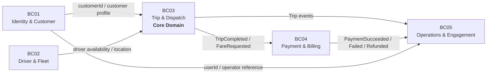

---

# 2. Từ điển Ubiquitous Language

Ubiquitous Language là bộ từ vựng chuẩn dùng thống nhất giữa:

- Business Analyst
- Developer
- Tester
- Architect
- Stakeholder

Một khái niệm trong cùng Bounded Context chỉ nên sử dụng **một tên thống nhất**.

---

## 2.1. Từ điển thuật ngữ

| Thuật ngữ | Context | Định nghĩa chuẩn | Quy ước |
|---|---|---|---|
| **User** | Identity | Tài khoản có khả năng xác thực trong hệ thống | Không đồng nghĩa Customer hoặc Driver |
| **Role** | Identity | Vai trò nghiệp vụ dùng trong RBAC | CUSTOMER, DRIVER, OPERATOR, ADMIN, FINANCE |
| **Permission** | Identity | Quyền thực hiện một hành động cụ thể | Ví dụ `TRIP_VIEW`, `DRIVER_MANAGE` |
| **Customer** | Identity & Customer | Người sử dụng dịch vụ để đặt xe | Có `customerId` và liên kết với `userId` |
| **Customer Profile** | Identity & Customer | Hồ sơ nghiệp vụ của khách hàng | Họ tên, liên hệ, địa chỉ, trạng thái |
| **Driver** | Driver & Fleet | Tài xế có thể nhận và thực hiện chuyến | AVAILABLE/BUSY/OFFLINE |
| **Vehicle** | Driver & Fleet | Phương tiện do tài xế sử dụng | Có vehicle type, license plate |
| **Driver Location** | Driver & Fleet | Vị trí hiện tại hoặc lịch sử vị trí tài xế | Không thuộc Trip DB |
| **Trip** | Trip & Dispatch | Một chuyến xe từ pickup đến destination | Aggregate chính |
| **Trip Request** | Trip & Dispatch | Yêu cầu đặt xe ban đầu | Khởi tạo Trip ở REQUESTED |
| **Pickup** | Trip & Dispatch | Điểm đón khách | Tọa độ + địa chỉ |
| **Destination** | Trip & Dispatch | Điểm đến | Tọa độ + địa chỉ |
| **Dispatch** | Trip & Dispatch | Quá trình tìm và mời tài xế nhận chuyến | Có nhiều Dispatch Attempt |
| **Candidate Driver** | Trip & Dispatch | Tài xế phù hợp có thể được mời nhận chuyến | Nguồn từ Driver service |
| **Dispatch Attempt** | Trip & Dispatch | Một lần gửi yêu cầu nhận chuyến đến một Driver | PENDING/ACCEPTED/REJECTED/TIMEOUT |
| **Assignment** | Trip & Dispatch | Kết quả gán tài xế vào Trip | Chỉ tồn tại khi driver được chọn |
| **Fare Quote** | Payment & Billing | Cước dự kiến | Có thể có thời hạn hiệu lực |
| **Payment** | Payment & Billing | Nghĩa vụ thanh toán của một Trip | PENDING/PAID/FAILED/... |
| **Payment Transaction** | Payment & Billing | Một lần giao tiếp với payment gateway | Có gateway reference |
| **Refund** | Payment & Billing | Hoàn lại một phần hoặc toàn bộ payment | Có trạng thái riêng |
| **Incident** | Operations | Sự cố cần nhân viên vận hành xử lý | Có priority và status |
| **Intervention** | Operations | Hành động can thiệp vào một Incident | Ví dụ force cancel |
| **Notification** | Engagement | Thông báo gửi đến recipient | PUSH/SMS/EMAIL/IN_APP |
| **Audit Log** | Operations | Bản ghi thao tác quan trọng | Append-only |
| **Report Snapshot** | Reporting | Dữ liệu tổng hợp phục vụ truy vấn báo cáo | Được cập nhật từ event |
| **Saga** | Cross-context | Chuỗi local transaction phối hợp bằng event | Không dùng distributed ACID |
| **Compensation** | Cross-context | Hành động bù khi một bước thất bại | Ví dụ release driver |

---

## 2.2. State vocabulary chuẩn

| Đối tượng | Trạng thái chuẩn |
|---|---|
| **Driver** | AVAILABLE, BUSY, OFFLINE |
| **Dispatch Attempt** | PENDING, ACCEPTED, REJECTED, TIMEOUT, CANCELLED |
| **Trip** | REQUESTED, SEARCHING_DRIVER, DRIVER_ASSIGNED, DRIVER_ACCEPTED, DRIVER_ARRIVING, DRIVER_ARRIVED, PASSENGER_PICKED_UP, IN_PROGRESS, COMPLETED, CANCELLED |
| **Payment** | PENDING, PAID, FAILED, REFUNDED, PARTIALLY_REFUNDED |
| **Notification** | PENDING, SENT, FAILED, RETRYING |
| **Incident** | OPEN, PROCESSING, RESOLVED, CLOSED |

> **Khuyến nghị:** chuẩn hóa API hiện tại từ `cancel` / `cancelled` về một giá trị duy nhất là `CANCELLED`.

---

# 3. Kiến trúc Microservice

## 3.1. Mapping Bounded Context → Microservice → Database

| Bounded Context | Microservice | Database |
|---|---|---|
| BC01 - Identity & Customer | `identity-customer-service` | `identity_customer_db` |
| BC02 - Driver & Fleet | `driver-fleet-service` | `driver_fleet_db` |
| BC03 - Trip & Dispatch | `trip-dispatch-service` | `trip_dispatch_db` |
| BC04 - Payment & Billing | `payment-billing-service` | `payment_billing_db` |
| BC05 - Operations & Engagement | `operations-engagement-service` | `operations_engagement_db` |

---

## 3.2. Sơ đồ kiến trúc logic

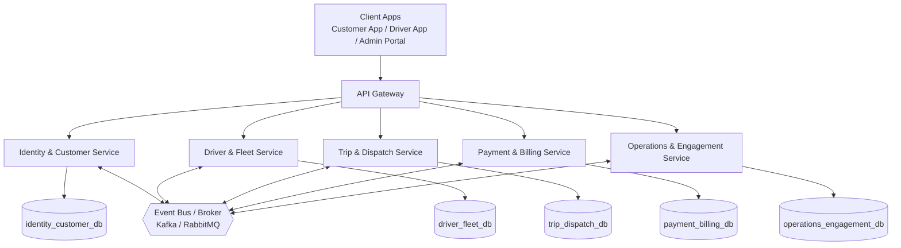

---

## 3.3. Quy tắc kiến trúc

### Quy tắc 1 - Database per Service

Mỗi service chỉ được phép đọc/ghi database của chính nó.

**Sai:**

```text
Trip Service -> SELECT * FROM driver_fleet_db.driver
```

**Đúng:**

```text
Trip Service -> Driver Service API
Trip Service <- Driver availability response
```

---

### Quy tắc 2 - External Reference

Ví dụ trong `trip_dispatch_db`:

```text
customer_id
driver_id
vehicle_id
```

chỉ là external reference.

Không tạo:

```sql
FOREIGN KEY (driver_id)
REFERENCES driver_fleet_db.driver(driver_id);
```

---

### Quy tắc 3 - REST cho truy vấn đồng bộ

Ví dụ:

```text
Trip Service
   |
   | GET available drivers
   v
Driver Service
```

---

### Quy tắc 4 - Event cho thay đổi trạng thái

Ví dụ:

```text
TripCompleted
PaymentSucceeded
PaymentFailed
DriverAssigned
DriverAvailable
NotificationRequested
```

---

### Quy tắc 5 - Outbox Pattern

Mỗi service ghi:

1. business data;
2. outbox event;

trong **cùng local transaction**.

Sau đó Outbox Relay publish event ra broker.

---

## 3.4. API ownership gợi ý

| Service | Endpoint chính |
|---|---|
| `identity-customer-service` | `POST /auth/login`, `POST /auth/refresh`, `GET/POST/PATCH /customers` |
| `driver-fleet-service` | `GET/POST/PATCH /drivers`, `PUT /drivers/{id}/location`, `GET/POST /vehicles` |
| `trip-dispatch-service` | `POST /trips`, `GET/PATCH /trips/{id}`, `POST /trips/{id}/cancel`, `POST /trips/{id}/dispatch-response` |
| `payment-billing-service` | `POST /fare-quotes`, `POST /payments`, `GET /payments/{id}`, `POST /payments/{id}/refund` |
| `operations-engagement-service` | `GET /operations/*`, `POST /incidents`, `POST /notifications`, `GET /reports/*` |

---

# 4. Mô hình thực thể & Schema DDL / JSON Schema

> Ví dụ DDL sử dụng PostgreSQL.  
> Các external reference sang Microservice khác **không tạo foreign key vật lý**.

---

## 4.1. identity-customer-service

### ERD

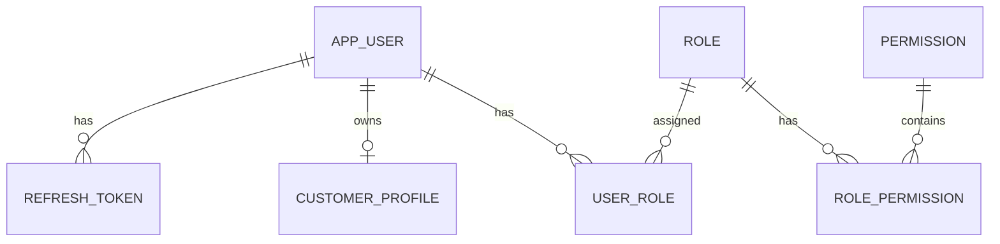

### PostgreSQL DDL

```sql
CREATE EXTENSION IF NOT EXISTS "uuid-ossp";

CREATE TABLE app_user (
    user_id UUID PRIMARY KEY DEFAULT uuid_generate_v4(),
    username VARCHAR(80) NOT NULL UNIQUE,
    password_hash VARCHAR(255) NOT NULL,
    email VARCHAR(160) UNIQUE,
    phone VARCHAR(30) UNIQUE,
    status VARCHAR(20) NOT NULL DEFAULT 'ACTIVE',
    created_at TIMESTAMPTZ NOT NULL DEFAULT now(),
    updated_at TIMESTAMPTZ NOT NULL DEFAULT now()
);

CREATE TABLE role (
    role_id UUID PRIMARY KEY DEFAULT uuid_generate_v4(),
    role_code VARCHAR(40) NOT NULL UNIQUE,
    role_name VARCHAR(120) NOT NULL
);

CREATE TABLE permission (
    permission_id UUID PRIMARY KEY DEFAULT uuid_generate_v4(),
    permission_code VARCHAR(80) NOT NULL UNIQUE,
    description VARCHAR(255)
);

CREATE TABLE user_role (
    user_id UUID NOT NULL REFERENCES app_user(user_id),
    role_id UUID NOT NULL REFERENCES role(role_id),
    PRIMARY KEY (user_id, role_id)
);

CREATE TABLE role_permission (
    role_id UUID NOT NULL REFERENCES role(role_id),
    permission_id UUID NOT NULL REFERENCES permission(permission_id),
    PRIMARY KEY (role_id, permission_id)
);

CREATE TABLE customer_profile (
    customer_id UUID PRIMARY KEY DEFAULT uuid_generate_v4(),
    user_id UUID NOT NULL UNIQUE REFERENCES app_user(user_id),
    full_name VARCHAR(160) NOT NULL,
    address VARCHAR(255),
    status VARCHAR(20) NOT NULL DEFAULT 'ACTIVE',
    created_at TIMESTAMPTZ NOT NULL DEFAULT now(),
    updated_at TIMESTAMPTZ NOT NULL DEFAULT now()
);

CREATE TABLE refresh_token (
    token_id UUID PRIMARY KEY DEFAULT uuid_generate_v4(),
    user_id UUID NOT NULL REFERENCES app_user(user_id),
    token_hash VARCHAR(255) NOT NULL,
    expires_at TIMESTAMPTZ NOT NULL,
    revoked BOOLEAN NOT NULL DEFAULT FALSE,
    created_at TIMESTAMPTZ NOT NULL DEFAULT now()
);
```

### JSON Schema - CustomerProfile

```json
{
  "$schema": "https://json-schema.org/draft/2020-12/schema",
  "title": "CustomerProfile",
  "type": "object",
  "required": ["customerId", "userId", "fullName", "status"],
  "properties": {
    "customerId": {
      "type": "string",
      "format": "uuid"
    },
    "userId": {
      "type": "string",
      "format": "uuid"
    },
    "fullName": {
      "type": "string",
      "minLength": 1,
      "maxLength": 160
    },
    "email": {
      "type": "string",
      "format": "email"
    },
    "phone": {
      "type": "string",
      "maxLength": 30
    },
    "address": {
      "type": ["string", "null"]
    },
    "status": {
      "enum": ["ACTIVE", "SUSPENDED", "INACTIVE"]
    }
  },
  "additionalProperties": false
}
```

---

## 4.2. driver-fleet-service

### ERD

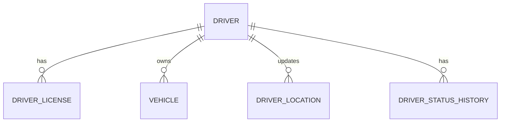

### PostgreSQL DDL

```sql
CREATE TABLE driver (
    driver_id UUID PRIMARY KEY,
    user_id UUID NOT NULL UNIQUE,
    full_name VARCHAR(160) NOT NULL,
    phone VARCHAR(30),
    email VARCHAR(160),
    status VARCHAR(20) NOT NULL
        CHECK (status IN ('AVAILABLE','BUSY','OFFLINE')),
    rating NUMERIC(3,2) DEFAULT 0,
    created_at TIMESTAMPTZ NOT NULL DEFAULT now(),
    updated_at TIMESTAMPTZ NOT NULL DEFAULT now()
);

CREATE TABLE driver_license (
    license_id UUID PRIMARY KEY,
    driver_id UUID NOT NULL REFERENCES driver(driver_id),
    license_number VARCHAR(80) NOT NULL UNIQUE,
    license_type VARCHAR(40),
    issued_date DATE,
    expired_date DATE,
    status VARCHAR(20) NOT NULL DEFAULT 'VALID'
);

CREATE TABLE vehicle (
    vehicle_id UUID PRIMARY KEY,
    driver_id UUID NOT NULL REFERENCES driver(driver_id),
    license_plate VARCHAR(30) NOT NULL UNIQUE,
    vehicle_type VARCHAR(40) NOT NULL,
    brand VARCHAR(80),
    model VARCHAR(80),
    color VARCHAR(40),
    status VARCHAR(20) NOT NULL DEFAULT 'ACTIVE'
);

CREATE TABLE driver_location (
    location_id BIGSERIAL PRIMARY KEY,
    driver_id UUID NOT NULL REFERENCES driver(driver_id),
    latitude NUMERIC(9,6) NOT NULL,
    longitude NUMERIC(9,6) NOT NULL,
    address VARCHAR(255),
    recorded_at TIMESTAMPTZ NOT NULL DEFAULT now()
);

CREATE INDEX idx_driver_location_driver_time
ON driver_location(driver_id, recorded_at DESC);

CREATE TABLE driver_status_history (
    history_id BIGSERIAL PRIMARY KEY,
    driver_id UUID NOT NULL REFERENCES driver(driver_id),
    old_status VARCHAR(20),
    new_status VARCHAR(20) NOT NULL,
    changed_at TIMESTAMPTZ NOT NULL DEFAULT now()
);
```

### JSON Schema - DriverAvailability

```json
{
  "$schema": "https://json-schema.org/draft/2020-12/schema",
  "title": "DriverAvailability",
  "type": "object",
  "required": ["driverId", "status", "location"],
  "properties": {
    "driverId": {
      "type": "string",
      "format": "uuid"
    },
    "vehicleId": {
      "type": "string",
      "format": "uuid"
    },
    "status": {
      "enum": ["AVAILABLE", "BUSY", "OFFLINE"]
    },
    "vehicleType": {
      "type": "string"
    },
    "location": {
      "type": "object",
      "required": ["latitude", "longitude"],
      "properties": {
        "latitude": {
          "type": "number",
          "minimum": -90,
          "maximum": 90
        },
        "longitude": {
          "type": "number",
          "minimum": -180,
          "maximum": 180
        }
      }
    }
  }
}
```

---

## 4.3. trip-dispatch-service

### ERD

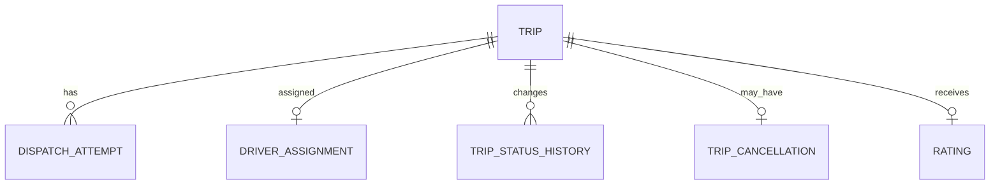

### PostgreSQL DDL

```sql
CREATE TABLE trip (
    trip_id UUID PRIMARY KEY,
    customer_id UUID NOT NULL,
    driver_id UUID,
    vehicle_id UUID,

    pickup_latitude NUMERIC(9,6) NOT NULL,
    pickup_longitude NUMERIC(9,6) NOT NULL,
    pickup_address VARCHAR(255),

    destination_latitude NUMERIC(9,6) NOT NULL,
    destination_longitude NUMERIC(9,6) NOT NULL,
    destination_address VARCHAR(255),

    service_type VARCHAR(40) NOT NULL,
    status VARCHAR(40) NOT NULL,

    estimated_fare NUMERIC(14,2),
    final_fare NUMERIC(14,2),

    requested_at TIMESTAMPTZ NOT NULL DEFAULT now(),
    started_at TIMESTAMPTZ,
    completed_at TIMESTAMPTZ,

    created_at TIMESTAMPTZ NOT NULL DEFAULT now(),
    updated_at TIMESTAMPTZ NOT NULL DEFAULT now()
);

CREATE TABLE dispatch_attempt (
    dispatch_attempt_id UUID PRIMARY KEY,
    trip_id UUID NOT NULL REFERENCES trip(trip_id),
    driver_id UUID NOT NULL,
    attempt_number INT NOT NULL,
    status VARCHAR(20) NOT NULL
        CHECK (
            status IN (
                'PENDING',
                'ACCEPTED',
                'REJECTED',
                'TIMEOUT',
                'CANCELLED'
            )
        ),
    sent_at TIMESTAMPTZ NOT NULL DEFAULT now(),
    expires_at TIMESTAMPTZ NOT NULL,
    responded_at TIMESTAMPTZ,
    UNIQUE(trip_id, attempt_number)
);

CREATE TABLE driver_assignment (
    assignment_id UUID PRIMARY KEY,
    trip_id UUID NOT NULL UNIQUE REFERENCES trip(trip_id),
    driver_id UUID NOT NULL,
    vehicle_id UUID,
    status VARCHAR(20) NOT NULL,
    assigned_at TIMESTAMPTZ NOT NULL DEFAULT now(),
    accepted_at TIMESTAMPTZ
);

CREATE TABLE trip_status_history (
    history_id BIGSERIAL PRIMARY KEY,
    trip_id UUID NOT NULL REFERENCES trip(trip_id),
    previous_status VARCHAR(40),
    new_status VARCHAR(40) NOT NULL,
    changed_by VARCHAR(40),
    changed_at TIMESTAMPTZ NOT NULL DEFAULT now()
);

CREATE TABLE trip_cancellation (
    cancellation_id UUID PRIMARY KEY,
    trip_id UUID NOT NULL UNIQUE REFERENCES trip(trip_id),
    cancelled_by VARCHAR(40) NOT NULL,
    reason VARCHAR(255),
    cancellation_fee NUMERIC(14,2) DEFAULT 0,
    cancelled_at TIMESTAMPTZ NOT NULL DEFAULT now()
);

CREATE TABLE rating (
    rating_id UUID PRIMARY KEY,
    trip_id UUID NOT NULL UNIQUE REFERENCES trip(trip_id),
    customer_id UUID NOT NULL,
    driver_id UUID NOT NULL,
    score INT NOT NULL CHECK (score BETWEEN 1 AND 5),
    comment VARCHAR(1000),
    created_at TIMESTAMPTZ NOT NULL DEFAULT now()
);
```

### JSON Schema - Trip

```json
{
  "$schema": "https://json-schema.org/draft/2020-12/schema",
  "title": "Trip",
  "type": "object",
  "required": [
    "tripId",
    "customerId",
    "pickup",
    "destination",
    "serviceType",
    "status"
  ],
  "properties": {
    "tripId": {
      "type": "string",
      "format": "uuid"
    },
    "customerId": {
      "type": "string",
      "format": "uuid"
    },
    "driverId": {
      "type": ["string", "null"],
      "format": "uuid"
    },
    "vehicleId": {
      "type": ["string", "null"],
      "format": "uuid"
    },
    "serviceType": {
      "enum": ["STANDARD", "VIP", "AIRPORT", "PACKAGE"]
    },
    "status": {
      "enum": [
        "REQUESTED",
        "SEARCHING_DRIVER",
        "DRIVER_ASSIGNED",
        "DRIVER_ACCEPTED",
        "DRIVER_ARRIVING",
        "DRIVER_ARRIVED",
        "PASSENGER_PICKED_UP",
        "IN_PROGRESS",
        "COMPLETED",
        "CANCELLED"
      ]
    },
    "pickup": {
      "$ref": "#/$defs/location"
    },
    "destination": {
      "$ref": "#/$defs/location"
    },
    "estimatedFare": {
      "type": ["number", "null"],
      "minimum": 0
    },
    "finalFare": {
      "type": ["number", "null"],
      "minimum": 0
    }
  },
  "$defs": {
    "location": {
      "type": "object",
      "required": ["latitude", "longitude"],
      "properties": {
        "latitude": {
          "type": "number",
          "minimum": -90,
          "maximum": 90
        },
        "longitude": {
          "type": "number",
          "minimum": -180,
          "maximum": 180
        },
        "address": {
          "type": ["string", "null"]
        }
      }
    }
  }
}
```

---

## 4.4. payment-billing-service

### ERD

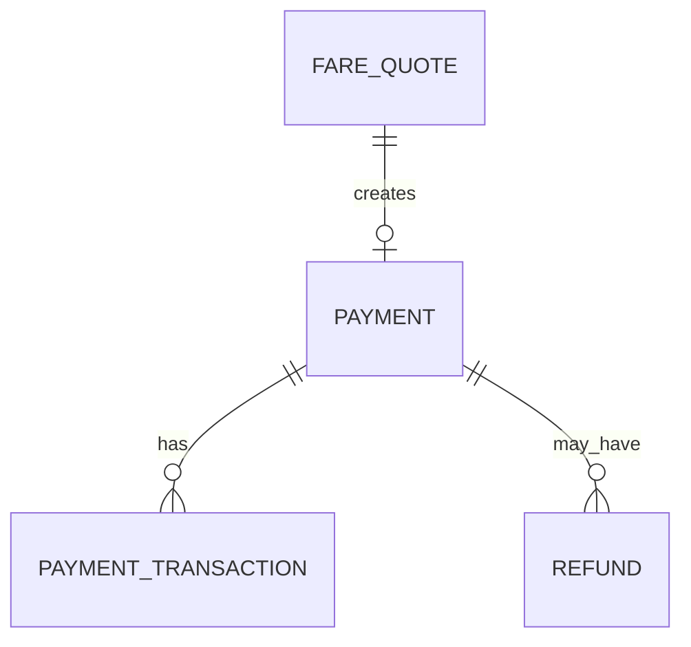

### PostgreSQL DDL

```sql
CREATE TABLE fare_quote (
    quote_id UUID PRIMARY KEY,
    trip_id UUID NOT NULL,
    service_type VARCHAR(40) NOT NULL,
    distance_km NUMERIC(10,2),
    base_fare NUMERIC(14,2) NOT NULL,
    surcharge NUMERIC(14,2) NOT NULL DEFAULT 0,
    total_fare NUMERIC(14,2) NOT NULL,
    currency CHAR(3) NOT NULL DEFAULT 'VND',
    created_at TIMESTAMPTZ NOT NULL DEFAULT now(),
    expires_at TIMESTAMPTZ
);

CREATE TABLE payment (
    payment_id UUID PRIMARY KEY,
    trip_id UUID NOT NULL,
    customer_id UUID NOT NULL,
    amount NUMERIC(14,2) NOT NULL CHECK (amount >= 0),
    currency CHAR(3) NOT NULL DEFAULT 'VND',
    payment_method VARCHAR(30) NOT NULL,
    status VARCHAR(30) NOT NULL
        CHECK (
            status IN (
                'PENDING',
                'PAID',
                'FAILED',
                'REFUNDED',
                'PARTIALLY_REFUNDED'
            )
        ),
    created_at TIMESTAMPTZ NOT NULL DEFAULT now(),
    paid_at TIMESTAMPTZ
);

CREATE UNIQUE INDEX uq_payment_trip_active
ON payment(trip_id)
WHERE status IN ('PENDING', 'PAID', 'PARTIALLY_REFUNDED');

CREATE TABLE payment_transaction (
    transaction_id UUID PRIMARY KEY,
    payment_id UUID NOT NULL REFERENCES payment(payment_id),
    gateway VARCHAR(80),
    gateway_transaction_id VARCHAR(160),
    amount NUMERIC(14,2) NOT NULL,
    status VARCHAR(30) NOT NULL,
    response_code VARCHAR(80),
    created_at TIMESTAMPTZ NOT NULL DEFAULT now()
);

CREATE TABLE refund (
    refund_id UUID PRIMARY KEY,
    payment_id UUID NOT NULL REFERENCES payment(payment_id),
    amount NUMERIC(14,2) NOT NULL CHECK (amount > 0),
    reason VARCHAR(255),
    status VARCHAR(30) NOT NULL,
    gateway_reference VARCHAR(160),
    created_at TIMESTAMPTZ NOT NULL DEFAULT now(),
    completed_at TIMESTAMPTZ
);
```

### JSON Schema - Payment

```json
{
  "$schema": "https://json-schema.org/draft/2020-12/schema",
  "title": "Payment",
  "type": "object",
  "required": [
    "paymentId",
    "tripId",
    "customerId",
    "amount",
    "currency",
    "method",
    "status"
  ],
  "properties": {
    "paymentId": {
      "type": "string",
      "format": "uuid"
    },
    "tripId": {
      "type": "string",
      "format": "uuid"
    },
    "customerId": {
      "type": "string",
      "format": "uuid"
    },
    "amount": {
      "type": "number",
      "minimum": 0
    },
    "currency": {
      "type": "string",
      "pattern": "^[A-Z]{3}$"
    },
    "method": {
      "enum": ["CASH", "CARD", "WALLET", "BANK_TRANSFER"]
    },
    "status": {
      "enum": [
        "PENDING",
        "PAID",
        "FAILED",
        "REFUNDED",
        "PARTIALLY_REFUNDED"
      ]
    },
    "gatewayReference": {
      "type": ["string", "null"]
    }
  },
  "additionalProperties": false
}
```

---

## 4.5. operations-engagement-service

### ERD

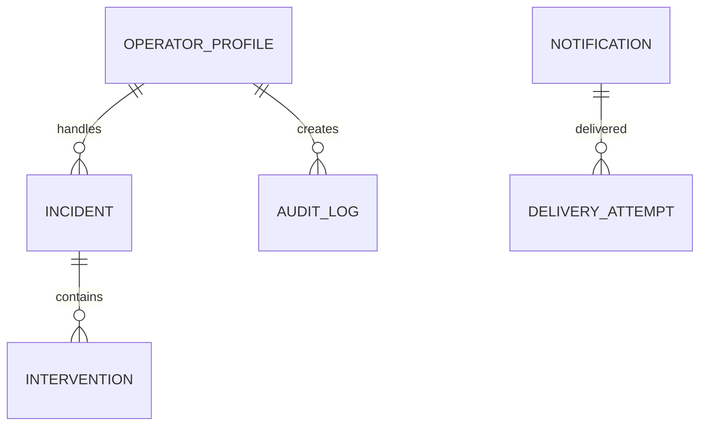

### PostgreSQL DDL

```sql
CREATE TABLE operator_profile (
    operator_id UUID PRIMARY KEY,
    user_id UUID NOT NULL UNIQUE,
    employee_code VARCHAR(40) NOT NULL UNIQUE,
    full_name VARCHAR(160) NOT NULL,
    status VARCHAR(20) NOT NULL DEFAULT 'ACTIVE'
);

CREATE TABLE incident (
    incident_id UUID PRIMARY KEY,
    trip_id UUID,
    customer_id UUID,
    driver_id UUID,
    incident_type VARCHAR(80) NOT NULL,
    description TEXT,
    priority VARCHAR(20) NOT NULL,
    status VARCHAR(20) NOT NULL
        CHECK (status IN ('OPEN','PROCESSING','RESOLVED','CLOSED')),
    assigned_operator_id UUID REFERENCES operator_profile(operator_id),
    created_at TIMESTAMPTZ NOT NULL DEFAULT now(),
    resolved_at TIMESTAMPTZ
);

CREATE TABLE intervention (
    intervention_id UUID PRIMARY KEY,
    incident_id UUID NOT NULL REFERENCES incident(incident_id),
    operator_id UUID NOT NULL REFERENCES operator_profile(operator_id),
    action_code VARCHAR(80) NOT NULL,
    description TEXT,
    created_at TIMESTAMPTZ NOT NULL DEFAULT now()
);

CREATE TABLE audit_log (
    audit_id BIGSERIAL PRIMARY KEY,
    user_id UUID,
    action_code VARCHAR(100) NOT NULL,
    entity_type VARCHAR(80),
    entity_id VARCHAR(120),
    payload JSONB,
    created_at TIMESTAMPTZ NOT NULL DEFAULT now()
);

CREATE TABLE notification (
    notification_id UUID PRIMARY KEY,
    recipient_id UUID NOT NULL,
    recipient_type VARCHAR(30) NOT NULL,
    trip_id UUID,
    channel VARCHAR(20) NOT NULL
        CHECK (channel IN ('PUSH','SMS','EMAIL','IN_APP')),
    content TEXT NOT NULL,
    status VARCHAR(20) NOT NULL
        CHECK (status IN ('PENDING','SENT','FAILED','RETRYING')),
    created_at TIMESTAMPTZ NOT NULL DEFAULT now(),
    sent_at TIMESTAMPTZ
);

CREATE TABLE delivery_attempt (
    attempt_id UUID PRIMARY KEY,
    notification_id UUID NOT NULL REFERENCES notification(notification_id),
    provider VARCHAR(80),
    attempt_number INT NOT NULL,
    status VARCHAR(20) NOT NULL,
    response_code VARCHAR(80),
    error_message TEXT,
    attempted_at TIMESTAMPTZ NOT NULL DEFAULT now()
);

CREATE TABLE daily_trip_summary (
    report_date DATE PRIMARY KEY,
    total_trips INT NOT NULL DEFAULT 0,
    completed_trips INT NOT NULL DEFAULT 0,
    cancelled_trips INT NOT NULL DEFAULT 0,
    total_revenue NUMERIC(16,2) NOT NULL DEFAULT 0,
    updated_at TIMESTAMPTZ NOT NULL DEFAULT now()
);
```

### JSON Schema - NotificationRequested

```json
{
  "$schema": "https://json-schema.org/draft/2020-12/schema",
  "title": "NotificationRequested",
  "type": "object",
  "required": [
    "eventId",
    "recipientId",
    "channel",
    "templateCode",
    "occurredAt"
  ],
  "properties": {
    "eventId": {
      "type": "string",
      "format": "uuid"
    },
    "recipientId": {
      "type": "string",
      "format": "uuid"
    },
    "channel": {
      "enum": ["PUSH", "SMS", "EMAIL", "IN_APP"]
    },
    "templateCode": {
      "type": "string"
    },
    "tripId": {
      "type": ["string", "null"],
      "format": "uuid"
    },
    "variables": {
      "type": "object",
      "additionalProperties": true
    },
    "occurredAt": {
      "type": "string",
      "format": "date-time"
    }
  }
}
```

---

## 4.6. Ownership dữ liệu

| Dữ liệu | Owner | Quy tắc |
|---|---|---|
| User / Role / Permission / Customer | `identity-customer-service` | Service khác chỉ giữ `userId/customerId` |
| Driver / Vehicle / Driver Location | `driver-fleet-service` | Trip chỉ giữ `driverId/vehicleId` |
| Trip / Dispatch / Assignment / Rating | `trip-dispatch-service` | Payment/Operations không update trực tiếp `trip_dispatch_db` |
| Fare / Payment / Transaction / Refund | `payment-billing-service` | Trip chỉ consume Payment event |
| Incident / Audit / Notification / Report | `operations-engagement-service` | Read model cập nhật từ domain event |

---

# 5. Quy trình điều phối giao dịch phân tán - Saga Choreography Flow

## 5.1. Khái niệm

Saga Choreography không có một orchestrator trung tâm.

Mỗi Microservice:

1. thực hiện **local transaction**;
2. commit dữ liệu của chính nó;
3. publish domain event;
4. service khác subscribe event;
5. tiếp tục local transaction kế tiếp.

Nếu một bước thất bại, service phát event lỗi hoặc event bù để các service liên quan thực hiện **compensation**.

---

# 5.2. Saga A - Đặt xe và phân công tài xế

## Luồng nghiệp vụ

| Bước | Service | Local Transaction | Event |
|---|---|---|---|
| 1 | Trip Service | Tạo Trip = REQUESTED | `TripRequested` |
| 2 | Driver Service | Tìm Driver AVAILABLE phù hợp | `CandidateDriversFound` |
| 3 | Trip Service | Tạo Dispatch Attempt | `DriverAssignmentRequested` |
| 4 | Operations & Engagement | Gửi push cho Driver | `NotificationSent` / `NotificationFailed` |
| 5A | Trip Service | Driver Accept → tạo Assignment | `DriverAssigned` |
| 5B | Trip Service | Reject/Timeout → đóng attempt, chọn driver tiếp theo | `DriverRejectedTrip` / `DriverAssignmentTimeout` |
| 6 | Driver Service | Driver = BUSY | `DriverBusy` |
| 7 | Trip Service | Hết Candidate → kết thúc tìm xe | `TripNoDriverAvailable` |

---

## Sơ đồ Saga đặt xe

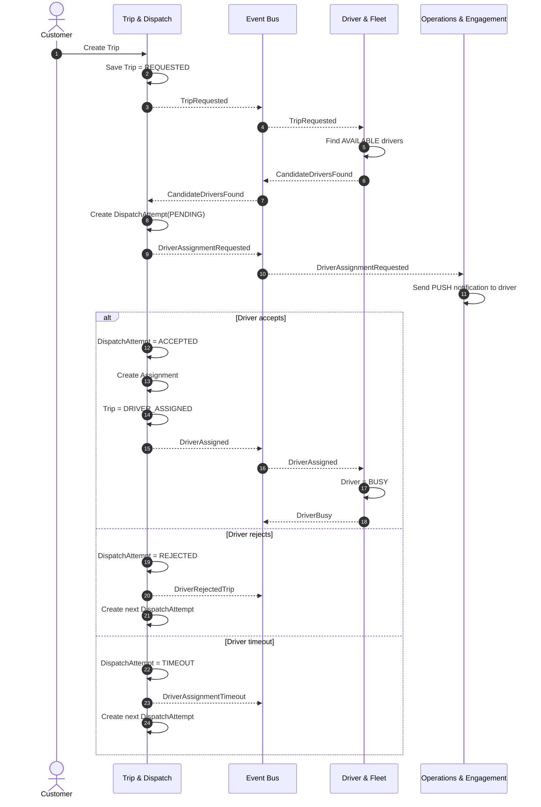

---

# 5.3. Saga B - Hoàn thành chuyến và thanh toán

## Luồng nghiệp vụ

| Bước | Service | Local Transaction | Event |
|---|---|---|---|
| 1 | Trip Service | Trip → COMPLETED | `TripCompleted` |
| 2 | Payment Service | Tính fare và tạo Payment=PENDING | `PaymentRequested` |
| 3A | Payment Service | Gateway thành công → PAID | `PaymentSucceeded` |
| 3B | Payment Service | Gateway thất bại → FAILED | `PaymentFailed` |
| 4 | Driver Service | Driver BUSY → AVAILABLE | `DriverAvailable` |
| 5 | Operations & Engagement | Gửi receipt, notification, cập nhật report | `NotificationSent`, `ReportUpdated` |

---

## Sơ đồ Saga hoàn thành chuyến và thanh toán

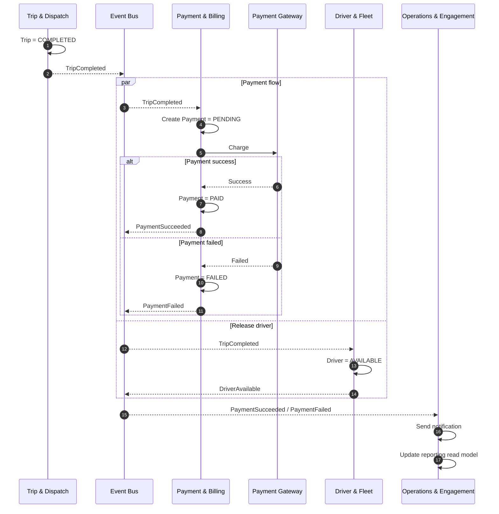

---

# 5.4. Compensation Rules

| Tình huống | Event bù | Compensation |
|---|---|---|
| Driver không phản hồi | `DriverAssignmentTimeout` | Đóng attempt hiện tại, tạo attempt mới |
| Driver từ chối | `DriverRejectedTrip` | Chọn candidate driver tiếp theo |
| DriverAssigned nhưng cập nhật Driver=BUSY thất bại | `DriverReservationFailed` | Hủy assignment, tiếp tục dispatch |
| Payment gateway thất bại | `PaymentFailed` | Không rollback Trip; cho phép retry hoặc đổi sang CASH |
| Notification lỗi sau PaymentSucceeded | `NotificationFailed` | Không rollback Payment; retry Notification |
| Payment đã thành công nhưng cần hoàn tiền | `PaymentRefunded` | Điều chỉnh report; Trip vẫn COMPLETED |
| Trip bị hủy sau khi assign driver | `TripCancelled` | Driver trả về AVAILABLE; Payment pending bị hủy nếu tồn tại |

---

# 5.5. Sơ đồ Compensation tổng quát

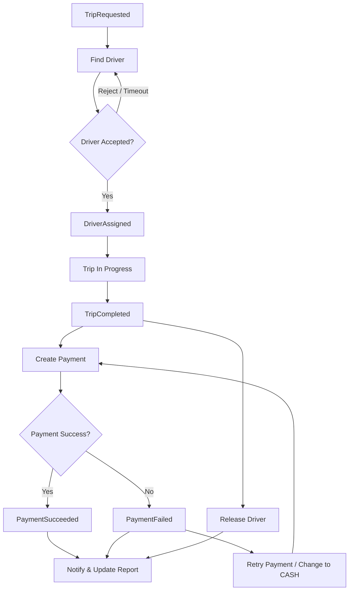

---

# 5.6. Event Envelope chuẩn

```json
{
  "eventId": "uuid",
  "eventType": "TripCompleted",
  "eventVersion": 1,
  "aggregateId": "trip-uuid",
  "correlationId": "saga-correlation-uuid",
  "causationId": "previous-event-uuid",
  "occurredAt": "2026-09-23T10:00:00Z",
  "producer": "trip-dispatch-service",
  "payload": {}
}
```

---

# 5.7. Outbox Pattern

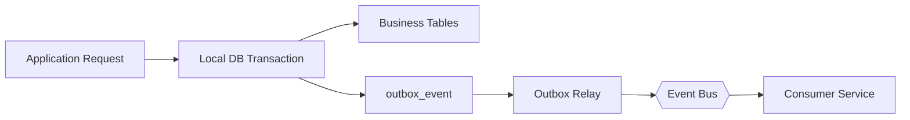

### Ý nghĩa

Trong một transaction:

```text
UPDATE business data
+
INSERT outbox event
=
COMMIT cùng lúc
```

Nhờ vậy tránh trường hợp:

```text
Business data đã commit
nhưng event chưa publish
```

---

# 5.8. Idempotent Consumer

Mỗi consumer nên có bảng:

```sql
CREATE TABLE processed_event (
    event_id UUID PRIMARY KEY,
    event_type VARCHAR(120) NOT NULL,
    processed_at TIMESTAMPTZ NOT NULL DEFAULT now()
);
```

Pseudo flow:

```text
Receive event

IF eventId exists in processed_event
    -> Ignore duplicate

ELSE
    -> Execute local transaction
    -> Insert processed_event
    -> Commit
```

---

# 5.9. Yêu cầu kỹ thuật để Saga hoạt động an toàn

1. **Transactional Outbox**  
   Business data và Event phải được commit cùng transaction.

2. **Idempotency**  
   Consumer phải xử lý duplicate event an toàn.

3. **Correlation ID**  
   Mỗi Saga phải có `correlationId`.

4. **Retry with Backoff**  
   Dùng cho lỗi mạng hoặc lỗi tạm thời.

5. **Dead Letter Queue**  
   Event thất bại nhiều lần được chuyển sang DLQ.

6. **Compensation phải idempotent**  
   Ví dụ gọi release driver hai lần vẫn cho trạng thái cuối cùng là AVAILABLE.

7. **Không giả định Event Ordering tuyệt đối**  
   Consumer phải kiểm tra state transition.

8. **Không dùng Distributed Transaction xuyên database**  
   Mỗi service chỉ thực hiện transaction trên database của mình.

---

# 6. Tổng thể kiến trúc hoàn chỉnh

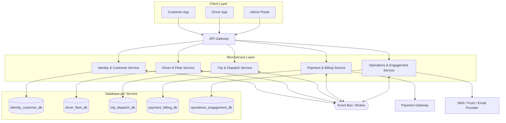

---

# 7. Kết luận

Thiết kế trên bảo đảm các nguyên tắc chính:

- **5 Bounded Context rõ ràng**.
- **1 Bounded Context = 1 Microservice**.
- **1 Microservice = 1 Database**.
- Không có cross-database foreign key.
- `Trip & Dispatch` là Core Domain.
- Giao tiếp đồng bộ dùng REST khi cần query tức thời.
- Giao tiếp bất đồng bộ dùng Domain Event.
- Giao dịch phân tán sử dụng **Saga Choreography**.
- Bảo đảm eventual consistency.
- Sử dụng Outbox Pattern và Idempotent Consumer để tăng độ tin cậy.
- Hỗ trợ mở rộng hệ thống theo đúng yêu cầu loosely-coupled trong SRS.
