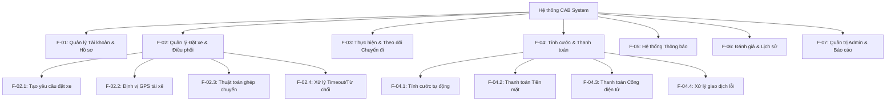

Bước 1: - đọc và phân tích yêu cầu: hiểu về bussiness contesxt và bussiness problem
        - trả lời câu hỏi: khách hàng muốn giải quyết vấn đề gì
        - vì sao k thể đáp ứng, ai sử dụng ht này,
        - giá trị sau khi tạo ra 
# BƯỚC 1: 
1. Bối cảnh Nghiệp vụ (Business Context)

Công ty ABC là doanh nghiệp cung cấp dịch vụ đặt xe trực tuyến đang phục vụ khách hàng qua hai kênh: tổng đài và một ứng dụng di động đơn giản. Doanh nghiệp đang đối mặt với sự gia tăng về quy mô nhưng hạ tầng vận hành hiện tại đã chạm ngưỡng giới hạn.

2. Vấn đề Nghiệp vụ (Business Problem) - Khách hàng muốn giải quyết vấn đề gì?

- Công ty ABC muốn giải quyết 4 nhóm vấn đề cốt lõi đang kìm hãm sự phát triển của họ:

- Sự phụ thuộc vào vận hành thủ công: Việc phân công tài xế chủ yếu làm bằng tay, tốn thời gian, dễ gây sai sót và không thể xử lý khi số lượng đơn hàng tăng cao.

- Trải nghiệm khách hàng kém (Lack of Visibility): Khách hàng hoàn toàn "mù thông tin" về tiến trình chuyến đi — không biết trạng thái tìm xe, không biết tài xế đang ở đâu, bao giờ tới và thiếu công cụ đánh giá chất lượng dịch vụ.

- Thanh toán phân tán, rủi ro: Chưa có hệ thống quản lý thanh toán tập trung, thiếu tích hợp thanh toán điện tử an toàn.

- Hạ tầng công nghệ đơn điểm (Single Point of Failure): Hệ thống cũ có kiến trúc đóng, các bộ phận dính liền nhau nên khi một chức năng gặp sự cố sẽ kéo theo toàn bộ hệ thống sập; đồng thời không thể mở rộng quy mô hay bổ sung dịch vụ mới.

3. Vì sao hệ thống hiện tại KHÔNG THỂ đáp ứng nhu cầu?

- Giới hạn về Khả năng Mở rộng (Scalability): Hệ thống cũ được thiết kế đơn giản, không áp dụng kiến trúc phân tán hay độc lập (microservices/modular). Khi tải tăng đột biến, hệ thống không thể tự nâng cấp quy mô từng phần.

- Thiếu Thuật toán Tự động hóa: Không có cơ chế tự động định vị (GPS) và thuật toán ghép chuyến thông minh (matching algorithm) để tự động tìm, điều phối và chuyển đổi tài xế liên tục khi có người từ chối.

- Không đáp ứng Yêu cầu Bảo mật Modern: Hệ thống chưa có cơ chế tích hợp an toàn với Cổng thanh toán bên ngoài (Payment Gateway) theo tiêu chuẩn bảo mật (như không lưu trữ dữ liệu thẻ trực tiếp).

- Thiếu Hạ tầng Dữ liệu & Báo cáo: Dữ liệu bị phân tán, không có công cụ tự động tổng hợp để đưa ra các báo cáo thời gian thực (real-time analytics) cho Ban quản trị.

4. Ai sẽ sử dụng hệ thống này (Actors / User Groups)?

Hệ thống CAB mới phục vụ 3 nhóm người dùng nội bộ/ngoại bộ và tương tác với 2 hệ thống bên ngoài:

- Khách hàng (Customer): Đăng ký/đăng nhập, đặt xe, theo dõi vị trí tài xế theo thời gian thực, thanh toán (tiền mặt/điện tử), xem lịch sử và đánh giá tài xế.

- Tài xế (Driver): Bật/tắt trạng thái sẵn sàng, nhận thông báo chuyến, chấp nhận/từ chối chuyến, cập nhật trạng thái chuyến đi (Đã đến, Đã đón, Hoàn thành), truyền dữ liệu vị trí GPS.

- Nhân viên Vận hành & Quản trị (Operator / Admin): Quản lý tài khoản, giám sát các chuyến đi thực tế, can thiệp xử lý sự cố/khiếu nại, cấu hình phân quyền và khai thác báo cáo doanh thu/hiệu suất.

- Hệ thống Bên ngoài (External Systems):

  + Cổng thanh toán (Payment Gateway): Xử lý giao dịch điện tử an toàn.

  + Dịch vụ thông báo (Notification Provider): Gửi tin nhắn SMS/Push Notification.

5. Giá trị mang lại sau khi hoàn thành dự án (Business Value)

- Tối ưu hóa Chi phí & Năng suất Vận hành: Tự động hóa hoàn toàn luồng ghép chuyến và điều phối giúp giảm thiểu nhân sự tổng đài, xử lý được gấp nhiều lần số lượng chuyến đi cùng lúc.

- Nâng cao Trải nghiệm & Giữ chân Khách hàng: Minh bạch thông tin chuyến đi (vị trí tài xế, thời gian dự kiến đến, giá cước) giúp tăng độ hài lòng và tỷ lệ quay lại của khách hàng.

- Đảm bảo Tính Liên tục của Kinh doanh (High Availability): Kiến trúc hệ thống mới cho phép mở rộng độc lập và cách ly lỗi — sự cố thanh toán hay thông báo không làm gián đoạn luồng đặt xe cốt lõi.

- Tạo Nền tảng Cho Tăng trưởng Lâu dài (Extensibility): Hệ thống linh hoạt dễ dàng mở rộng sang các loại hình dịch vụ mới (giao hàng, xe chung), thêm phương thức thanh toán hoặc đối tác thông báo mà không cần đập đi xây lại.

- Ra quyết định Dựa trên Dữ liệu (Data-Driven Decisions): Cung cấp hệ thống báo cáo chính xác về doanh thu, tỷ lệ hoàn thành/hủy chuyến, giúp Ban lãnh đạo điều chỉnh chiến lược kinh doanh kịp thời.
    
Bước 2: Xác định các stackeholders (các bên liên quan trong hệ thống): 
- Bảng danh sách: cột đầu tiên là stackeholders, cột 2 là vai trò
- Vẽ ma trận stackeholders metric (cho biết mức độ ảnh hưởng của các vai trò )

# BƯỚC 2: XÁC ĐỊNH VÀ PHÂN TÍCH CÁC BÊN LIÊN QUAN (STAKEHOLDERS)

---

### 1. Danh sách các Stakeholders và Vai trò

| Stakeholder (Bên liên quan) | Vai trò & Trách nhiệm chính trong Dự án/Hệ thống |
| :--- | :--- |
| **Ban Giám đốc / Ban Lãnh đạo (Sponsor / Executives)** | Định hướng chiến lược, phê duyệt ngân sách, đặt ra kỳ vọng phát triển dài hạn và đánh giá hiệu quả đầu tư (ROI) của dự án CAB System. |
| **Khách hàng (Customers / End-users)** | Người trực tiếp sử dụng ứng dụng để đặt xe, theo dõi chuyến đi, thực hiện thanh toán và đánh giá chất lượng dịch vụ. |
| **Tài xế (Drivers)** | Người tiếp nhận yêu cầu chuyến đi, thực hiện vận chuyển khách hàng, cập nhật vị trí GPS và trạng thái chuyến đi qua ứng dụng. |
| **Bộ phận Vận hành (Operations Team)** | Sử dụng giao diện quản trị (Admin Dashboard) để giám sát chuyến đi thời gian thực, điều phối thủ công khi có sự cố, quản lý tài khoản khách hàng/tài xế/phương tiện. |
| **Bộ phận Kế toán & Tài chính (Finance & Accounting)** | Quản lý doanh thu, đối soát giao dịch thanh toán điện tử/tiền mặt, xem các báo cáo tài chính và xử lý hoàn tiền nếu có sự cố. |
| **Bộ phận Chăm sóc Khách hàng (Customer Support)** | Tiếp nhận khiếu nại, hỗ trợ giải quyết sự cố phát sinh trong chuyến đi giữa khách hàng và tài xế. |
| **Business Analyst (BA) - Đội Dự án** | Làm rõ yêu cầu nghiệp vụ với khách hàng, xác định phạm vi, quy tắc nghiệp vụ, trường hợp ngoại lệ và truyền đạt cho đội phát triển. |
| **Đội ngũ Phát triển & Kiểm thử (Dev & QA Team)** | Thiết kế kiến trúc, lập trình, kiểm thử và triển khai hệ thống đáp ứng đúng yêu cầu chức năng và phi chức năng trong 7 tuần. |
| **Nhà cung cấp Cổng Thanh toán (Payment Gateway Provider)** | Đối tác bên ngoài cung cấp hạ tầng xử lý giao dịch điện tử an toàn (Tokenization, API thanh toán). |
| **Nhà cung cấp Dịch vụ Thông báo (Notification Provider)** | Đối tác bên ngoài cung cấp hạ tầng gửi tin nhắn SMS, OTP, Push Notification. |

---

### 2. Ma trận Stakeholder (Stakeholder Power/Interest Matrix)

```text
       Mức độ Ảnh hưởng (Power)
                 ▲
          CAO    │   [B] Quản lý chặt chẽ         │   [A] Hợp tác tối đa
                 │   (Keep Satisfied)             │   (Manage Closely)
                 │   - Bộ phận Kế toán & Tài chính│   - Ban Giám đốc (Sponsor)
                 │   - Nhà cung cấp Thanh toán    │   - Bộ phận Vận hành
                 │   - Nhà cung cấp Thông báo     │   - Đội ngũ Phát triển & QA
                 │                                │   - Business Analyst (BA)
                 ├────────────────────────────────┼───────────────────────────────
          THẤP   │   [C] Theo dõi tối thiểu       │   [D] Cung cấp thông tin
                 │   (Monitor)                    │   (Keep Informed)
                 │                                │   - Khách hàng (Customers)
                 │                                │   - Tài xế (Drivers)
                 │                                │   - Bộ phận Chăm sóc Khách hàng
                 └────────────────────────────────┴───────────────────────────────►
                                THẤP                            CAO
                                       Mức độ Quan tâm (Interest)

```

Bước 3: Xác định Business Goal
# BƯỚC 3: XÁC ĐỊNH MỤC TIÊU KINH DOANH (BUSINESS GOALS)

---

### Mục tiêu Tổng quát (Strategic Vision)

Xây dựng và triển khai thành công nền tảng **CAB System** trong vòng **7 tuần**, chuyển đổi từ mô hình vận hành thủ công sang hệ thống đặt xe tự động hóa hoàn toàn. Hệ thống mới đảm bảo khả năng mở rộng linh hoạt, hoạt động ổn định ở tải cao, bảo mật dữ liệu giao dịch và tạo tiền đề để doanh nghiệp phát triển thêm các dịch vụ mới trong tương lai.

---

### Danh sách Mục tiêu Kinh doanh

| STT | Mục tiêu Kinh doanh | Mô tả chi tiết |
|---|---|---|
| **1** | **Tự động hóa vận hành** | Tự động ghép chuyến cho tài xế và khách hàng dựa trên vị trí GPS, giảm 95% sự can thiệp thủ công từ tổng đài. |
| **2** | **Rút ngắn thời gian chờ xe** | Giảm thời gian tìm và kết nối tài xế xuống dưới 30 giây cho mỗi yêu cầu đặt xe. |
| **3** | **Minh bạch thông tin chuyến đi** | Giúp khách hàng nắm rõ vị trí tài xế, thời gian xe đến, giá cước và lịch sử chuyến đi theo thời gian thực. |
| **4** | **Đảm bảo hệ thống chạy liên tục** | Giữ cho hệ thống luôn hoạt động ổn định (đạt 99.5% uptime), không bị sập toàn bộ kể cả khi giao dịch tăng cao vào giờ cao điểm. |
| **5** | **An toàn thanh toán & Bảo mật** | Tích hợp thanh toán qua cổng thanh toán uy tín, bảo mật thông tin tài khoản và không lưu dữ liệu thẻ ngân hàng của khách hàng. |
| **6** | **Dễ dàng mở rộng tương lai** | Xây dựng kiến trúc linh hoạt để sau này có thể thêm loại dịch vụ mới (giao hàng, đi chung), thêm phương thức thanh toán mà không phải làm lại hệ thống. |


---


Bước 4: Xác định scope (phạm vi)
# BƯỚC 4: XÁC ĐỊNH PHẠM VI DỰ ÁN (PROJECT SCOPE)

### 1. Phạm vi Thực hiện Dự án (In-Scope - 7 Tuần)

| Hạng mục / Module | Phạm vi Chức năng Chi tiết (In-Scope) |
|---|---|
| **Quản lý Tài khoản & Hồ sơ** | - Đăng ký, đăng nhập, quản lý thông tin tài khoản cho Khách hàng, Tài xế và Nhân viên Vận hành.<br>- Cập nhật hồ sơ tài xế, thông tin phương tiện và trạng thái hoạt động.<br>- Cấu hình phân quyền truy cập quản trị theo vai trò. |
| **Đặt xe & Điều phối Ghép chuyến** | - Nhập điểm đón, điểm đến, chọn loại xe và gửi yêu cầu đặt xe.<br>- Thu thập vị trí GPS thời gian thực của tài xế.<br>- Tự động tìm và gợi ý tài xế phù hợp theo vị trí và trạng thái sẵn sàng.<br>- Xử lý tự động chuyển sang tài xế khác nếu tài xế được đề xuất từ chối hoặc không phản hồi.<br>- Thông báo rõ ràng cho khách hàng khi không tìm thấy tài xế. |
| **Cập nhật & Theo dõi Tiến trình** | - Cập nhật trạng thái chuyến đi (*Đã nhận chuyến, Đã đến điểm đón, Đã đón khách, Đang di chuyển, Hoàn thành*).<br>- Khách hàng theo dõi vị trí tài xế và trạng thái chuyến đi theo thời gian thực.<br>- Lưu trữ dữ liệu lịch sử vị trí GPS của tài xế. |
| **Tính cước & Thanh toán** | - Tự động tính cước dựa trên loại dịch vụ và thông tin chuyến đi.<br>- Hỗ trợ thanh toán bằng Tiền mặt.<br>- Tích hợp 01 Cổng thanh toán điện tử bên ngoài (Payment Gateway).<br>- Tuân thủ bảo mật: Không lưu trực tiếp thông tin thẻ/tài khoản ngân hàng nhạy cảm trên hệ thống CAB.<br>- Xử lý ngoại lệ khi thanh toán điện tử thất bại (thông báo và cho phép xử lý lại/chuyển tiền mặt). |
| **Hệ thống Thông báo (Notifications)** | - Gửi thông báo đa kênh (Push Notification / SMS) cho Khách hàng và Tài xế về các sự kiện chuyến đi và kết quả thanh toán.<br>- Kết nối với 01 Nhà cung cấp dịch vụ thông báo bên ngoài. |
| **Đánh giá & Lịch sử Chuyến đi** | - Khách hàng tra cứu lịch sử chuyến đi và số tiền đã thanh toán.<br>- Khách hàng thực hiện đánh giá tài xế sau khi hoàn thành chuyến đi. |
| **Quản trị & Báo cáo (Admin)** | - Giao diện Admin quản lý Khách hàng, Tài xế, Phương tiện và Chuyến đi.<br>- Giám sát các chuyến đi đang diễn ra và kiểm tra trạng thái tài xế thời gian thực.<br>- Hỗ trợ nhân viên can thiệp, xử lý sự cố chuyến đi và tra cứu lịch sử giao dịch.<br>- Báo cáo thống kê: Số lượng chuyến, doanh thu, tỷ lệ hoàn thành/hủy chuyến, hiệu quả hoạt động của tài xế. |

---

### 2. Định hướng Mở rộng Tương lai (Future Roadmap)

Nhằm đảm bảo mục tiêu **triển khai thành công trong 7 tuần**, hệ thống được thiết kế theo kiến trúc linh hoạt (Loosely Coupled) để sẵn sàng mở rộng các tính năng sau trong tương lai mà không phải xây dựng lại toàn bộ ứng dụng:

- **Bổ sung loại hình dịch vụ mới:** Mở rộng thêm dịch vụ giao hàng, xe đi chung, đặt xe đường dài.
- **Tích hợp thêm phương thức thanh toán:** Kết nối thêm các cổng thanh toán mới, ví điện tử (Momo, VNPay, ZaloPay).
- **Mở rộng kênh thông báo:** Thêm nhà cung cấp dịch vụ SMS/OTT mới để tối ưu chi phí vận hành.
- **Nâng cấp thuật toán ghép chuyến:** Cấu hình linh hoạt các tiêu chí ưu tiên tài xế và điều chỉnh thời gian phản hồi theo thời điểm.

Bước 5: Thiết kế Business Requirement
# BƯỚC 5: THIẾT KẾ YÊU CẦU NGHIỆP VỤ CHI TIẾT (BUSINESS REQUIREMENTS)

---

### 1. Danh sách Yêu cầu Chức năng (Functional Requirements - FR)

| Mã YC | Module | Tác nhân chính | Mô tả Chức năng Nghiệp vụ |
|---|---|---|---|
| **FR-01** | Quản lý Tài khoản | Khách hàng, Tài xế, Admin | Cho phép đăng ký, đăng nhập, cập nhật thông tin cá nhân. Tài xế bổ sung thông tin phương tiện, hồ sơ hành nghề. |
| **FR-02** | Quản lý Trạng thái | Tài xế | Cho phép tài xế chuyển đổi trạng thái Hoạt động/Sẵn sàng nhận chuyến hoặc Tạm ngưng làm việc. |
| **FR-03** | Đặt xe | Khách hàng | Khách hàng nhập điểm đón, điểm đến, chọn loại xe và gửi yêu cầu đặt xe lên hệ thống. |
| **FR-04** | Định vị GPS | Tài xế, Hệ thống | Hệ thống thu thập và lưu vết dữ liệu vị trí GPS của tài xế theo thời gian thực. |
| **FR-05** | Ghép chuyến Tự động | Hệ thống | Tự động tìm kiếm và ưu tiên đề xuất chuyến đi cho tài xế phù hợp dựa trên khoảng cách GPS và trạng thái sẵn sàng. |
| **FR-06** | Xử lý Bỏ qua/Từ chối | Hệ thống, Tài xế | Cho phép tài xế chấp nhận hoặc từ chối chuyến. Nếu tài xế từ chối/không phản hồi, hệ thống tự động chuyển sang tài xế tiếp theo mà khách không cần thao tác lại. |
| **FR-07** | Theo dõi Tiến trình | Khách hàng, Tài xế | Cập nhật và hiển thị trạng thái chuyến đi (*Đã nhận chuyến, Đã đến điểm đón, Đã đón khách, Đang di chuyển, Hoàn thành*). Khách hàng xem vị trí tài xế thực tế. |
| **FR-08** | Tính cước | Hệ thống | Tự động tính tổng tiền chuyến đi dựa trên loại dịch vụ và thông tin quãng đường sau khi hoàn thành chuyến. |
| **FR-09** | Thanh toán | Khách hàng, Hệ thống | Hỗ trợ thanh toán Tiền mặt hoặc Thanh toán điện tử (kết nối Cổng thanh toán bên ngoài). Cho phép xử lý lại nếu giao dịch thất bại. |
| **FR-10** | Hệ thống Thông báo | Khách hàng, Tài xế | Gửi thông báo đa kênh (Push Notification/SMS) cập nhật trạng thái chuyến đi, phân công chuyến mới và kết quả thanh toán. |
| **FR-11** | Đánh giá & Lịch sử | Khách hàng | Khách hàng xem lại lịch sử các chuyến đi, số tiền đã trả và gửi đánh giá (sao/nhận xét) cho tài xế. |
| **FR-12** | Quản trị & Báo cáo | Nhân viên Vận hành | Giao diện Admin giám sát chuyến đi thời gian thực, hỗ trợ can thiệp chuyến lỗi, phân quyền người dùng và xuất báo cáo doanh thu/tỷ lệ hoàn thành/hiệu suất tài xế. |

---

### 2. Quy tắc Nghiệp vụ Cốt lõi (Core Business Rules - BR)

| Mã Rule | Tên Quy tắc | Nội dung Quy tắc Nghiệp vụ |
|---|---|---|
| **BR-01** | Điều kiện Ghép chuyến | Chỉ đề xuất chuyến đi cho tài xế đang ở trạng thái "Sẵn sàng" và có vị trí GPS trong bán kính cho phép so với điểm đón của khách hàng. |
| **BR-02** | Bảo mật Thanh toán | Tuyệt đối **không lưu trữ** thông tin nhạy cảm của thẻ (Số thẻ, CVV, PIN) hay tài khoản ngân hàng trực tiếp trên hệ thống CAB. Chỉ lưu mã Token do Cổng thanh toán trả về. |
| **BR-03** | Khai thác Độc lập | Lỗi từ dịch vụ Thanh toán hoặc Thông báo **không được làm gián đoạn** luồng Đặt xe và Ghép chuyến cốt lõi của hệ thống. |
| **BR-04** | Kiểm soát Truy cập | Nhân viên vận hành chỉ được thực hiện các thao tác quản trị theo đúng phạm vi phân quyền đã được cấu hình. Mọi thao tác nhạy cảm phải ghi log kiểm vết (Audit Log). |

---

### 3. Danh sách Các điểm Chưa rõ Cần Xác nhận với Khách hàng (Open Questions)

Do doanh nghiệp chưa chốt toàn bộ chi tiết nghiệp vụ, Business Analyst cần làm rõ các câu hỏi sau trước khi chốt thiết kế chi tiết:

| STT | Vấn đề Cần Làm rõ | Đề xuất giải pháp từ BA / Lựa chọn |
|---|---|---|
| **1** | **Công thức Tính cước chi tiết** | - Áp dụng *Cước phí Cố định* theo khoảng cách hay *Cước phí Linh hoạt* (Giá mở cửa + Giá/km + Phụ phí giờ cao điểm/thời tiết)? |
| **2** | **Thời gian tài xế Phản hồi (Timeout)** | - Tài xế có bao nhiêu giây (ví dụ: 15s hay 30s) để bấm nhận chuyến trước khi hệ thống chuyển sang tài xế tiếp theo? |
| **3** | **Chính sách Hủy chuyến (Cancellation Policy)** | - Khách hàng/Tài xế có được hủy chuyến miễn phí không? Phí phạt hủy chuyến áp dụng khi nào (ví dụ: hủy sau 5 phút kể từ khi tài xế nhận chuyến)? |
| **4** | **Xử lý Mất kết nối Mạng (Offline Handling)** | - Ứng dụng xử lý như thế nào khi tài xế bị mất kết nối 3G/4G giữa chuyến đi? Hệ thống tạm lưu dữ liệu GPS локально hay xử lý ra sao? |
| **5** | **Thời hạn Lưu trữ Dữ liệu (Data Retention)** | - Dữ liệu lịch sử định vị GPS chi tiết của tài xế và lịch sử chuyến đi cần lưu trữ trong bao lâu (ví dụ: 6 tháng hay 1 năm) trước khi lưu trữ định danh/xóa bớt? |

Bước 6: Business Process
# BƯỚC 7: PHÂN RÃ YÊU CẦU CHỨC NĂNG (FUNCTIONAL REQUIREMENTS DECOMPOSITION)

---

### 1. Danh sách Phân rã Chức năng Chi tiết (Detailed Requirements Breakdown)

| Mã Module | Mã Chức năng | Chức năng Cấp cao (Epic/Feature) | Yêu cầu Chức năng Chi tiết (Sub-function / User Story) |
|---|---|---|---|
| **F-01** | **F-01.1** | Quản lý Tài khoản Khách hàng | - Đăng ký tài khoản mới bằng Số điện thoại/Email.<br>- Đăng nhập / Đăng xuất hệ thống.<br>- Cập nhật thông tin cá nhân (Họ tên, Avatar, Email). |
| | **F-01.2** | Quản lý Tài khoản & Hồ sơ Tài xế | - Đăng ký/Tạo tài khoản tài xế.<br>- Cập nhật hồ sơ cá nhân, Bằng lái xe, Giấy tờ xe.<br>- Cập nhật thông tin phương tiện (Biển số, Loại xe, Màu xe).<br>- Chuyển đổi trạng thái hoạt động (*Sẵn sàng nhận chuyến / Tạm ngưng*). |
| | **F-01.3** | Quản lý Người dùng Admin | - Quản lý danh sách nhân viên vận hành.<br>- Cấu hình phân quyền truy cập theo vai trò (Role-based Access Control). |
| **F-02** | **F-02.1** | Yêu cầu Đặt xe | - Khách chọn Điểm đón, Điểm đến trên bản đồ hoặc nhập địa chỉ.<br>- Khách chọn Loại dịch vụ / Loại xe (Xe 4 chỗ, Xe 7 chỗ,...).<br>- Xem cước phí dự kiến và khoảng cách/thời gian di chuyển dự kiến. |
| | **F-02.2** | Quản lý Định vị & GPS | - Thu thập tọa độ GPS của tài xế theo chu kỳ định sẵn.<br>- Cập nhật vị trí tài xế thực tế lên bản đồ hệ thống. |
| **F-02** | **F-02.3** | Thuật toán Ghép chuyến | - Lọc danh sách tài xế ở trạng thái "Sẵn sàng" trong bán kính quét.<br>- Tính toán khoảng cách và ưu tiên tài xế phù hợp nhất (gần nhất).<br>- Gửi thông báo mời nhận chuyến đến tài xế được chọn. |
| | **F-02.4** | Xử lý Vòng lặp Tìm xe | - Cho phép tài xế Bấm Chấp nhận hoặc Từ chối chuyến đi.<br>- Đếm ngược thời gian phản hồi (Timeout counter).<br>- Tự động chuyển yêu cầu sang tài xế tiếp theo nếu tài xế trước Từ chối/Timeout.<br>- Thông báo lỗi cho Khách hàng khi đã quét hết tài xế mà không có người nhận. |
| **F-03** | **F-03.1** | Cập nhật Tiến trình Chuyến đi | - Tài xế bấm *"Đã đến điểm đón"*.<br>- Tài xế bấm *"Đã đón khách"* (Bắt đầu di chuyển).<br>- Tài xế bấm *"Hoàn thành chuyến đi"* khi tới điểm đến. |
| | **F-03.2** | Theo dõi Hành trình Thời gian thực | - Khách hàng xem vị trí tài xế đang di chuyển tới điểm đón trên bản đồ.<br>- Khách hàng xem vị trí xe trên lộ trình di chuyển thực tế. |
| **F-04** | **F-04.1** | Tính cước Chuyến đi | - Tự động tính cước chốt sổ dựa trên quãng đường thực tế và bảng giá dịch vụ.<br>- Áp dụng các phụ phí/thuế nếu có theo cấu hình nghiệp vụ. |
| | **F-04.2** | Xử lý Thanh toán | - Xử lý xác nhận thanh toán bằng Tiền mặt trực tiếp cho tài xế.<br>- Tích hợp API Cổng thanh toán điện tử (Payment Gateway) bên ngoài.<br>- Gửi thông tin giao dịch an toàn dạng Tokenization (không lưu dữ liệu thẻ). |
| | **F-04.3** | Xử lý Ngoại lệ Thanh toán | - Ghi nhận trạng thái Giao dịch Thất bại.<br>- Gửi thông báo lỗi cho khách hàng và gợi ý chọn lại phương thức (Tiền mặt/Thử lại thanh toán điện tử). |
| **F-05** | **F-05.1** | Thông báo Khách hàng | - Gửi Push Notification / SMS khi: *Yêu cầu được tiếp nhận, Có tài xế nhận chuyến, Tài xế đã đến, Chuyến đi hoàn thành, Kết quả thanh toán*. |
| | **F-05.2** | Thông báo Tài xế | - Gửi Push Notification khi: *Có chuyến đi mới cần nhận, Khách hàng hủy chuyến, Thay đổi thông tin chuyến đi*. |
| **F-06** | **F-06.1** | Tra cứu Lịch sử | - Khách hàng tra cứu danh sách các chuyến đi đã thực hiện, chi tiết cước phí và hóa đơn.<br>- Tài xế xem lịch sử các chuyến đã chạy và tổng thu nhập theo ngày/thần suất. |
| | **F-06.2** | Đánh giá & Phản hồi | - Khách hàng chấm điểm Tài xế (1 - 5 sao).<br>- Khách hàng nhập nội dung đánh giá / góp ý về chuyến đi. |
| **F-07** | **F-07.1** | Giám sát & Điều hành (Live Dashboard) | - Xem danh sách chuyến đi đang diễn ra trên hệ thống theo thời gian thực.<br>- Kiểm tra vị trí và trạng thái hoạt động của từng tài xế trên bản đồ Admin. |
| | **F-07.2** | Hỗ trợ & Can thiệp Sự cố | - Tra cứu thông tin chi tiết chuyến đi khi có khiếu nại.<br>- Hỗ trợ hủy chuyến hoặc điều chỉnh thông tin trong các trường hợp sự cố đặc biệt. |
| | **F-07.3** | Báo cáo Thống kê (Analytics) | - Báo cáo tổng số lượng chuyến đi (Thành công, Hủy, Không tìm thấy xe).<br>- Báo cáo tổng doanh thu theo ngày/tần suất/loại dịch vụ.<br>- Báo cáo tỷ lệ hoàn thành chuyến và chỉ số hiệu quả (KPIs) của tài xế. |

---

### 2. Ma trận Phụ thuộc giữa các Chức năng (Dependency Matrix)

Bảng này mô tả mối liên hệ và thứ tự ưu tiên phụ thuộc giữa các phân rã chức năng để hỗ trợ Lập trình viên triển khai theo tiến độ:

| Chức năng (Feature) | Chức năng Phụ thuộc (Prerequisite Features) | Lý do Phụ thuộc |
|---|---|---|
| **F-02.1 (Đặt xe)** | F-01.1 (Tài khoản Khách) | Phải đăng nhập tài khoản trước khi tạo đơn đặt xe. |
| **F-02.3 (Ghép chuyến)** | F-02.2 (Định vị GPS), F-01.2 (Hồ sơ Tài xế) | Cần có dữ liệu vị trí GPS và trạng thái "Sẵn sàng" của tài xế để thuật toán ghép chuyến quét dữ liệu. |
| **F-03.1 (Cập nhật Tiến trình)** | F-02.4 (Chấp nhận chuyến) | Tài xế phải nhận chuyến thành công trước khi có thể cập nhật các trạng thái chuyến đi. |
| **F-04.1 (Tính cước)** | F-03.1 (Hoàn thành chuyến) | Cần có tín hiệu hoàn thành chuyến đi để chốt quãng đường và tính cước thực tế. |
| **F-04.2 (Thanh toán)** | F-04.1 (Tính cước) | Phải có số tiền cước chính xác trước khi gửi yêu cầu trừ tiền qua Cổng thanh toán. |
| **F-06.2 (Đánh giá)** | F-04.2 (Thanh toán xong) | Khách hàng chỉ đánh giá tài xế sau khi hoàn tất chuyến đi và thanh toán thành công. |


Bước 7: Phân rã yêu cầu chức năng (Functional Requirement decomposition)
# BƯỚC 7: PHÂN RÃ YÊU CẦU CHỨC NĂNG (FUNCTIONAL REQUIREMENTS DECOMPOSITION)

---

### 1. Sơ đồ Phân rã Chức năng Tổng quan (Functional Decomposition Tree)


