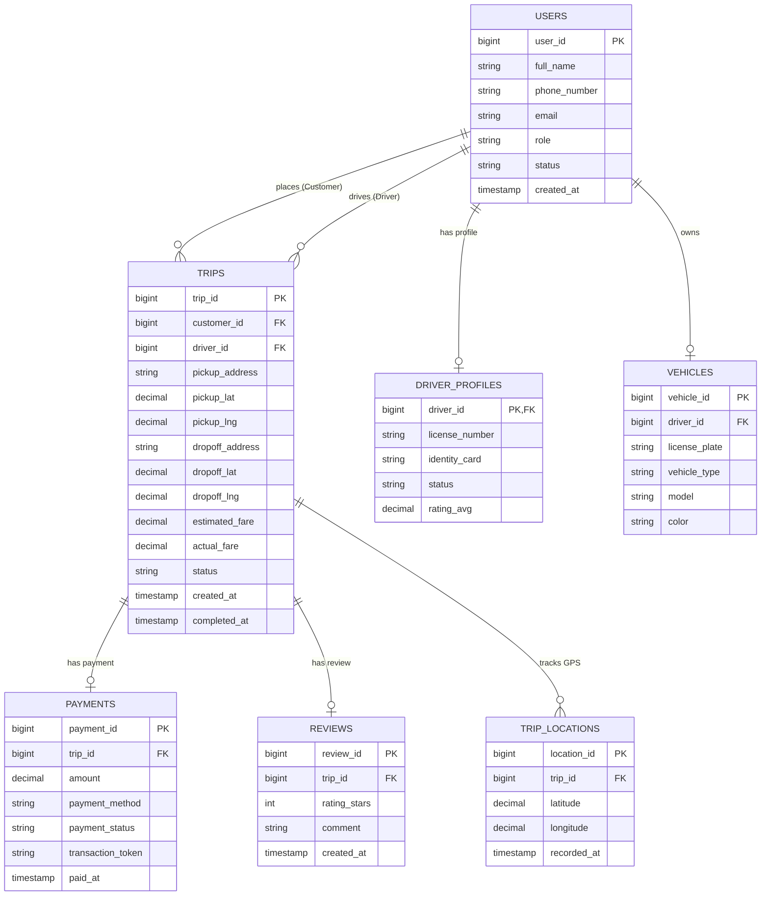
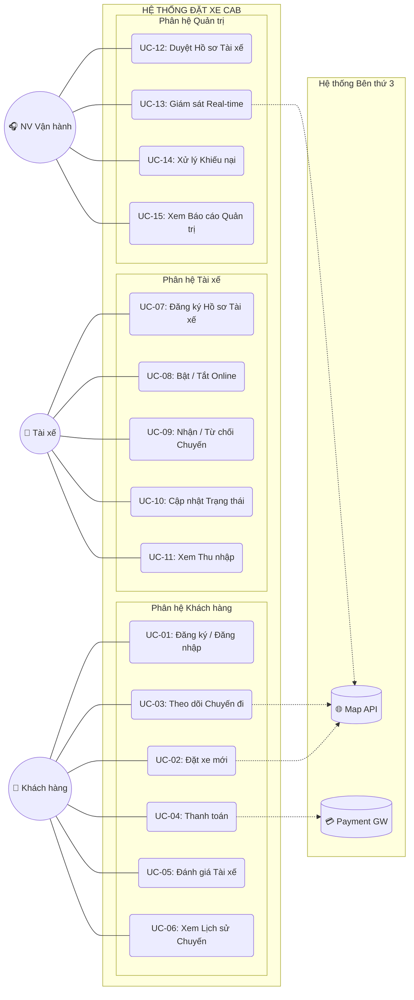
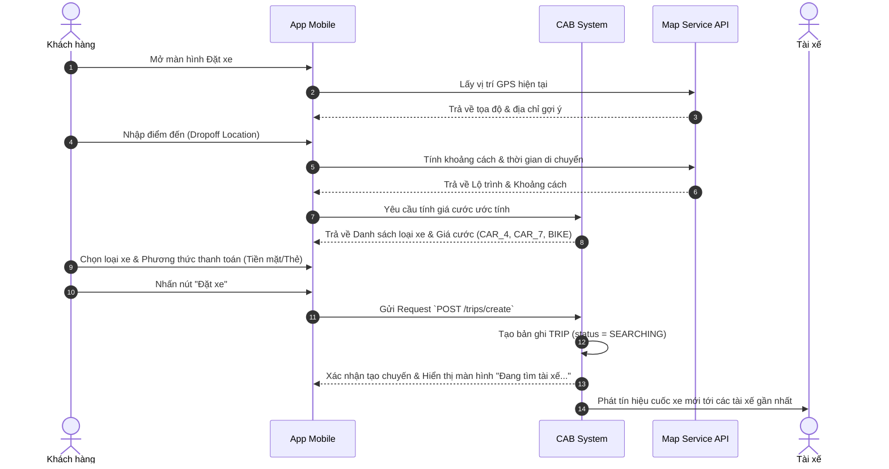

Bước 1: - đọc và phân tích yêu cầu: hiểu về bussiness contesxt và bussiness problem
        - trả lời câu hỏi: khách hàng muốn giải quyết vấn đề gì
        - vì sao k thể đáp ứng, ai sử dụng ht này,
        - giá trị sau khi tạo ra 
# BƯỚC 1: 
1. Bối cảnh Nghiệp vụ (Business Context)

Công ty ABC là doanh nghiệp cung cấp dịch vụ đặt xe trực tuyến đang phục vụ khách hàng qua hai kênh: tổng đài và một ứng dụng di động đơn giản. Doanh nghiệp đang đối mặt với sự gia tăng về quy mô nhưng hạ tầng vận hành hiện tại đã chạm ngưỡng giới hạn.

2. Vấn đề Nghiệp vụ (Business Problem) - Khách hàng muốn giải quyết vấn đề gì?

- Công ty ABC muốn giải quyết 4 nhóm vấn đề cốt lõi đang kìm hãm sự phát triển của họ:

- Sự phụ thuộc vào vận hành thủ công: Việc phân công tài xế chủ yếu làm bằng tay, tốn thời gian, dễ gây sai sót và không thể xử lý khi số lượng đơn hàng tăng cao.

- Trải nghiệm khách hàng kém (Lack of Visibility): Khách hàng hoàn toàn "mù thông tin" về tiến trình chuyến đi — không biết trạng thái tìm xe, không biết tài xế đang ở đâu, bao giờ tới và thiếu công cụ đánh giá chất lượng dịch vụ.

- Thanh toán phân tán, rủi ro: Chưa có hệ thống quản lý thanh toán tập trung, thiếu tích hợp thanh toán điện tử an toàn.

- Hạ tầng công nghệ đơn điểm (Single Point of Failure): Hệ thống cũ có kiến trúc đóng, các bộ phận dính liền nhau nên khi một chức năng gặp sự cố sẽ kéo theo toàn bộ hệ thống sập; đồng thời không thể mở rộng quy mô hay bổ sung dịch vụ mới.

3. Vì sao hệ thống hiện tại KHÔNG THỂ đáp ứng nhu cầu?

- Giới hạn về Khả năng Mở rộng (Scalability): Hệ thống cũ được thiết kế đơn giản, không áp dụng kiến trúc phân tán hay độc lập (microservices/modular). Khi tải tăng đột biến, hệ thống không thể tự nâng cấp quy mô từng phần.

- Thiếu Thuật toán Tự động hóa: Không có cơ chế tự động định vị (GPS) và thuật toán ghép chuyến thông minh (matching algorithm) để tự động tìm, điều phối và chuyển đổi tài xế liên tục khi có người từ chối.

- Không đáp ứng Yêu cầu Bảo mật Modern: Hệ thống chưa có cơ chế tích hợp an toàn với Cổng thanh toán bên ngoài (Payment Gateway) theo tiêu chuẩn bảo mật (như không lưu trữ dữ liệu thẻ trực tiếp).

- Thiếu Hạ tầng Dữ liệu & Báo cáo: Dữ liệu bị phân tán, không có công cụ tự động tổng hợp để đưa ra các báo cáo thời gian thực (real-time analytics) cho Ban quản trị.

4. Ai sẽ sử dụng hệ thống này (Actors / User Groups)?

Hệ thống CAB mới phục vụ 3 nhóm người dùng nội bộ/ngoại bộ và tương tác với 2 hệ thống bên ngoài:

- Khách hàng (Customer): Đăng ký/đăng nhập, đặt xe, theo dõi vị trí tài xế theo thời gian thực, thanh toán (tiền mặt/điện tử), xem lịch sử và đánh giá tài xế.

- Tài xế (Driver): Bật/tắt trạng thái sẵn sàng, nhận thông báo chuyến, chấp nhận/từ chối chuyến, cập nhật trạng thái chuyến đi (Đã đến, Đã đón, Hoàn thành), truyền dữ liệu vị trí GPS.

- Nhân viên Vận hành & Quản trị (Operator / Admin): Quản lý tài khoản, giám sát các chuyến đi thực tế, can thiệp xử lý sự cố/khiếu nại, cấu hình phân quyền và khai thác báo cáo doanh thu/hiệu suất.

- Hệ thống Bên ngoài (External Systems):

  + Cổng thanh toán (Payment Gateway): Xử lý giao dịch điện tử an toàn.

  + Dịch vụ thông báo (Notification Provider): Gửi tin nhắn SMS/Push Notification.

5. Giá trị mang lại sau khi hoàn thành dự án (Business Value)

- Tối ưu hóa Chi phí & Năng suất Vận hành: Tự động hóa hoàn toàn luồng ghép chuyến và điều phối giúp giảm thiểu nhân sự tổng đài, xử lý được gấp nhiều lần số lượng chuyến đi cùng lúc.

- Nâng cao Trải nghiệm & Giữ chân Khách hàng: Minh bạch thông tin chuyến đi (vị trí tài xế, thời gian dự kiến đến, giá cước) giúp tăng độ hài lòng và tỷ lệ quay lại của khách hàng.

- Đảm bảo Tính Liên tục của Kinh doanh (High Availability): Kiến trúc hệ thống mới cho phép mở rộng độc lập và cách ly lỗi — sự cố thanh toán hay thông báo không làm gián đoạn luồng đặt xe cốt lõi.

- Tạo Nền tảng Cho Tăng trưởng Lâu dài (Extensibility): Hệ thống linh hoạt dễ dàng mở rộng sang các loại hình dịch vụ mới (giao hàng, xe chung), thêm phương thức thanh toán hoặc đối tác thông báo mà không cần đập đi xây lại.

- Ra quyết định Dựa trên Dữ liệu (Data-Driven Decisions): Cung cấp hệ thống báo cáo chính xác về doanh thu, tỷ lệ hoàn thành/hủy chuyến, giúp Ban lãnh đạo điều chỉnh chiến lược kinh doanh kịp thời.
    
Bước 2: Xác định các stackeholders (các bên liên quan trong hệ thống): 
- Bảng danh sách: cột đầu tiên là stackeholders, cột 2 là vai trò
- Vẽ ma trận stackeholders metric (cho biết mức độ ảnh hưởng của các vai trò )

# BƯỚC 2: XÁC ĐỊNH VÀ PHÂN TÍCH CÁC BÊN LIÊN QUAN (STAKEHOLDERS)

---

### 1. Danh sách các Stakeholders và Vai trò

| Stakeholder (Bên liên quan) | Vai trò & Trách nhiệm chính trong Dự án/Hệ thống |
| :--- | :--- |
| **Ban Giám đốc / Ban Lãnh đạo (Sponsor / Executives)** | Định hướng chiến lược, phê duyệt ngân sách, đặt ra kỳ vọng phát triển dài hạn và đánh giá hiệu quả đầu tư (ROI) của dự án CAB System. |
| **Khách hàng (Customers / End-users)** | Người trực tiếp sử dụng ứng dụng để đặt xe, theo dõi chuyến đi, thực hiện thanh toán và đánh giá chất lượng dịch vụ. |
| **Tài xế (Drivers)** | Người tiếp nhận yêu cầu chuyến đi, thực hiện vận chuyển khách hàng, cập nhật vị trí GPS và trạng thái chuyến đi qua ứng dụng. |
| **Bộ phận Vận hành (Operations Team)** | Sử dụng giao diện quản trị (Admin Dashboard) để giám sát chuyến đi thời gian thực, điều phối thủ công khi có sự cố, quản lý tài khoản khách hàng/tài xế/phương tiện. |
| **Bộ phận Kế toán & Tài chính (Finance & Accounting)** | Quản lý doanh thu, đối soát giao dịch thanh toán điện tử/tiền mặt, xem các báo cáo tài chính và xử lý hoàn tiền nếu có sự cố. |
| **Bộ phận Chăm sóc Khách hàng (Customer Support)** | Tiếp nhận khiếu nại, hỗ trợ giải quyết sự cố phát sinh trong chuyến đi giữa khách hàng và tài xế. |
| **Business Analyst (BA) - Đội Dự án** | Làm rõ yêu cầu nghiệp vụ với khách hàng, xác định phạm vi, quy tắc nghiệp vụ, trường hợp ngoại lệ và truyền đạt cho đội phát triển. |
| **Đội ngũ Phát triển & Kiểm thử (Dev & QA Team)** | Thiết kế kiến trúc, lập trình, kiểm thử và triển khai hệ thống đáp ứng đúng yêu cầu chức năng và phi chức năng trong 7 tuần. |
| **Nhà cung cấp Cổng Thanh toán (Payment Gateway Provider)** | Đối tác bên ngoài cung cấp hạ tầng xử lý giao dịch điện tử an toàn (Tokenization, API thanh toán). |
| **Nhà cung cấp Dịch vụ Thông báo (Notification Provider)** | Đối tác bên ngoài cung cấp hạ tầng gửi tin nhắn SMS, OTP, Push Notification. |

---

### 2. Ma trận Stakeholder (Stakeholder Power/Interest Matrix)

```text
       Mức độ Ảnh hưởng (Power)
                 ▲
          CAO    │   [B] Quản lý chặt chẽ         │   [A] Hợp tác tối đa
                 │   (Keep Satisfied)             │   (Manage Closely)
                 │   - Bộ phận Kế toán & Tài chính│   - Ban Giám đốc (Sponsor)
                 │   - Nhà cung cấp Thanh toán    │   - Bộ phận Vận hành
                 │   - Nhà cung cấp Thông báo     │   - Đội ngũ Phát triển & QA
                 │                                │   - Business Analyst (BA)
                 ├────────────────────────────────┼───────────────────────────────
          THẤP   │   [C] Theo dõi tối thiểu       │   [D] Cung cấp thông tin
                 │   (Monitor)                    │   (Keep Informed)
                 │                                │   - Khách hàng (Customers)
                 │                                │   - Tài xế (Drivers)
                 │                                │   - Bộ phận Chăm sóc Khách hàng
                 └────────────────────────────────┴───────────────────────────────►
                                THẤP                            CAO
                                       Mức độ Quan tâm (Interest)

```

Bước 3: Xác định Business Goal
# BƯỚC 3: XÁC ĐỊNH MỤC TIÊU KINH DOANH (BUSINESS GOALS)

---

### Mục tiêu Tổng quát (Strategic Vision)

Xây dựng và triển khai thành công nền tảng **CAB System** trong vòng **7 tuần**, chuyển đổi từ mô hình vận hành thủ công sang hệ thống đặt xe tự động hóa hoàn toàn. Hệ thống mới đảm bảo khả năng mở rộng linh hoạt, hoạt động ổn định ở tải cao, bảo mật dữ liệu giao dịch và tạo tiền đề để doanh nghiệp phát triển thêm các dịch vụ mới trong tương lai.

---

### Danh sách Mục tiêu Kinh doanh

| STT | Mục tiêu Kinh doanh | Mô tả chi tiết |
|---|---|---|
| **1** | **Tự động hóa vận hành** | Tự động ghép chuyến cho tài xế và khách hàng dựa trên vị trí GPS, giảm 95% sự can thiệp thủ công từ tổng đài. |
| **2** | **Rút ngắn thời gian chờ xe** | Giảm thời gian tìm và kết nối tài xế xuống dưới 30 giây cho mỗi yêu cầu đặt xe. |
| **3** | **Minh bạch thông tin chuyến đi** | Giúp khách hàng nắm rõ vị trí tài xế, thời gian xe đến, giá cước và lịch sử chuyến đi theo thời gian thực. |
| **4** | **Đảm bảo hệ thống chạy liên tục** | Giữ cho hệ thống luôn hoạt động ổn định (đạt 99.5% uptime), không bị sập toàn bộ kể cả khi giao dịch tăng cao vào giờ cao điểm. |
| **5** | **An toàn thanh toán & Bảo mật** | Tích hợp thanh toán qua cổng thanh toán uy tín, bảo mật thông tin tài khoản và không lưu dữ liệu thẻ ngân hàng của khách hàng. |
| **6** | **Dễ dàng mở rộng tương lai** | Xây dựng kiến trúc linh hoạt để sau này có thể thêm loại dịch vụ mới (giao hàng, đi chung), thêm phương thức thanh toán mà không phải làm lại hệ thống. |


---


Bước 4: Xác định scope (phạm vi)
# BƯỚC 4: XÁC ĐỊNH PHẠM VI DỰ ÁN (PROJECT SCOPE)

### 1. Phạm vi Thực hiện Dự án (In-Scope - 7 Tuần)

| Hạng mục / Module | Phạm vi Chức năng Chi tiết (In-Scope) |
|---|---|
| **Quản lý Tài khoản & Hồ sơ** | - Đăng ký, đăng nhập, quản lý thông tin tài khoản cho Khách hàng, Tài xế và Nhân viên Vận hành.<br>- Cập nhật hồ sơ tài xế, thông tin phương tiện và trạng thái hoạt động.<br>- Cấu hình phân quyền truy cập quản trị theo vai trò. |
| **Đặt xe & Điều phối Ghép chuyến** | - Nhập điểm đón, điểm đến, chọn loại xe và gửi yêu cầu đặt xe.<br>- Thu thập vị trí GPS thời gian thực của tài xế.<br>- Tự động tìm và gợi ý tài xế phù hợp theo vị trí và trạng thái sẵn sàng.<br>- Xử lý tự động chuyển sang tài xế khác nếu tài xế được đề xuất từ chối hoặc không phản hồi.<br>- Thông báo rõ ràng cho khách hàng khi không tìm thấy tài xế. |
| **Cập nhật & Theo dõi Tiến trình** | - Cập nhật trạng thái chuyến đi (*Đã nhận chuyến, Đã đến điểm đón, Đã đón khách, Đang di chuyển, Hoàn thành*).<br>- Khách hàng theo dõi vị trí tài xế và trạng thái chuyến đi theo thời gian thực.<br>- Lưu trữ dữ liệu lịch sử vị trí GPS của tài xế. |
| **Tính cước & Thanh toán** | - Tự động tính cước dựa trên loại dịch vụ và thông tin chuyến đi.<br>- Hỗ trợ thanh toán bằng Tiền mặt.<br>- Tích hợp 01 Cổng thanh toán điện tử bên ngoài (Payment Gateway).<br>- Tuân thủ bảo mật: Không lưu trực tiếp thông tin thẻ/tài khoản ngân hàng nhạy cảm trên hệ thống CAB.<br>- Xử lý ngoại lệ khi thanh toán điện tử thất bại (thông báo và cho phép xử lý lại/chuyển tiền mặt). |
| **Hệ thống Thông báo (Notifications)** | - Gửi thông báo đa kênh (Push Notification / SMS) cho Khách hàng và Tài xế về các sự kiện chuyến đi và kết quả thanh toán.<br>- Kết nối với 01 Nhà cung cấp dịch vụ thông báo bên ngoài. |
| **Đánh giá & Lịch sử Chuyến đi** | - Khách hàng tra cứu lịch sử chuyến đi và số tiền đã thanh toán.<br>- Khách hàng thực hiện đánh giá tài xế sau khi hoàn thành chuyến đi. |
| **Quản trị & Báo cáo (Admin)** | - Giao diện Admin quản lý Khách hàng, Tài xế, Phương tiện và Chuyến đi.<br>- Giám sát các chuyến đi đang diễn ra và kiểm tra trạng thái tài xế thời gian thực.<br>- Hỗ trợ nhân viên can thiệp, xử lý sự cố chuyến đi và tra cứu lịch sử giao dịch.<br>- Báo cáo thống kê: Số lượng chuyến, doanh thu, tỷ lệ hoàn thành/hủy chuyến, hiệu quả hoạt động của tài xế. |

---

### 2. Định hướng Mở rộng Tương lai (Future Roadmap)

Nhằm đảm bảo mục tiêu **triển khai thành công trong 7 tuần**, hệ thống được thiết kế theo kiến trúc linh hoạt (Loosely Coupled) để sẵn sàng mở rộng các tính năng sau trong tương lai mà không phải xây dựng lại toàn bộ ứng dụng:

- **Bổ sung loại hình dịch vụ mới:** Mở rộng thêm dịch vụ giao hàng, xe đi chung, đặt xe đường dài.
- **Tích hợp thêm phương thức thanh toán:** Kết nối thêm các cổng thanh toán mới, ví điện tử (Momo, VNPay, ZaloPay).
- **Mở rộng kênh thông báo:** Thêm nhà cung cấp dịch vụ SMS/OTT mới để tối ưu chi phí vận hành.
- **Nâng cấp thuật toán ghép chuyến:** Cấu hình linh hoạt các tiêu chí ưu tiên tài xế và điều chỉnh thời gian phản hồi theo thời điểm.

Bước 5: Thiết kế Business Requirement
# BƯỚC 5: THIẾT KẾ YÊU CẦU NGHIỆP VỤ CHI TIẾT (BUSINESS REQUIREMENTS)

---

### 1. Danh sách Yêu cầu Chức năng (Functional Requirements - FR)

| Mã YC | Module | Tác nhân chính | Mô tả Chức năng Nghiệp vụ |
|---|---|---|---|
| **FR-01** | Quản lý Tài khoản | Khách hàng, Tài xế, Admin | Cho phép đăng ký, đăng nhập, cập nhật thông tin cá nhân. Tài xế bổ sung thông tin phương tiện, hồ sơ hành nghề. |
| **FR-02** | Quản lý Trạng thái | Tài xế | Cho phép tài xế chuyển đổi trạng thái Hoạt động/Sẵn sàng nhận chuyến hoặc Tạm ngưng làm việc. |
| **FR-03** | Đặt xe | Khách hàng | Khách hàng nhập điểm đón, điểm đến, chọn loại xe và gửi yêu cầu đặt xe lên hệ thống. |
| **FR-04** | Định vị GPS | Tài xế, Hệ thống | Hệ thống thu thập và lưu vết dữ liệu vị trí GPS của tài xế theo thời gian thực. |
| **FR-05** | Ghép chuyến Tự động | Hệ thống | Tự động tìm kiếm và ưu tiên đề xuất chuyến đi cho tài xế phù hợp dựa trên khoảng cách GPS và trạng thái sẵn sàng. |
| **FR-06** | Xử lý Bỏ qua/Từ chối | Hệ thống, Tài xế | Cho phép tài xế chấp nhận hoặc từ chối chuyến. Nếu tài xế từ chối/không phản hồi, hệ thống tự động chuyển sang tài xế tiếp theo mà khách không cần thao tác lại. |
| **FR-07** | Theo dõi Tiến trình | Khách hàng, Tài xế | Cập nhật và hiển thị trạng thái chuyến đi (*Đã nhận chuyến, Đã đến điểm đón, Đã đón khách, Đang di chuyển, Hoàn thành*). Khách hàng xem vị trí tài xế thực tế. |
| **FR-08** | Tính cước | Hệ thống | Tự động tính tổng tiền chuyến đi dựa trên loại dịch vụ và thông tin quãng đường sau khi hoàn thành chuyến. |
| **FR-09** | Thanh toán | Khách hàng, Hệ thống | Hỗ trợ thanh toán Tiền mặt hoặc Thanh toán điện tử (kết nối Cổng thanh toán bên ngoài). Cho phép xử lý lại nếu giao dịch thất bại. |
| **FR-10** | Hệ thống Thông báo | Khách hàng, Tài xế | Gửi thông báo đa kênh (Push Notification/SMS) cập nhật trạng thái chuyến đi, phân công chuyến mới và kết quả thanh toán. |
| **FR-11** | Đánh giá & Lịch sử | Khách hàng | Khách hàng xem lại lịch sử các chuyến đi, số tiền đã trả và gửi đánh giá (sao/nhận xét) cho tài xế. |
| **FR-12** | Quản trị & Báo cáo | Nhân viên Vận hành | Giao diện Admin giám sát chuyến đi thời gian thực, hỗ trợ can thiệp chuyến lỗi, phân quyền người dùng và xuất báo cáo doanh thu/tỷ lệ hoàn thành/hiệu suất tài xế. |

---

### 2. Quy tắc Nghiệp vụ Cốt lõi (Core Business Rules - BR)

| Mã Rule | Tên Quy tắc | Nội dung Quy tắc Nghiệp vụ |
|---|---|---|
| **BR-01** | Điều kiện Ghép chuyến | Chỉ đề xuất chuyến đi cho tài xế đang ở trạng thái "Sẵn sàng" và có vị trí GPS trong bán kính cho phép so với điểm đón của khách hàng. |
| **BR-02** | Bảo mật Thanh toán | Tuyệt đối **không lưu trữ** thông tin nhạy cảm của thẻ (Số thẻ, CVV, PIN) hay tài khoản ngân hàng trực tiếp trên hệ thống CAB. Chỉ lưu mã Token do Cổng thanh toán trả về. |
| **BR-03** | Khai thác Độc lập | Lỗi từ dịch vụ Thanh toán hoặc Thông báo **không được làm gián đoạn** luồng Đặt xe và Ghép chuyến cốt lõi của hệ thống. |
| **BR-04** | Kiểm soát Truy cập | Nhân viên vận hành chỉ được thực hiện các thao tác quản trị theo đúng phạm vi phân quyền đã được cấu hình. Mọi thao tác nhạy cảm phải ghi log kiểm vết (Audit Log). |

---

### 3. Danh sách Các điểm Chưa rõ Cần Xác nhận với Khách hàng (Open Questions)

Do doanh nghiệp chưa chốt toàn bộ chi tiết nghiệp vụ, Business Analyst cần làm rõ các câu hỏi sau trước khi chốt thiết kế chi tiết:

| STT | Vấn đề Cần Làm rõ | Đề xuất giải pháp từ BA / Lựa chọn |
|---|---|---|
| **1** | **Công thức Tính cước chi tiết** | - Áp dụng *Cước phí Cố định* theo khoảng cách hay *Cước phí Linh hoạt* (Giá mở cửa + Giá/km + Phụ phí giờ cao điểm/thời tiết)? |
| **2** | **Thời gian tài xế Phản hồi (Timeout)** | - Tài xế có bao nhiêu giây (ví dụ: 15s hay 30s) để bấm nhận chuyến trước khi hệ thống chuyển sang tài xế tiếp theo? |
| **3** | **Chính sách Hủy chuyến (Cancellation Policy)** | - Khách hàng/Tài xế có được hủy chuyến miễn phí không? Phí phạt hủy chuyến áp dụng khi nào (ví dụ: hủy sau 5 phút kể từ khi tài xế nhận chuyến)? |
| **4** | **Xử lý Mất kết nối Mạng (Offline Handling)** | - Ứng dụng xử lý như thế nào khi tài xế bị mất kết nối 3G/4G giữa chuyến đi? Hệ thống tạm lưu dữ liệu GPS локально hay xử lý ra sao? |
| **5** | **Thời hạn Lưu trữ Dữ liệu (Data Retention)** | - Dữ liệu lịch sử định vị GPS chi tiết của tài xế và lịch sử chuyến đi cần lưu trữ trong bao lâu (ví dụ: 6 tháng hay 1 năm) trước khi lưu trữ định danh/xóa bớt? |

Bước 6: Business Process
# BƯỚC 7: PHÂN RÃ YÊU CẦU CHỨC NĂNG (FUNCTIONAL REQUIREMENTS DECOMPOSITION)

---

### 1. Danh sách Phân rã Chức năng Chi tiết (Detailed Requirements Breakdown)

| Mã Module | Mã Chức năng | Chức năng Cấp cao (Epic/Feature) | Yêu cầu Chức năng Chi tiết (Sub-function / User Story) |
|---|---|---|---|
| **F-01** | **F-01.1** | Quản lý Tài khoản Khách hàng | - Đăng ký tài khoản mới bằng Số điện thoại/Email.<br>- Đăng nhập / Đăng xuất hệ thống.<br>- Cập nhật thông tin cá nhân (Họ tên, Avatar, Email). |
| | **F-01.2** | Quản lý Tài khoản & Hồ sơ Tài xế | - Đăng ký/Tạo tài khoản tài xế.<br>- Cập nhật hồ sơ cá nhân, Bằng lái xe, Giấy tờ xe.<br>- Cập nhật thông tin phương tiện (Biển số, Loại xe, Màu xe).<br>- Chuyển đổi trạng thái hoạt động (*Sẵn sàng nhận chuyến / Tạm ngưng*). |
| | **F-01.3** | Quản lý Người dùng Admin | - Quản lý danh sách nhân viên vận hành.<br>- Cấu hình phân quyền truy cập theo vai trò (Role-based Access Control). |
| **F-02** | **F-02.1** | Yêu cầu Đặt xe | - Khách chọn Điểm đón, Điểm đến trên bản đồ hoặc nhập địa chỉ.<br>- Khách chọn Loại dịch vụ / Loại xe (Xe 4 chỗ, Xe 7 chỗ,...).<br>- Xem cước phí dự kiến và khoảng cách/thời gian di chuyển dự kiến. |
| | **F-02.2** | Quản lý Định vị & GPS | - Thu thập tọa độ GPS của tài xế theo chu kỳ định sẵn.<br>- Cập nhật vị trí tài xế thực tế lên bản đồ hệ thống. |
| **F-02** | **F-02.3** | Thuật toán Ghép chuyến | - Lọc danh sách tài xế ở trạng thái "Sẵn sàng" trong bán kính quét.<br>- Tính toán khoảng cách và ưu tiên tài xế phù hợp nhất (gần nhất).<br>- Gửi thông báo mời nhận chuyến đến tài xế được chọn. |
| | **F-02.4** | Xử lý Vòng lặp Tìm xe | - Cho phép tài xế Bấm Chấp nhận hoặc Từ chối chuyến đi.<br>- Đếm ngược thời gian phản hồi (Timeout counter).<br>- Tự động chuyển yêu cầu sang tài xế tiếp theo nếu tài xế trước Từ chối/Timeout.<br>- Thông báo lỗi cho Khách hàng khi đã quét hết tài xế mà không có người nhận. |
| **F-03** | **F-03.1** | Cập nhật Tiến trình Chuyến đi | - Tài xế bấm *"Đã đến điểm đón"*.<br>- Tài xế bấm *"Đã đón khách"* (Bắt đầu di chuyển).<br>- Tài xế bấm *"Hoàn thành chuyến đi"* khi tới điểm đến. |
| | **F-03.2** | Theo dõi Hành trình Thời gian thực | - Khách hàng xem vị trí tài xế đang di chuyển tới điểm đón trên bản đồ.<br>- Khách hàng xem vị trí xe trên lộ trình di chuyển thực tế. |
| **F-04** | **F-04.1** | Tính cước Chuyến đi | - Tự động tính cước chốt sổ dựa trên quãng đường thực tế và bảng giá dịch vụ.<br>- Áp dụng các phụ phí/thuế nếu có theo cấu hình nghiệp vụ. |
| | **F-04.2** | Xử lý Thanh toán | - Xử lý xác nhận thanh toán bằng Tiền mặt trực tiếp cho tài xế.<br>- Tích hợp API Cổng thanh toán điện tử (Payment Gateway) bên ngoài.<br>- Gửi thông tin giao dịch an toàn dạng Tokenization (không lưu dữ liệu thẻ). |
| | **F-04.3** | Xử lý Ngoại lệ Thanh toán | - Ghi nhận trạng thái Giao dịch Thất bại.<br>- Gửi thông báo lỗi cho khách hàng và gợi ý chọn lại phương thức (Tiền mặt/Thử lại thanh toán điện tử). |
| **F-05** | **F-05.1** | Thông báo Khách hàng | - Gửi Push Notification / SMS khi: *Yêu cầu được tiếp nhận, Có tài xế nhận chuyến, Tài xế đã đến, Chuyến đi hoàn thành, Kết quả thanh toán*. |
| | **F-05.2** | Thông báo Tài xế | - Gửi Push Notification khi: *Có chuyến đi mới cần nhận, Khách hàng hủy chuyến, Thay đổi thông tin chuyến đi*. |
| **F-06** | **F-06.1** | Tra cứu Lịch sử | - Khách hàng tra cứu danh sách các chuyến đi đã thực hiện, chi tiết cước phí và hóa đơn.<br>- Tài xế xem lịch sử các chuyến đã chạy và tổng thu nhập theo ngày/thần suất. |
| | **F-06.2** | Đánh giá & Phản hồi | - Khách hàng chấm điểm Tài xế (1 - 5 sao).<br>- Khách hàng nhập nội dung đánh giá / góp ý về chuyến đi. |
| **F-07** | **F-07.1** | Giám sát & Điều hành (Live Dashboard) | - Xem danh sách chuyến đi đang diễn ra trên hệ thống theo thời gian thực.<br>- Kiểm tra vị trí và trạng thái hoạt động của từng tài xế trên bản đồ Admin. |
| | **F-07.2** | Hỗ trợ & Can thiệp Sự cố | - Tra cứu thông tin chi tiết chuyến đi khi có khiếu nại.<br>- Hỗ trợ hủy chuyến hoặc điều chỉnh thông tin trong các trường hợp sự cố đặc biệt. |
| | **F-07.3** | Báo cáo Thống kê (Analytics) | - Báo cáo tổng số lượng chuyến đi (Thành công, Hủy, Không tìm thấy xe).<br>- Báo cáo tổng doanh thu theo ngày/tần suất/loại dịch vụ.<br>- Báo cáo tỷ lệ hoàn thành chuyến và chỉ số hiệu quả (KPIs) của tài xế. |

---

### 2. Ma trận Phụ thuộc giữa các Chức năng (Dependency Matrix)

Bảng này mô tả mối liên hệ và thứ tự ưu tiên phụ thuộc giữa các phân rã chức năng để hỗ trợ Lập trình viên triển khai theo tiến độ:

| Chức năng (Feature) | Chức năng Phụ thuộc (Prerequisite Features) | Lý do Phụ thuộc |
|---|---|---|
| **F-02.1 (Đặt xe)** | F-01.1 (Tài khoản Khách) | Phải đăng nhập tài khoản trước khi tạo đơn đặt xe. |
| **F-02.3 (Ghép chuyến)** | F-02.2 (Định vị GPS), F-01.2 (Hồ sơ Tài xế) | Cần có dữ liệu vị trí GPS và trạng thái "Sẵn sàng" của tài xế để thuật toán ghép chuyến quét dữ liệu. |
| **F-03.1 (Cập nhật Tiến trình)** | F-02.4 (Chấp nhận chuyến) | Tài xế phải nhận chuyến thành công trước khi có thể cập nhật các trạng thái chuyến đi. |
| **F-04.1 (Tính cước)** | F-03.1 (Hoàn thành chuyến) | Cần có tín hiệu hoàn thành chuyến đi để chốt quãng đường và tính cước thực tế. |
| **F-04.2 (Thanh toán)** | F-04.1 (Tính cước) | Phải có số tiền cước chính xác trước khi gửi yêu cầu trừ tiền qua Cổng thanh toán. |
| **F-06.2 (Đánh giá)** | F-04.2 (Thanh toán xong) | Khách hàng chỉ đánh giá tài xế sau khi hoàn tất chuyến đi và thanh toán thành công. |


Bước 8: Business rules and Exceptions (Những nguyên tắc nghiệp vụ và ngoại lệ)
# BƯỚC 8: NGUYÊN TẮC NGHIỆP VỤ VÀ XỬ LÝ NGOẠI LỆ (BUSINESS RULES & EXCEPTIONS)

---

### 1. Danh sách Nguyên tắc Nghiệp vụ Cốt lõi (Core Business Rules)

| Mã Rule | Nhóm Nghiệp vụ | Nguyên tắc Nghiệp vụ Chi tiết (Business Rule) |
|---|---|---|
| **BR-01** | Điều phối & Ghép chuyến | - Hệ thống chỉ đề xuất chuyến đi cho tài xế ở trạng thái **"Sẵn sàng"** và có vị trí GPS trong bán kính quy định (ví dụ: tối đa 5km) so với điểm đón của khách hàng.<br>- Mỗi tài xế tại một thời điểm chỉ được phép nhận **01 chuyến đi duy nhất** (không hỗ trợ nhận ghép trùng chuyến). |
| **BR-02** | Phản hồi từ Tài xế | - Tài xế có tối đa **15 giây** để bấm "Chấp nhận" hoặc "Từ chối" kể từ khi nhận được thông báo đề xuất chuyến đi.<br>- Nếu quá 15 giây không phản hồi, hệ thống tự động đánh giá là tài xế bỏ qua chuyến và chuyển sang tài xế tiếp theo. |
| **BR-03** | Tính cước & Khuyến mãi | - Tổng tiền cước chuyến đi bao gồm: *Cước phí cơ bản + (Đơn giá/km × Quãng đường) + Phụ phí (nếu có)*.<br>- Cước phí tạm tính được khóa chốt tại thời điểm đặt xe, trừ trường hợp khách hàng yêu cầu đổi điểm đến mid-trip. |
| **BR-04** | An toàn & Bảo mật Thanh toán | - **Không lưu trữ** trực tiếp thông tin thẻ ngân hàng/CVV/PIN của khách hàng trên cơ sở dữ liệu hệ thống CAB. Chỉ lưu mã Token do Cổng thanh toán cấp phép.<br>- Mọi giao dịch thanh toán điện tử phải thông qua nhà cung cấp Payment Gateway uy tín. |
| **BR-05** | Hủy chuyến đi | - Khách hàng được phép **Hủy chuyến miễn phí** trong vòng **03 phút** kể từ khi tài xế nhận chuyến.<br>- Nếu hủy sau 03 phút hoặc khi tài xế đã đến điểm đón (`ARRIVED`), hệ thống ghi nhận vi phạm chính sách (hoặc áp dụng phí hủy chuyến theo cấu hình). |
| **BR-06** | Độc lập Chức năng (Decoupling) | - Lỗi gián đoạn từ các đối tác bên ngoài (như Cổng thanh toán, Nhà cung cấp SMS) **không được làm ảnh hưởng** đến luồng Đặt xe và Ghép chuyến cốt lõi của hệ thống. |

---

### 2. Quản lý các Trường hợp Ngoại lệ (Exception Handling)

| Mã Ngoại lệ | Trường hợp Ngoại lệ (Exception Scenario) | Tác động Hệ thống | Quy trình Xử lý Ngoại lệ (Resolution Flow) |
|---|---|---|---|
| **EX-01** | **Tài xế bỏ qua / Từ chối nhận chuyến** | Chuyến đi chưa có người tiếp nhận. | 1. Hệ thống tự động ghi nhận tài xế trước từ chối.<br>2. Tìm kiếm và chuyển yêu cầu mời chuyến đến tài xế phù hợp tiếp theo trong danh sách.<br>3. Khách hàng không cần thao tác lại. |
| **EX-02** | **Không tìm thấy tài xế khả dụng (No Driver Found)** | Hết danh sách tài xế quét hoặc không có ai ở trạng thái "Sẵn sàng". | 1. Hệ thống dừng vòng lặp tìm kiếm sau số lần quét quy định.<br>2. Chuyển trạng thái chuyến đi sang `UNMATCHED`.<br>3. Hiển thị thông báo thân thiện cho khách: *"Hiện chưa tìm thấy tài xế, vui lòng thử lại sau"*. |
| **EX-03** | **Thanh toán Điện tử thất bại** | Giao dịch qua Payment Gateway báo lỗi (thẻ hết hạn, không đủ số dư, timeout ngân hàng). | 1. Hệ thống ghi nhận trạng thái thanh toán thất bại.<br>2. Gửi thông báo sự cố cho Khách hàng và Tài xế.<br>3. Cho phép Khách hàng chọn: **Thử lại thanh toán điện tử** hoặc **Chuyển sang trả Tiền mặt**. |
| **EX-04** | **Tài xế / Khách hàng Hủy chuyến giữa chừng** | Chuyến đi bị chấm dứt trước khi hoàn thành (`CANCELLED`). | 1. Cập nhật trạng thái chuyến đi thành `CANCELLED`.<br>2. Giải phóng trạng thái tài xế về lại "Sẵn sàng".<br>3. Ghi nhận lý do hủy chuyến vào hệ thống để bộ phận Chăm sóc khách hàng (CS) tra cứu khi có khiếu nại. |
| **EX-05** | **Mất kết nối GPS / Mạng di động (3G/4G)** | Thiết bị của tài xế bị rớt mạng hoặc mất tín hiệu định vị khi đang chạy chuyến. | 1. Ứng dụng mobile của tài xế tạm thời lưu dữ liệu tọa độ GPS local trên thiết bị.<br>2. Khi có mạng trở lại, ứng dụng tự động đồng bộ (sync) dữ liệu hành trình lên hệ thống central. |
| **EX-06** | **Đối tác Cổng thanh toán / SMS bị ngắt kết nối (API Down)** | Không thể gửi OTP/SMS hoặc không gọi được API thanh toán. | 1. Hệ thống kích hoạt chế độ fallback / cảnh báo log lỗi.<br>2. Chuyển hướng thanh toán mặc định sang Tiền mặt.<br>3. Duy trì luồng đặt xe cốt lõi hoạt động bình thường. |

---

### 3. Ma trận Quyền Can thiệp Nghiệp vụ (Admin Interventions)

Dành cho Nhân viên Vận hành (Operations Team) xử lý các tình huống ngoại lệ đặc biệt trên Admin Dashboard:

- **Can thiệp Hủy chuyến khẩn cấp:** Cho phép Admin bấm hủy chuyến và giải phóng tài xế khi nhận được cuộc gọi báo sự cố (tai nạn, hỏng xe).
- **Điều chỉnh Tiền cước thủ công:** Cho phép Bộ phận CS/Kế toán điều chỉnh cước phí hoặc hoàn tiền cho khách hàng nếu tài xế đi sai lộ trình nghiêm trọng.
- **Khóa tài khoản Tạm thời:** Tự động hoặc thủ công khóa trạng thái nhận chuyến của tài xế nếu tỷ lệ hủy chuyến/bỏ chuyến vượt quá mức cho phép trong ngày.

Bước 9: Mô hình hoá dữ liệu (Data modeling)
# BƯỚC 9: MÔ HÌNH HÓA DỮ LIỆU (DATA MODELING)

---

### 1. Sơ đồ Thực thể - Mối quan hệ (Entity Relationship Diagram - ERD)


Bước 10: Xác định Non-Functional Requirement
# BƯỚC 10: XÁC ĐỊNH YÊU CẦU PHI CHỨC NĂNG (NON-FUNCTIONAL REQUIREMENTS)

---

### 1. Hiệu năng & Thời gian Phản hồi (Performance & Response Time)

| Mã YC | Hạng mục | Tiêu chuẩn Kỹ thuật / Chỉ số Đo lường (KPI) |
|---|---|---|
| **NFR-01** | **Thời gian Phản hồi API** | - 95% các yêu cầu tìm xe, đặt xe và cập nhật trạng thái phải trả về kết quả dưới **2 giây**.<br>- Các thao tác tra cứu tĩnh (như xem lịch sử chuyến đi) phản hồi dưới **1 giây**. |
| **NFR-02** | **Cập nhật Vị trí GPS** | Định vị GPS của tài xế được đồng bộ lên hệ thống central theo chu kỳ **3 - 5 giây/lần** khi tài xế đang ở trạng thái `ONLINE` hoặc `IN_TRIP`. |
| **NFR-03** | **Khả năng Tải (Throughput)** | Hệ thống đáp ứng xử lý tối thiểu **100 giao dịch đặt xe/giây (TPS)** và đảm bảo tải cho ít nhất **1,000 tài xế hoạt động đồng thời** mà không bị nghẽn mạng. |

---

### 2. Độ tin cậy & Tính Khả dụng (Reliability & Availability)

| Mã YC | Hạng mục | Tiêu chuẩn Kỹ thuật / Chỉ số Đo lường (KPI) |
|---|---|---|
| **NFR-04** | **Tính Sẵn sàng (Uptime)** | Hệ thống đạt chỉ số sẵn sàng tối thiểu **99.5% Uptime** (thời gian gián đoạn tối đa không quá 3.6 giờ/tháng). |
| **NFR-05** | **Khả năng Phục hồi (Disaster Recovery)** | - **RPO (Recovery Point Objective):** Dữ liệu chuyến đi và giao dịch không bị mất quá **1 phút** khi có sự cố hạ tầng nghiêm trọng.<br>- **RTO (Recovery Time Objective):** Khôi phục hoạt động hệ thống trong vòng **30 phút**. |
| **NFR-06** | **Chịu lỗi Độc lập (Fault Tolerance)** | Khi các dịch vụ bên thứ 3 (Cổng thanh toán, SMS) bị lỗi kết nối, tính năng Đặt xe & Ghép chuyến cốt lõi **vẫn phải hoạt động bình thường**. |

---

### 3. An toàn & Bảo mật Dữ liệu (Security & Data Protection)

| Mã YC | Hạng mục | Tiêu chuẩn Kỹ thuật / Chỉ số Đo lường (KPI) |
|---|---|---|
| **NFR-07** | **Mã hóa Dữ liệu** | - Tất cả kết nối API giữa Mobile App/Web với Server phải mã hóa qua **HTTPS (TLS 1.2/1.3)**.<br>- Mật khẩu và thông tin định danh nhạy cảm phải được mã hóa 1 chiều bằng thuật toán an toàn (ví dụ: `BCrypt` hoặc `Argon2`). |
| **NFR-08** | **Tuân thủ Bảo mật Thẻ (PCI-DSS)** | Tuyệt đối **không lưu trữ** thông tin nhạy cảm của thẻ (Số thẻ, ngày hết hạn, CVV/CVC) trên cơ sở dữ liệu CAB. Mọi giao dịch qua thẻ dùng kỹ thuật Tokenization từ Payment Gateway. |
| **NFR-09** | **Phân quyền & Nhật ký (Audit Log)** | - Áp dụng mô hình phân quyền theo vai trò (RBAC - Role-Based Access Control) cho Nhân viên Vận hành.<br>- Ghi log toàn bộ các thao tác chỉnh sửa dữ liệu hoặc can thiệp chuyến đi của Admin để phục vụ kiểm vết. |

---

### 4. Khả năng Mở rộng & Bảo trì (Scalability & Maintainability)

| Mã YC | Hạng mục | Tiêu chuẩn Kỹ thuật / Chỉ số Đo lường (KPI) |
|---|---|---|
| **NFR-10** | **Kiến trúc Linh hoạt (Decoupled Architecture)** | Xây dựng hệ thống theo mô hình dịch vụ độc lập (Microservices hoặc Modular Monolith) để dễ dàng tích hợp thêm loại xe, ví điện tử mới mà không làm ảnh hưởng đến mã nguồn hiện tại. |
| **NFR-11** | **Khả năng Tự động Mở rộng (Auto-scaling)** | Hạ tầng Cloud/Server hỗ trợ tự động nâng dung lượng tính toán (Horizontal Scaling) khi lưu lượng truy cập tăng vọt đột biến vào các khung giờ cao điểm. |

---

### 5. Khả năng Sử dụng (Usability & Compatibility)

| Mã YC | Hạng mục | Tiêu chuẩn Kỹ thuật / Chỉ số Đo lường (KPI) |
|---|---|---|
| **NFR-12** | **Giao diện Người dùng (UI/UX)** | - Thiết kế tối giản, cho phép Khách hàng thực hiện thao tác đặt xe thành công trong **không quá 3 bước** chạm.<br>- Giao diện ứng dụng tài xế hiển thị nút nhận chuyến to, rõ ràng, dễ thao tác an toàn khi đang lái xe. |
| **NFR-13** | **Tương thích Thiết bị** | - Ứng dụng di động hoạt động tốt trên cả 2 hệ điều hành: **Android (từ phiên bản 8.0 trở lên)** và **iOS (từ phiên bản 13.0 trở lên)**.<br>- Trang Admin tương thích tốt trên các trình duyệt hiện đại (Chrome, Safari, Edge). |

Bước 11: Vẽ usecase(UC)
# BƯỚC 11: SƠ ĐỒ USE CASE TỔNG QUAN (USE CASE DIAGRAM)

---

### Sơ đồ Use Case Tổng quan Hệ thống (System Use Case Diagram)


Bước 12: Tạo đặc tả usecase
# BƯỚC 12: ĐẶC TẢ USE CASE CHI TIẾT (USE CASE SPECIFICATION)

---

## ĐẶC TẢ USE CASE: UC-02 - ĐẶT XE MỚI (BOOK A TRIP)

### 1. Thông tin Tổng quan (Overview Information)

| Thuộc tính | Giá trị / Mô tả |
|---|---|
| **Mã Use Case (ID)** | **UC-02** |
| **Tên Use Case** | Đặt xe mới (Book a New Trip) |
| **Tác nhân chính (Primary Actor)** | Khách hàng (Customer) |
| **Tác nhân phụ (Secondary Actors)** | Tài xế (Driver), Dịch vụ Bản đồ (Map API), Cổng Thanh toán (Payment Gateway) |
| **Mô tả Tóm tắt** | Cho phép Khách hàng chọn điểm đón/trả, xem giá cước tạm tính, chọn phương thức thanh toán và gửi yêu cầu tìm tài xế gần nhất. |
| **Mức độ Ưu tiên** | High (Cốt lõi) |

---

### 2. Điều kiện Tiên quyết & Điều kiện Sau (Pre & Post Conditions)

*   **Điều kiện Tiên quyết (Preconditions):**
    1. Khách hàng đã đăng nhập thành công vào ứng dụng mobile.
    2. Thiết bị đã bật dịch vụ vị trí (GPS) và có kết nối Internet.
    3. Tài khoản Khách hàng ở trạng thái `ACTIVE` (không bị khóa).
*   **Điều kiện Sau (Postconditions):**
    1. Mới một bản ghi Chuyến đi (`TRIP`) được tạo trên cơ sở dữ liệu với trạng thái `SEARCHING`.
    2. Thông báo tìm xe được gửi tới các Tài xế phù hợp xung quanh bán kính điểm đón.

---

### 3. Luồng Sự kiện Chính (Main Success Scenario / Happy Path)


Bước 13: Acceptance criteria (Tiêu chí chấp nhận AC)
# BƯỚC 13: TIÊU CHÍ CHẤP NHẬN (ACCEPTANCE CRITERIA - AC)

---

## 1. AC Cho UC-01: Đăng nhập bằng Số điện thoại & OTP

### **AC-01.1: Gửi mã OTP thành công**
* **Given (Giả sử):** Khách hàng đang ở màn hình Đăng nhập và chưa nhận mã OTP.
* **When (Khi):** Khách hàng nhập số điện thoại hợp lệ (ví dụ: `0912345678`) và nhấn nút "Gửi mã OTP".
* **Then (Thì):** 
  * Hệ thống gửi mã OTP 6 chữ số qua SMS trong vòng 10 giây.
  * Màn hình chuyển sang giao diện nhập OTP với đếm ngược thời gian (60 giây).
  * Nút "Gửi lại mã" bị vô hiệu hóa trong thời gian đếm ngược.

### **AC-01.2: Nhập sai mã OTP quá số lần quy định**
* **Given:** Khách hàng đang ở màn hình Nhập OTP.
* **When:** Khách hàng nhập sai mã OTP 5 lần liên tiếp.
* **Then:**
  * Hệ thống khóa tính năng gửi/nhập OTP của số điện thoại đó trong **15 phút**.
  * Hiển thị thông báo lỗi: *"Bạn đã nhập sai quá 5 lần. Vui lòng thử lại sau 15 phút."*

---

## 2. AC Cho UC-02: Đặt xe mới (Book a Trip)

### **AC-02.1: Hiển thị đúng thông tin cước và thời gian dự kiến**
* **Given:** Khách hàng đã chọn điểm đón và điểm đến hợp lệ trên bản đồ.
* **When:** Hệ thống tính toán xong lộ trình.
* **Then:**
  * Hiển thị danh sách các loại xe (Xe 4 chỗ, Xe 7 chỗ, Xe máy).
  * Mỗi loại xe phải hiển thị đầy đủ: Giá cước ước tính (VND), Thời gian tài xế dự kiến đến đón (phút), và Khoảng cách di chuyển (km).

### **AC-02.2: Áp dụng Mã giảm giá (Promo Code) thành công**
* **Given:** Khách hàng đang ở màn hình Xác nhận đặt xe với chuyến đi có giá gốc `100.000 VND`.
* **When:** Khách hàng nhập mã giảm giá `CAB20` (Giảm 20%, tối đa 30.000 VND) và nhấn "Áp dụng".
* **Then:**
  * Giá cước hiển thị cập nhật thành `80.000 VND`.
  * Hiển thị dòng chi tiết: *"Đã giảm: -20.000 VND"*.

### **AC-02.3: Xử lý Hết thời gian tìm xe (Search Timeout)**
* **Given:** Khách hàng đã nhấn nút "Đặt xe" và hệ thống chuyển sang trạng thái `SEARCHING`.
* **When:** Sau **60 giây** mà không có tài xế nào nhận chuyến.
* **Then:**
  * Trạng thái chuyến đi tự động chuyển thành `UNMATCHED`.
  * Hiển thị Popup: *"Rất tiếc, hiện chưa tìm thấy tài xế gần bạn"* kèm 2 nút chọn: **[Thử lại]** và **[Hủy đặt xe]**.

---

## 3. AC Cho UC-09: Nhận / Từ chối Chuyến đi (Dành cho Tài xế)

### **AC-09.1: Nhận cuộc xe thành công**
* **Given:** Tài xế đang ở trạng thái `ONLINE` và màn hình nổ cuốc phát âm thanh thông báo.
* **When:** Tài xế nhấn nút **"Chấp nhận"** trong vòng **15 giây**.
* **Then:**
  * Chuyến đi chuyển sang trạng thái `ACCEPTED`.
  * Màn hình tài xế chuyển sang giao diện điều hướng dẫn đường tới điểm đón Khách hàng.
  * Khách hàng nhận được thông báo: *"Tài xế [Tên] đang đến đón bạn"*.

### **AC-09.2: Bỏ qua / Quá thời gian nhận chuyến (Timeout)**
* **Given:** Màn hình phát cuốc xe mới đang hiển thị trên ứng dụng Tài xế.
* **When:** Tài xế nhấn nút "Từ chối" HOẶC không thao tác gì sau **15 giây**.
* **Then:**
  * Cuốc xe tự động đóng lại trên màn hình tài xế đó.
  * Hệ thống chuyển tín hiệu mời chuyến sang tài xế thích hợp tiếp theo trong khu vực.
  * Ghi nhận 1 lần "Bỏ qua cuốc" vào chỉ số hiệu suất của tài xế.

---

## 4. AC Cho UC-04: Thanh toán Chuyến đi (Payment)

### **AC-04.1: Thanh toán qua Ví / Thẻ thất bại do không đủ dư**
* **Given:** Chuyến đi hoàn thành với số tiền `150.000 VND` và phương thức thanh toán là `Thẻ liên kết / Ví`.
* **When:** Hệ thống tự động trừ tiền nhưng tài khoản thẻ/ví không đủ số dư.
* **Then:**
  * Hệ thống thông báo thanh toán thất bại cho Khách hàng.
  * Trạng thái thanh toán của chuyến đi đổi thành `PENDING_PAYMENT`.
  * Yêu cầu Khách hàng chuyển sang phương thức **Thanh toán Tiền mặt** hoặc chọn Thẻ khác để tiếp tục.

---

## 5. Bảng Tiêu chí Chấp nhận Phi chức năng (Non-Functional AC Checklist)

| Mã AC | Hạng mục | Tiêu chí chấp nhận (Criteria) |
|:---:|---|---|
| **AC-NFR-01** | **Thao tác Real-time** | Độ trễ cập nhật vị trí GPS của Tài xế trên màn hình Khách hàng không quá **3 giây**. |
| **AC-NFR-02** | **Hiệu năng (Performance)** | Thời gian phản hồi API tính cước và lộ trình phải nhỏ hơn **1.5 giây** trong điều kiện bình thường. |
| **AC-NFR-03** | **An toàn bảo mật** | Tất cả thông tin thanh toán thẻ phải được mã hóa theo chuẩn **PCI-DSS**. |
| **AC-NFR-04** | **Độ tin cậy (Reliability)** | Hệ thống gửi thông báo Push Notification tìm xe đạt tỷ lệ thành công tối thiểu **99%**. |

Bước 14: Truy xuất nguồn gốc yêu cầu (REQUIREMENTS TRACEABILITY MATRIX - RTM)
# BƯỚC 14: MA TRẬN TRUY XUẤT NGUỒN GỐC YÊU CẦU (REQUIREMENTS TRACEABILITY MATRIX - RTM)

---

## 1. Giới thiệu Ma trận Truy xuất Nguồn gốc (RTM)

Ma trận truy xuất nguồn gốc yêu cầu (RTM) được sử dụng để liên kết các yêu cầu từ góc độ người dùng (**User Requirements - UR**) đến các yêu cầu chức năng (**Functional Requirements - FR**), các trường hợp sử dụng (**Use Cases - UC**), tiêu chí chấp nhận (**Acceptance Criteria - AC**) và các kịch bản kiểm thử (**Test Cases - TC**).

### Mục tiêu chính:
* **Đảm bảo tính đầy đủ (Coverage):** 100% yêu cầu người dùng đều được thiết kế thành Use Case và có kịch bản kiểm thử tương ứng.
* **Kiểm soát phạm vi (Scope Control):** Tránh hiện tượng "Gold Plating" (phát triển các tính năng không có trong yêu cầu kinh doanh).
* **Quản lý thay đổi (Impact Analysis):** Khi có thay đổi từ phía Khách hàng (UR), dễ dàng khoanh vùng các UC, AC và TC cần cập nhật.

---

## 2. Mô hình Truy xuất (Traceability Model)
Tóm tắt tài liệu Yêu cầu Khách hàng (BRD) cho Dự án Hệ thống CAB System:

Thông tin Dự án

Tên dự án: Nền tảng đặt xe trực tuyến (CAB System).

Thời gian thực hiện: 7 tuần (Xây dựng & Triển khai).

Mục tiêu chính: Thay thế quy trình thủ công hiện tại bằng nền tảng có khả năng mở rộng, tự động hóa ghép chuyến, quản lý tập trung và vận hành ổn định.

Các Tác nhân Hệ thống (Actors)

Khách hàng (Customer): Đặt xe, theo dõi chuyến đi, thanh toán, xem lịch sử và đánh giá tài xế.

Tài xế (Driver): Cập nhật hồ sơ/phương tiện, bật/tắt trạng thái sẵn sàng, nhận/từ chối chuyến, cập nhật tiến trình chuyến đi.

Nhân viên Vận hành (Operator/Admin): Quản lý tài khoản, hỗ trợ sự cố chuyến đi, tra cứu lịch sử, cấu hình phân quyền và xem báo cáo dashboard.

Hệ thống Bên ngoài (External Systems): Cổng thanh toán (Payment Gateway), Dịch vụ thông báo (SMS/Push Notification Gateway).

Yêu cầu Chức năng (Functional Requirements)

Quản lý Tài khoản & Hồ sơ:

Đăng ký, đăng nhập, xác thực người dùng (Khách hàng, Tài xế, Nhân viên).

Quản lý hồ sơ cá nhân, thông tin phương tiện (tài xế) và phân quyền quản trị.

Quản lý Chuyến đi & Điều phối (Core Flow):

Đặt xe: Khách chọn điểm đón/đến, loại dịch vụ và gửi yêu cầu.

Định vị & Ghép chuyến: Thu thập vị trí tài xế theo thời gian thực; tự động tìm và gợi ý tài xế phù hợp theo thuật toán ưu tiên (khoảng cách, trạng thái).

Xử lý vòng lặp tìm tài xế: Tự động chuyển tài xế tiếp theo nếu tài xế trước từ chối/không phản hồi mà không bắt khách hàng thao tác lại. Thông báo rõ nếu không tìm thấy xe.

Cập nhật tiến trình: Đổi trạng thái chuyến đi (Đã nhận chuyến → Đã đến điểm đón → Đã đón khách → Đang di chuyển → Hoàn thành).

Tính cước & Thanh toán:

Tự động tính cước dựa trên loại xe, khoảng cách và thông tin chuyến đi.

Hỗ trợ thanh toán Tiền mặt và Thanh toán điện tử (qua Cổng thanh toán bên ngoài).

Xử lý ngoại lệ khi giao dịch điện tử thất bại (cho phép thử lại/chuyển hình thức).

Hệ thống Thông báo (Notification):

Gửi thông báo đa kênh (đặt xe thành công, tài xế nhận chuyến, tài xế đến, hoàn thành, kết quả thanh toán) tới khách hàng và tài xế.

Quản trị & Báo cáo (Admin & Analytics):

Theo dõi danh sách chuyến đi thực tế (Live tracking), hỗ trợ can thiệp khi lỗi.

Báo cáo doanh thu, số lượng chuyến, tỷ lệ hoàn thành/hủy chuyến, hiệu suất tài xế.

Yêu cầu Phi chức năng & Kiến trúc (Non-Functional Requirements)

Tiêu chí	Chi tiết yêu cầu
Kiến trúc & Linh hoạt	Thiết kế dạng module độc lập (Loosely coupled / Microservices) để dễ dàng thêm loại dịch vụ, phương thức thanh toán, nhà cung cấp thông báo mới mà không ảnh hưởng toàn hệ thống.
Độ tin cậy & Độ sẵn sàng	Lỗi ở module Thanh toán hoặc Thông báo không được làm ngưng trệ luồng Đặt xe chính. Các thành phần có khả năng mở rộng (Scale) độc lập.
Bảo mật (Security)	Mã hóa dữ liệu nhạy cảm, vị trí và giao dịch; tuân thủ quy định không lưu trực tiếp thông tin thẻ/tài khoản ngân hàng trên hệ thống CAB (dùng Tokenization của cổng thanh toán).
Ghi vết (Logging/Audit)	Lưu vết lịch sử thao tác (Audit logs) toàn hệ thống để phục vụ tra cứu sự cố.


Nhiệm vụ của Business Analyst (Cần làm rõ trước khi phát triển)

Quy tắc Nghiệp vụ (Business Rules):

Công thức tính cước chi tiết (giá mở cửa, giá theo km, phụ phí khung giờ).

Tiêu chí chi tiết để ưu tiên tài xế và thời gian chờ tài xế phản hồi (Timeout).

Chính sách hủy chuyến (phí hủy chuyến áp dụng cho khách/tài xế).

Trường hợp Ngoại lệ (Exceptions):

Cơ chế xử lý khi ứng dụng mất kết nối mạng (Offline handling) giữa chuyến đi.

Quy định thời gian lưu trữ dữ liệu lịch sử chuyến đi và thông tin vị trí.


Bạn đã nói
Bước 1: đọc và phân tích yêu cầu: hiểuu về bussiness contesxt và bussiness problem
trả lời câu hỏi: khách hàng muốn giải quyết vấn đề gì
vì sao k thể đáp ứng, ai sử dụng ht này,
giá trị sau khi tạo ra 


Gemini đã nói
1. Bối cảnh Nghiệp vụ (Business Context)

Công ty ABC là doanh nghiệp cung cấp dịch vụ đặt xe trực tuyến đang phục vụ khách hàng qua hai kênh: tổng đài và một ứng dụng di động đơn giản. Doanh nghiệp đang đối mặt với sự gia tăng về quy mô nhưng hạ tầng vận hành hiện tại đã chạm ngưỡng giới hạn.

2. Vấn đề Nghiệp vụ (Business Problem) - Khách hàng muốn giải quyết vấn đề gì?

Công ty ABC muốn giải quyết 4 nhóm vấn đề cốt lõi đang kìm hãm sự phát triển của họ:

Sự phụ thuộc vào vận hành thủ công: Việc phân công tài xế chủ yếu làm bằng tay, tốn thời gian, dễ gây sai sót và không thể xử lý khi số lượng đơn hàng tăng cao.

Trải nghiệm khách hàng kém (Lack of Visibility): Khách hàng hoàn toàn "mù thông tin" về tiến trình chuyến đi — không biết trạng thái tìm xe, không biết tài xế đang ở đâu, bao giờ tới và thiếu công cụ đánh giá chất lượng dịch vụ.

Thanh toán phân tán, rủi ro: Chưa có hệ thống quản lý thanh toán tập trung, thiếu tích hợp thanh toán điện tử an toàn.

Hạ tầng công nghệ đơn điểm (Single Point of Failure): Hệ thống cũ có kiến trúc đóng, các bộ phận dính liền nhau nên khi một chức năng gặp sự cố sẽ kéo theo toàn bộ hệ thống sập; đồng thời không thể mở rộng quy mô hay bổ sung dịch vụ mới.

3. Vì sao hệ thống hiện tại KHÔNG THỂ đáp ứng nhu cầu?

Giới hạn về Khả năng Mở rộng (Scalability): Hệ thống cũ được thiết kế đơn giản, không áp dụng kiến trúc phân tán hay độc lập (microservices/modular). Khi tải tăng đột biến, hệ thống không thể tự nâng cấp quy mô từng phần.

Thiếu Thuật toán Tự động hóa: Không có cơ chế tự động định vị (GPS) và thuật toán ghép chuyến thông minh (matching algorithm) để tự động tìm, điều phối và chuyển đổi tài xế liên tục khi có người từ chối.

Không đáp ứng Yêu cầu Bảo mật Modern: Hệ thống chưa có cơ chế tích hợp an toàn với Cổng thanh toán bên ngoài (Payment Gateway) theo tiêu chuẩn bảo mật (như không lưu trữ dữ liệu thẻ trực tiếp).

Thiếu Hạ tầng Dữ liệu & Báo cáo: Dữ liệu bị phân tán, không có công cụ tự động tổng hợp để đưa ra các báo cáo thời gian thực (real-time analytics) cho Ban quản trị.

4. Ai sẽ sử dụng hệ thống này (Actors / User Groups)?

Hệ thống CAB mới phục vụ 3 nhóm người dùng nội bộ/ngoại bộ và tương tác với 2 hệ thống bên ngoài:

Khách hàng (Customer): Đăng ký/đăng nhập, đặt xe, theo dõi vị trí tài xế theo thời gian thực, thanh toán (tiền mặt/điện tử), xem lịch sử và đánh giá tài xế.

Tài xế (Driver): Bật/tắt trạng thái sẵn sàng, nhận thông báo chuyến, chấp nhận/từ chối chuyến, cập nhật trạng thái chuyến đi (Đã đến, Đã đón, Hoàn thành), truyền dữ liệu vị trí GPS.

Nhân viên Vận hành & Quản trị (Operator / Admin): Quản lý tài khoản, giám sát các chuyến đi thực tế, can thiệp xử lý sự cố/khiếu nại, cấu hình phân quyền và khai thác báo cáo doanh thu/hiệu suất.

Hệ thống Bên ngoài (External Systems):

Cổng thanh toán (Payment Gateway): Xử lý giao dịch điện tử an toàn.

Dịch vụ thông báo (Notification Provider): Gửi tin nhắn SMS/Push Notification.

5. Giá trị mang lại sau khi hoàn thành dự án (Business Value)

Tối ưu hóa Chi phí & Năng suất Vận hành: Tự động hóa hoàn toàn luồng ghép chuyến và điều phối giúp giảm thiểu nhân sự tổng đài, xử lý được gấp nhiều lần số lượng chuyến đi cùng lúc.

Nâng cao Trải nghiệm & Giữ chân Khách hàng: Minh bạch thông tin chuyến đi (vị trí tài xế, thời gian dự kiến đến, giá cước) giúp tăng độ hài lòng và tỷ lệ quay lại của khách hàng.

Đảm bảo Tính Liên tục của Kinh doanh (High Availability): Kiến trúc hệ thống mới cho phép mở rộng độc lập và cách ly lỗi — sự cố thanh toán hay thông báo không làm gián đoạn luồng đặt xe cốt lõi.

Tạo Nền tảng Cho Tăng trưởng Lâu dài (Extensibility): Hệ thống linh hoạt dễ dàng mở rộng sang các loại hình dịch vụ mới (giao hàng, xe chung), thêm phương thức thanh toán hoặc đối tác thông báo mà không cần đập đi xây lại.

Ra quyết định Dựa trên Dữ liệu (Data-Driven Decisions): Cung cấp hệ thống báo cáo chính xác về doanh thu, tỷ lệ hoàn thành/hủy chuyến, giúp Ban lãnh đạo điều chỉnh chiến lược kinh doanh kịp thời.


Bạn đã nói
Bước 2: Xác định các stackholder (các bên liên quan trong hệ thống): 
- Bảng danh sách: cột đầu tiên là stackholder, cột 2 là vai trò
- Vẽ ma trận stackholder metric (cho biết mức độ ảnh hưởng của các vai trò )
CHI TIẾT BƯỚC 2


Gemini đã nói
BƯỚC 2: XÁC ĐỊNH VÀ PHÂN TÍCH CÁC BÊN LIÊN QUAN (STAKEHOLDERS)

1. Danh sách các Stakeholders và Vai trò

Stakeholder (Bên liên quan)	Vai trò & Trách nhiệm chính trong Dự án/Hệ thống
Ban Giám đốc / Ban Lãnh đạo (Sponsor / Executives)	Định hướng chiến lược, phê duyệt ngân sách, đặt ra kỳ vọng phát triển dài hạn và đánh giá hiệu quả đầu tư (ROI) của dự án CAB System.
Khách hàng (Customers / End-users)	Người trực tiếp sử dụng ứng dụng để đặt xe, theo dõi chuyến đi, thực hiện thanh toán và đánh giá chất lượng dịch vụ.
Tài xế (Drivers)	Người tiếp nhận yêu cầu chuyến đi, thực hiện vận chuyển khách hàng, cập nhật vị trí GPS và trạng thái chuyến đi qua ứng dụng.
Bộ phận Vận hành (Operations Team)	Sử dụng giao diện quản trị (Admin Dashboard) để giám sát chuyến đi thời gian thực, điều phối thủ công khi có sự cố, quản lý tài khoản khách hàng/tài xế/phương tiện.
Bộ phận Kế toán & Tài chính (Finance & Accounting)	Quản lý doanh thu, đối soát giao dịch thanh toán điện tử/tiền mặt, xem các báo cáo tài chính và xử lý hoàn tiền nếu có sự cố.
Bộ phận Chăm sóc Khách hàng (Customer Support)	Tiếp nhận khiếu nại, hỗ trợ giải quyết sự cố phát sinh trong chuyến đi giữa khách hàng và tài xế.
Business Analyst (BA) - Đội Dự án	Làm rõ yêu cầu nghiệp vụ với khách hàng, xác định phạm vi, quy tắc nghiệp vụ, trường hợp ngoại lệ và truyền đạt cho đội phát triển.
Đội ngũ Phát triển & Kiểm thử (Dev & QA Team)	Thiết kế kiến trúc, lập trình, kiểm thử và triển khai hệ thống đáp ứng đúng yêu cầu chức năng và phi chức năng trong 7 tuần.
Nhà cung cấp Cổng Thanh toán (Payment Gateway Provider)	Đối tác bên ngoài cung cấp hạ tầng xử lý giao dịch điện tử an toàn (Tokenization, API thanh toán).
Nhà cung cấp Dịch vụ Thông báo (Notification Provider)	Đối tác bên ngoài cung cấp hạ tầng gửi tin nhắn SMS, OTP, Push Notification.


2. Ma trận Mức độ Ảnh hưởng & Quan tâm (Stakeholder Power/Interest Grid)

Ma trận này giúp Business Analyst phân loại và đưa ra chiến lược quản lý, giao tiếp phù hợp với từng bên liên quan dựa trên Quyền lực/Mức độ ảnh hưởng (Power) và Mức độ quan tâm (Interest) tới dự án.

       Mức độ Ảnh hưởng (Power)
                 ▲
          CAO    │   [B] Quản lý chặt chẽ         │   [A] Hợp tác tối đa
                 │   (Keep Satisfied)             │   (Manage Closely)
                 │   - Bộ phận Kế toán & Tài chính│   - Ban Giám đốc (Sponsor)
                 │   - Nhà cung cấp Thanh toán    │   - Bộ phận Vận hành
                 │   - Nhà cung cấp Thông báo     │   - Đội ngũ Phát triển & QA
                 │                                │   - Business Analyst (BA)
                 ├────────────────────────────────┼───────────────────────────────
          THẤP   │   [C] Theo dõi tối thiểu       │   [D] Cung cấp thông tin
                 │   (Monitor)                    │   (Keep Informed)
                 │                                │   - Khách hàng (Customers)
                 │                                │   - Tài xế (Drivers)
                 │                                │   - Bộ phận Chăm sóc Khách hàng
                 └────────────────────────────────┴───────────────────────────────►
                                THẤP                            CAO
                                       Mức độ Quan tâm (Interest)
Giải thích chi tiết chiến lược quản lý theo ma trận:

Nhóm A: Hợp tác tối đa (High Power - High Interest)

Thành viên: Ban Giám đốc, Bộ phận Vận hành, Đội Dev/QA, BA.

Chiến lược: Báo cáo tiến độ định kỳ (hàng tuần trong khung 7 tuần), làm việc sát sao để chốt sớm các quy tắc nghiệp vụ còn thiếu (cách tính cước, tiêu chí ưu tiên tài xế, timeout).

Nhóm B: Quản lý chặt chẽ / Giữ hài lòng (High Power - Low Interest)

Thành viên: Bộ phận Kế toán & Tài chính, Các Nhà cung cấp Cổng thanh toán & Thông báo (External Integration).

Chiến lược: Tham vấn kĩ về quy trình đối soát dữ liệu tài chính và tiêu chuẩn bảo mật (không lưu dữ liệu thẻ). Đảm bảo giao tiếp kĩ thuật API với đối tác bên ngoài để tránh nghẽn tiến độ.

Nhóm C: Theo dõi tối thiểu (Low Power - Low Interest)

Thành viên: Không có đối tượng nổi bật ở nhóm này do dự án có quy mô tập trung.

Nhóm D: Cung cấp thông tin thường xuyên (Low Power - High Interest)

Thành viên: Khách hàng, Tài xế, Bộ phận Chăm sóc Khách hàng.

Chiến lược: Thu thập trải nghiệm người dùng (UX/UI), khảo sát nhu cầu tính năng (định vị thời gian thực, minh bạch giá cước) và đào tạo/hướng dẫn sử dụng khi chuẩn bị ra mắt hệ thống.


Bạn đã nói
định dạng để copy vào GitHub ra được bảng


Gemini đã nói
Dưới đây là định dạng Markdown chuẩn của Bước 2. Bạn chỉ cần bấm vào nút Copy (hoặc sao chép toàn bộ ô mã bên dưới) và dán trực tiếp vào GitHub (Issue, PR, README hoặc Wiki), hệ thống sẽ tự động hiển thị thành bảng và sơ đồ ma trận đẹp mắt.

Markdown


# BƯỚC 2: XÁC ĐỊNH VÀ PHÂN TÍCH CÁC BÊN LIÊN QUAN (STAKEHOLDERS)

---

### 1. Danh sách các Stakeholders và Vai trò

| Stakeholder (Bên liên quan) | Vai trò & Trách nhiệm chính trong Dự án/Hệ thống |
| :--- | :--- |
| **Ban Giám đốc / Ban Lãnh đạo (Sponsor / Executives)** | Định hướng chiến lược, phê duyệt ngân sách, đặt ra kỳ vọng phát triển dài hạn và đánh giá hiệu quả đầu tư (ROI) của dự án CAB System. |
| **Khách hàng (Customers / End-users)** | Người trực tiếp sử dụng ứng dụng để đặt xe, theo dõi chuyến đi, thực hiện thanh toán và đánh giá chất lượng dịch vụ. |
| **Tài xế (Drivers)** | Người tiếp nhận yêu cầu chuyến đi, thực hiện vận chuyển khách hàng, cập nhật vị trí GPS và trạng thái chuyến đi qua ứng dụng. |
| **Bộ phận Vận hành (Operations Team)** | Sử dụng giao diện quản trị (Admin Dashboard) để giám sát chuyến đi thời gian thực, điều phối thủ công khi có sự cố, quản lý tài khoản khách hàng/tài xế/phương tiện. |
| **Bộ phận Kế toán & Tài chính (Finance & Accounting)** | Quản lý doanh thu, đối soát giao dịch thanh toán điện tử/tiền mặt, xem các báo cáo tài chính và xử lý hoàn tiền nếu có sự cố. |
| **Bộ phận Chăm sóc Khách hàng (Customer Support)** | Tiếp nhận khiếu nại, hỗ trợ giải quyết sự cố phát sinh trong chuyến đi giữa khách hàng và tài xế. |
| **Business Analyst (BA) - Đội Dự án** | Làm rõ yêu cầu nghiệp vụ với khách hàng, xác định phạm vi, quy tắc nghiệp vụ, trường hợp ngoại lệ và truyền đạt cho đội phát triển. |
| **Đội ngũ Phát triển & Kiểm thử (Dev & QA Team)** | Thiết kế kiến trúc, lập trình, kiểm thử và triển khai hệ thống đáp ứng đúng yêu cầu chức năng và phi chức năng trong 7 tuần. |
| **Nhà cung cấp Cổng Thanh toán (Payment Gateway Provider)** | Đối tác bên ngoài cung cấp hạ tầng xử lý giao dịch điện tử an toàn (Tokenization, API thanh toán). |
| **Nhà cung cấp Dịch vụ Thông báo (Notification Provider)** | Đối tác bên ngoài cung cấp hạ tầng gửi tin nhắn SMS, OTP, Push Notification. |

---

### 2. Ma trận Stakeholder (Stakeholder Power/Interest Matrix)

```text
       Mức độ Ảnh hưởng (Power)
                 ▲
          CAO    │   [B] Quản lý chặt chẽ         │   [A] Hợp tác tối đa
                 │   (Keep Satisfied)             │   (Manage Closely)
                 │   - Bộ phận Kế toán & Tài chính│   - Ban Giám đốc (Sponsor)
                 │   - Nhà cung cấp Thanh toán    │   - Bộ phận Vận hành
                 │   - Nhà cung cấp Thông báo     │   - Đội ngũ Phát triển & QA
                 │                                │   - Business Analyst (BA)
                 ├────────────────────────────────┼───────────────────────────────
          THẤP   │   [C] Theo dõi tối thiểu       │   [D] Cung cấp thông tin
                 │   (Monitor)                    │   (Keep Informed)
                 │                                │   - Khách hàng (Customers)
                 │                                │   - Tài xế (Drivers)
                 │                                │   - Bộ phận Chăm sóc Khách hàng
                 └────────────────────────────────┴───────────────────────────────►
                                THẤP                            CAO
                                       Mức độ Quan tâm (Interest)
Chi tiết chiến lược quản lý Stakeholders:

[A] Hợp tác tối đa (High Power - High Interest):

Đối tượng: Ban Giám đốc, Bộ phận Vận hành, Đội Dev/QA, BA.

Chiến lược: Báo cáo tiến độ định kỳ (hàng tuần trong khung 7 tuần), làm việc sát sao để chốt sớm các quy tắc nghiệp vụ còn thiếu (cách tính cước, tiêu chí ưu tiên tài xế, timeout).

[B] Quản lý chặt chẽ / Giữ hài lòng (High Power - Low Interest):

Đối tượng: Bộ phận Kế toán & Tài chính, Các Nhà cung cấp Cổng thanh toán & Thông báo.

Chiến lược: Tham vấn kỹ về quy trình đối soát dữ liệu tài chính và tiêu chuẩn bảo mật (không lưu dữ liệu thẻ). Đảm bảo giao tiếp kỹ thuật API với đối tác bên ngoài để tránh nghẽn tiến độ.

[C] Theo dõi tối thiểu (Low Power - Low Interest):

Đối tượng: Không có nhóm đối tượng nổi bật.

[D] Cung cấp thông tin thường xuyên (Low Power - High Interest):

Đối tượng: Khách hàng, Tài xế, Bộ phận Chăm sóc Khách hàng.

Chiến lược: Thu thập trải nghiệm người dùng (UX/UI), khảo sát nhu cầu tính năng (định vị thời gian thực, minh bạch giá cước) và đào tạo/hướng dẫn sử dụng khi chuẩn bị ra mắt hệ thống.


Bạn đã nói
copy ko ra định dạng bảng


Gemini đã nói
Dưới đây là mã Markdown chuẩn nguyên bản. Khi bạn nhấn nút "Copy" ở góc trên của ô mã bên dưới và dán (Paste) vào Markdown editor của GitHub (như Issue, Pull Request, file README.md hay GitHub Wiki), nó sẽ tự động render thành bảng và ma trận hiển thị rất đẹp.

Markdown


# BƯỚC 2: XÁC ĐỊNH VÀ PHÂN TÍCH CÁC BÊN LIÊN QUAN (STAKEHOLDERS)

---

### 1. Danh sách các Stakeholders và Vai trò

| Stakeholder (Bên liên quan) | Vai trò & Trách nhiệm chính trong Dự án/Hệ thống |
| :--- | :--- |
| **Ban Giám đốc / Ban Lãnh đạo (Sponsor / Executives)** | Định hướng chiến lược, phê duyệt ngân sách, đặt ra kỳ vọng phát triển dài hạn và đánh giá hiệu quả đầu tư (ROI) của dự án CAB System. |
| **Khách hàng (Customers / End-users)** | Người trực tiếp sử dụng ứng dụng để đặt xe, theo dõi chuyến đi, thực hiện thanh toán và đánh giá chất lượng dịch vụ. |
| **Tài xế (Drivers)** | Người tiếp nhận yêu cầu chuyến đi, thực hiện vận chuyển khách hàng, cập nhật vị trí GPS và trạng thái chuyến đi qua ứng dụng. |
| **Bộ phận Vận hành (Operations Team)** | Sử dụng giao diện quản trị (Admin Dashboard) để giám sát chuyến đi thời gian thực, điều phối thủ công khi có sự cố, quản lý tài khoản khách hàng/tài xế/phương tiện. |
| **Bộ phận Kế toán & Tài chính (Finance & Accounting)** | Quản lý doanh thu, đối soát giao dịch thanh toán điện tử/tiền mặt, xem các báo cáo tài chính và xử lý hoàn tiền nếu có sự cố. |
| **Bộ phận Chăm sóc Khách hàng (Customer Support)** | Tiếp nhận khiếu nại, hỗ trợ giải quyết sự cố phát sinh trong chuyến đi giữa khách hàng và tài xế. |
| **Business Analyst (BA) - Đội Dự án** | Làm rõ yêu cầu nghiệp vụ với khách hàng, xác định phạm vi, quy tắc nghiệp vụ, trường hợp ngoại lệ và truyền đạt cho đội phát triển. |
| **Đội ngũ Phát triển & Kiểm thử (Dev & QA Team)** | Thiết kế kiến trúc, lập trình, kiểm thử và triển khai hệ thống đáp ứng đúng yêu cầu chức năng và phi chức năng trong 7 tuần. |
| **Nhà cung cấp Cổng Thanh toán (Payment Gateway Provider)** | Đối tác bên ngoài cung cấp hạ tầng xử lý giao dịch điện tử an toàn (Tokenization, API thanh toán). |
| **Nhà cung cấp Dịch vụ Thông báo (Notification Provider)** | Đối tác bên ngoài cung cấp hạ tầng gửi tin nhắn SMS, OTP, Push Notification. |

---

### 2. Ma trận Stakeholder (Stakeholder Power/Interest Matrix)

```text
       Mức độ Ảnh hưởng (Power)
                 ▲
          CAO    │   [B] Quản lý chặt chẽ         │   [A] Hợp tác tối đa
                 │   (Keep Satisfied)             │   (Manage Closely)
                 │   - Bộ phận Kế toán & Tài chính│   - Ban Giám đốc (Sponsor)
                 │   - Nhà cung cấp Thanh toán    │   - Bộ phận Vận hành
                 │   - Nhà cung cấp Thông báo     │   - Đội ngũ Phát triển & QA
                 │                                │   - Business Analyst (BA)
                 ├────────────────────────────────┼───────────────────────────────
          THẤP   │   [C] Theo dõi tối thiểu       │   [D] Cung cấp thông tin
                 │   (Monitor)                    │   (Keep Informed)
                 │                                │   - Khách hàng (Customers)
                 │                                │   - Tài xế (Drivers)
                 │                                │   - Bộ phận Chăm sóc Khách hàng
                 └────────────────────────────────┴───────────────────────────────►
                                THẤP                            CAO
                                       Mức độ Quan tâm (Interest)
Chi tiết chiến lược quản lý Stakeholders:

[A] Hợp tác tối đa (High Power - High Interest):

Đối tượng: Ban Giám đốc, Bộ phận Vận hành, Đội Dev/QA, BA.

Chiến lược: Báo cáo tiến độ định kỳ (hàng tuần trong khung 7 tuần), làm việc sát sao để chốt sớm các quy tắc nghiệp vụ còn thiếu (cách tính cước, tiêu chí ưu tiên tài xế, timeout).

[B] Quản lý chặt chẽ / Giữ hài lòng (High Power - Low Interest):

Đối tượng: Bộ phận Kế toán & Tài chính, Các Nhà cung cấp Cổng thanh toán & Thông báo.

Chiến lược: Tham vấn kỹ về quy trình đối soát dữ liệu tài chính và tiêu chuẩn bảo mật (không lưu dữ liệu thẻ). Đảm bảo giao tiếp kỹ thuật API với đối tác bên ngoài để tránh nghẽn tiến độ.

[C] Theo dõi tối thiểu (Low Power - Low Interest):

Đối tượng: Không có nhóm đối tượng nổi bật.

[D] Cung cấp thông tin thường xuyên (Low Power - High Interest):

Đối tượng: Khách hàng, Tài xế, Bộ phận Chăm sóc Khách hàng.

Chiến lược: Thu thập trải nghiệm người dùng (UX/UI), khảo sát nhu cầu tính năng (định vị thời gian thực, minh bạch giá cước) và đào tạo/hướng dẫn sử dụng khi chuẩn bị ra mắt hệ thống.


Bạn đã nói
chỗ danh sách ko định dạng được


Gemini đã nói
Nếu bạn dán vào GitHub mà bảng không hiển thị (bị dính chùm văn bản), đó là do GitHub yêu cầu khoảng trống hàng (empty line) giữa các dòng văn bản và bảng.

Dưới đây là đoạn văn bản thô (plain text). Bạn hãy Copy nội dung bên dưới và dán vào GitHub, bảng sẽ tự động render chuẩn xác:

BƯỚC 2: XÁC ĐỊNH VÀ PHÂN TÍCH CÁC BÊN LIÊN QUAN (STAKEHOLDERS)

1. Danh sách các Stakeholders và Vai trò

Stakeholder (Bên liên quan)	Vai trò & Trách nhiệm chính trong Dự án/Hệ thống
Ban Giám đốc / Ban Lãnh đạo (Sponsor / Executives)	Định hướng chiến lược, phê duyệt ngân sách, đặt ra kỳ vọng phát triển dài hạn và đánh giá hiệu quả đầu tư (ROI) của dự án CAB System.
Khách hàng (Customers / End-users)	Người trực tiếp sử dụng ứng dụng để đặt xe, theo dõi chuyến đi, thực hiện thanh toán và đánh giá chất lượng dịch vụ.
Tài xế (Drivers)	Người tiếp nhận yêu cầu chuyến đi, thực hiện vận chuyển khách hàng, cập nhật vị trí GPS và trạng thái chuyến đi qua ứng dụng.
Bộ phận Vận hành (Operations Team)	Sử dụng giao diện quản trị (Admin Dashboard) để giám sát chuyến đi thời gian thực, điều phối thủ công khi có sự cố, quản lý tài khoản khách hàng/tài xế/phương tiện.
Bộ phận Kế toán & Tài chính (Finance & Accounting)	Quản lý doanh thu, đối soát giao dịch thanh toán điện tử/tiền mặt, xem các báo cáo tài chính và xử lý hoàn tiền nếu có sự cố.
Bộ phận Chăm sóc Khách hàng (Customer Support)	Tiếp nhận khiếu nại, hỗ trợ giải quyết sự cố phát sinh trong chuyến đi giữa khách hàng và tài xế.
Business Analyst (BA) - Đội Dự án	Làm rõ yêu cầu nghiệp vụ với khách hàng, xác định phạm vi, quy tắc nghiệp vụ, trường hợp ngoại lệ và truyền đạt cho đội phát triển.
Đội ngũ Phát triển & Kiểm thử (Dev & QA Team)	Thiết kế kiến trúc, lập trình, kiểm thử và triển khai hệ thống đáp ứng đúng yêu cầu chức năng và phi chức năng trong 7 tuần.
Nhà cung cấp Cổng Thanh toán (Payment Gateway Provider)	Đối tác bên ngoài cung cấp hạ tầng xử lý giao dịch điện tử an toàn (Tokenization, API thanh toán).
Nhà cung cấp Dịch vụ Thông báo (Notification Provider)	Đối tác bên ngoài cung cấp hạ tầng gửi tin nhắn SMS, OTP, Push Notification.


2. Ma trận Stakeholder (Stakeholder Power/Interest Matrix)

Plaintext


       Mức độ Ảnh hưởng (Power)
                 ▲
          CAO    │   [B] Quản lý chặt chẽ         │   [A] Hợp tác tối đa
                 │   (Keep Satisfied)             │   (Manage Closely)
                 │   - Bộ phận Kế toán & Tài chính│   - Ban Giám đốc (Sponsor)
                 │   - Nhà cung cấp Thanh toán    │   - Bộ phận Vận hành
                 │   - Nhà cung cấp Thông báo     │   - Đội ngũ Phát triển & QA
                 │                                │   - Business Analyst (BA)
                 ├────────────────────────────────┼───────────────────────────────
          THẤP   │   [C] Theo dõi tối thiểu       │   [D] Cung cấp thông tin
                 │   (Monitor)                    │   (Keep Informed)
                 │                                │   - Khách hàng (Customers)
                 │                                │   - Tài xế (Drivers)
                 │                                │   - Bộ phận Chăm sóc Khách hàng
                 └────────────────────────────────┴───────────────────────────────►
                                THẤP                            CAO
                                       Mức độ Quan tâm (Interest)
Chi tiết chiến lược quản lý Stakeholders:

[A] Hợp tác tối đa (High Power - High Interest):

Đối tượng: Ban Giám đốc, Bộ phận Vận hành, Đội Dev/QA, BA.

Chiến lược: Báo cáo tiến độ định kỳ (hàng tuần trong khung 7 tuần), làm việc sát sao để chốt sớm các quy tắc nghiệp vụ còn thiếu (cách tính cước, tiêu chí ưu tiên tài xế, timeout).

[B] Quản lý chặt chẽ / Giữ hài lòng (High Power - Low Interest):

Đối tượng: Bộ phận Kế toán & Tài chính, Các Nhà cung cấp Cổng thanh toán & Thông báo.

Chiến lược: Tham vấn kỹ về quy trình đối soát dữ liệu tài chính và tiêu chuẩn bảo mật (không lưu dữ liệu thẻ). Đảm bảo giao tiếp kỹ thuật API với đối tác bên ngoài để tránh nghẽn tiến độ.

[C] Theo dõi tối thiểu (Low Power - Low Interest):

Đối tượng: Không có nhóm đối tượng nổi bật.

[D] Cung cấp thông tin thường xuyên (Low Power - High Interest):

Đối tượng: Khách hàng, Tài xế, Bộ phận Chăm sóc Khách hàng.

Chiến lược: Thu thập trải nghiệm người dùng (UX/UI), khảo sát nhu cầu tính năng (định vị thời gian thực, minh bạch giá cước) và đào tạo/hướng dẫn sử dụng khi chuẩn bị ra mắt hệ thống.

Muốn tiếp tục sang Bước 3: Xác định Phạm vi (Scope) và Yêu cầu Chức năng?


Có


Bạn đã nói
cái danh sách vẫn chưa được


Gemini đã nói
Nguyên nhân chính khiến GitHub không nhận dạng được bảng Markdown là do thiếu dòng trống ở đầu/cuối bảng hoặc dòng kẻ phân cách cột |---|---| bị thiếu khoảng trắng.

Dưới đây là mã thô (Raw Code). Bạn copy đúng toàn bộ đoạn dưới đây và dán vào GitHub:

Markdown


# BƯỚC 2: XÁC ĐỊNH VÀ PHÂN TÍCH CÁC BÊN LIÊN QUAN (STAKEHOLDERS)

### 1. Danh sách các Stakeholders và Vai trò

| Stakeholder | Vai trò & Trách nhiệm chính |
| --- | --- |
| Ban Giám đốc / Ban Lãnh đạo | Định hướng chiến lược, phê duyệt ngân sách, đặt ra kỳ vọng phát triển dài hạn và đánh giá hiệu quả đầu tư (ROI) của dự án CAB System. |
| Khách hàng (Customers) | Người trực tiếp sử dụng ứng dụng để đặt xe, theo dõi chuyến đi, thực hiện thanh toán và đánh giá chất lượng dịch vụ. |
| Tài xế (Drivers) | Người tiếp nhận yêu cầu chuyến đi, thực hiện vận chuyển khách hàng, cập nhật vị trí GPS và trạng thái chuyến đi qua ứng dụng. |
| Bộ phận Vận hành | Sử dụng giao diện quản trị (Admin Dashboard) để giám sát chuyến đi thời gian thực, điều phối thủ công khi có sự cố, quản lý tài khoản khách hàng/tài xế/phương tiện. |
| Bộ phận Kế toán & Tài chính | Quản lý doanh thu, đối soát giao dịch thanh toán điện tử/tiền mặt, xem các báo cáo tài chính và xử lý hoàn tiền nếu có sự cố. |
| Bộ phận Chăm sóc Khách hàng | Tiếp nhận khiếu nại, hỗ trợ giải quyết sự cố phát sinh trong chuyến đi giữa khách hàng và tài xế. |
| Business Analyst (BA) | Làm rõ yêu cầu nghiệp vụ với khách hàng, xác định phạm vi, quy tắc nghiệp vụ, trường hợp ngoại lệ và truyền đạt cho đội phát triển. |
| Đội ngũ Phát triển & Kiểm thử | Thiết kế kiến trúc, lập trình, kiểm thử và triển khai hệ thống đáp ứng đúng yêu cầu chức năng và phi chức năng trong 7 tuần. |
| Nhà cung cấp Cổng Thanh toán | Đối tác bên ngoài cung cấp hạ tầng xử lý giao dịch điện tử an toàn (Tokenization, API thanh toán). |
| Nhà cung cấp Dịch vụ Thông báo | Đối tác bên ngoài cung cấp hạ tầng gửi tin nhắn SMS, OTP, Push Notification. |

### 2. Ma trận Stakeholder (Stakeholder Power/Interest Matrix)

| Mức độ | Mức độ Quan tâm THẤP | Mức độ Quan tâm CAO |
| --- | --- | --- |
| **Ảnh hưởng CAO** | **[B] Quản lý chặt chẽ (Keep Satisfied)**<br>- Bộ phận Kế toán & Tài chính<br>- Nhà cung cấp Thanh toán<br>- Nhà cung cấp Thông báo | **[A] Hợp tác tối đa (Manage Closely)**<br>- Ban Giám đốc (Sponsor)<br>- Bộ phận Vận hành<br>- Đội ngũ Phát triển & QA<br>- Business Analyst (BA) |
| **Ảnh hưởng THẤP** | **[C] Theo dõi tối thiểu (Monitor)**<br>- *(Không có đối tượng nổi bật)* | **[D] Cung cấp thông tin (Keep Informed)**<br>- Khách hàng (Customers)<br>- Tài xế (Drivers)<br>- Bộ phận Chăm sóc Khách hàng |

#### Chi tiết chiến lược quản lý Stakeholders:

* **[A] Hợp tác tối đa (High Power - High Interest):**
  * **Đối tượng:** Ban Giám đốc, Bộ phận Vận hành, Đội Dev/QA, BA.
  * **Chiến lược:** Báo cáo tiến độ định kỳ (hàng tuần trong khung 7 tuần), làm việc sát sao để chốt sớm các quy tắc nghiệp vụ còn thiếu (cách tính cước, tiêu chí ưu tiên tài xế, timeout).

* **[B] Quản lý chặt chẽ / Giữ hài lòng (High Power - Low Interest):**
  * **Đối tượng:** Bộ phận Kế toán & Tài chính, Các Nhà cung cấp Cổng thanh toán & Thông báo.
  * **Chiến lược:** Tham vấn kỹ về quy trình đối soát dữ liệu tài chính và tiêu chuẩn bảo mật (không lưu dữ liệu thẻ). Đảm bảo giao tiếp kỹ thuật API với đối tác bên ngoài để tránh nghẽn tiến độ.

* **[C] Theo dõi tối thiểu (Low Power - Low Interest):**
  * **Đối tượng:** Không có nhóm đối tượng nổi bật.

* **[D] Cung cấp thông tin thường xuyên (Low Power - High Interest):**
  * **Đối tượng:** Khách hàng, Tài xế, Bộ phận Chăm sóc Khách hàng.
  * **Chiến lược:** Thu thập trải nghiệm người dùng (UX/UI), khảo sát nhu cầu tính năng (định vị thời gian thực, minh bạch giá cước) và đào tạo/hướng dẫn sử dụng khi chuẩn bị ra mắt hệ thống.
Bạn đã copy và hiển thị được bảng trên GitHub chưa?


Có


Bạn đã nói
định dạng bảng mardown


Hiện mã

Gemini đã nói
Your Markdown file is ready


buoc_2_stakeholders
 MD 
Đang mở
Dưới đây là định dạng Markdown nguyên bản đã được tối ưu cú pháp chuẩn cho GitHub (sử dụng cú pháp |---|---| tinh gọn, loại bỏ khoảng trắng dư thừa gây lỗi render):

BƯỚC 2: XÁC ĐỊNH VÀ PHÂN TÍCH CÁC BÊN LIÊN QUAN (STAKEHOLDERS)

1. Danh sách các Stakeholders và Vai trò

Stakeholder	Vai trò & Trách nhiệm chính
Ban Giám đốc / Ban Lãnh đạo	Định hướng chiến lược, phê duyệt ngân sách, đặt ra kỳ vọng phát triển dài hạn và đánh giá hiệu quả đầu tư (ROI) của dự án CAB System.
Khách hàng (Customers)	Người trực tiếp sử dụng ứng dụng để đặt xe, theo dõi chuyến đi, thực hiện thanh toán và đánh giá chất lượng dịch vụ.
Tài xế (Drivers)	Người tiếp nhận yêu cầu chuyến đi, thực hiện vận chuyển khách hàng, cập nhật vị trí GPS và trạng thái chuyến đi qua ứng dụng.
Bộ phận Vận hành	Sử dụng giao diện quản trị (Admin Dashboard) để giám sát chuyến đi thời gian thực, điều phối thủ công khi có sự cố, quản lý tài khoản khách hàng/tài xế/phương tiện.
Bộ phận Kế toán & Tài chính	Quản lý doanh thu, đối soát giao dịch thanh toán điện tử/tiền mặt, xem các báo cáo tài chính và xử lý hoàn tiền nếu có sự cố.
Bộ phận Chăm sóc Khách hàng	Tiếp nhận khiếu nại, hỗ trợ giải quyết sự cố phát sinh trong chuyến đi giữa khách hàng và tài xế.
Business Analyst (BA)	Làm rõ yêu cầu nghiệp vụ với khách hàng, xác định phạm vi, quy tắc nghiệp vụ, trường hợp ngoại lệ và truyền đạt cho đội phát triển.
Đội ngũ Phát triển & Kiểm thử	Thiết kế kiến trúc, lập trình, kiểm thử và triển khai hệ thống đáp ứng đúng yêu cầu chức năng và phi chức năng trong 7 tuần.
Nhà cung cấp Cổng Thanh toán	Đối tác bên ngoài cung cấp hạ tầng xử lý giao dịch điện tử an toàn (Tokenization, API thanh toán).
Nhà cung cấp Dịch vụ Thông báo	Đối tác bên ngoài cung cấp hạ tầng gửi tin nhắn SMS, OTP, Push Notification.


2. Ma trận Stakeholder (Stakeholder Power/Interest Matrix)

Mức độ	Mức độ Quan tâm THẤP	Mức độ Quan tâm CAO
Ảnh hưởng CAO	
[B] Quản lý chặt chẽ (Keep Satisfied)


- Bộ phận Kế toán & Tài chính


- Nhà cung cấp Thanh toán


- Nhà cung cấp Thông báo

[A] Hợp tác tối đa (Manage Closely)


- Ban Giám đốc (Sponsor)


- Bộ phận Vận hành


- Đội ngũ Phát triển & QA


- Business Analyst (BA)

Ảnh hưởng THẤP	
[C] Theo dõi tối thiểu (Monitor)


- (Không có đối tượng nổi bật)

[D] Cung cấp thông tin (Keep Informed)


- Khách hàng (Customers)


- Tài xế (Drivers)


- Bộ phận Chăm sóc Khách hàng


Chi tiết chiến lược quản lý Stakeholders:

[A] Hợp tác tối đa (High Power - High Interest):

Đối tượng: Ban Giám đốc, Bộ phận Vận hành, Đội Dev/QA, BA.

Chiến lược: Báo cáo tiến độ định kỳ (hàng tuần trong khung 7 tuần), làm việc sát sao để chốt sớm các quy tắc nghiệp vụ còn thiếu (cách tính cước, tiêu chí ưu tiên tài xế, timeout).

[B] Quản lý chặt chẽ / Giữ hài lòng (High Power - Low Interest):

Đối tượng: Bộ phận Kế toán & Tài chính, Các Nhà cung cấp Cổng thanh toán & Thông báo.

Chiến lược: Tham vấn kỹ về quy trình đối soát dữ liệu tài chính và tiêu chuẩn bảo mật (không lưu dữ liệu thẻ). Đảm bảo giao tiếp kỹ thuật API với đối tác bên ngoài để tránh nghẽn tiến độ.

[C] Theo dõi tối thiểu (Low Power - Low Interest):

Đối tượng: Không có nhóm đối tượng nổi bật.

[D] Cung cấp thông tin thường xuyên (Low Power - High Interest):

Đối tượng: Khách hàng, Tài xế, Bộ phận Chăm sóc Khách hàng.

Chiến lược: Thu thập trải nghiệm người dùng (UX/UI), khảo sát nhu cầu tính năng (định vị thời gian thực, minh bạch giá cước) và đào tạo/hướng dẫn sử dụng khi chuẩn bị ra mắt hệ thống.


Bạn đã nói
Bước 3: Xác định Business Goal


Gemini đã nói
Dưới đây là nội dung Bước 3: Xác định Business Goal (Mục tiêu Kinh doanh) được trình bày theo cú pháp Markdown chuẩn tối ưu nhất cho GitHub để bạn copy trực tiếp.

Markdown


# BƯỚC 3: XÁC ĐỊNH MỤC TIÊU KINH DOANH (BUSINESS GOALS)

---

### 1. Mục tiêu Tổng quát (Strategic Vision)

Xây dựng và triển khai thành công nền tảng **CAB System** trong vòng **7 tuần**, chuyển đổi từ mô hình vận hành thủ công sang hệ thống đặt xe tự động hóa hoàn toàn. Hệ thống mới đảm bảo khả năng mở rộng linh hoạt, hoạt động ổn định ở tải cao, bảo mật dữ liệu giao dịch và tạo tiền đề để doanh nghiệp phát triển thêm các dịch vụ mới trong tương lai.

---

### 2. Bảng Mục tiêu Kinh doanh theo Tiêu chí SMART

| Mã Goal | Mục tiêu Kinh doanh (Business Goal) | Chỉ số đo lường (Metric / KPI) | Thời hạn (Timeline) |
|---|---|---|---|
| **BG-01** | **Tự động hóa & Tối ưu vận hành**<br>Giảm thiểu tối đa việc phân công tài xế thủ công, chuyển sang tự động ghép chuyến dựa trên vị trí GPS. | Tự động hóa ≥ 95% tổng số chuyến đi thành công mà không cần nhân viên vận hành can thiệp. | Ngay khi Go-Live |
| **BG-02** | **Nâng cao Trải nghiệm Khách hàng**<br>Cung cấp khả năng theo dõi tiến trình chuyến đi thời gian thực (real-time tracking) và minh bạch cước phí. | - Tỷ lệ hủy chuyến giảm 20%<br>- Điểm đánh giá trải nghiệm trung bình (CSAT) ≥ 4.5/5 sao. | Trong 3 tháng sau Go-Live |
| **BG-03** | **Đảm bảo Độ tin cậy & Khả năng Mở rộng**<br>Hệ thống hoạt động liên tục vào giờ cao điểm, các module độc lập không làm gián đoạn luồng đặt xe cốt lõi. | - Uptime hệ thống đạt ≥ 99.5%<br>- Xử lý thành công khi lưu lượng chuyến đi tăng 300% giờ cao điểm. | Trong 6 tháng sau Go-Live |
| **BG-04** | **Bảo mật & Tuân thủ Tài chính**<br>Xử lý thanh toán điện tử an toàn qua nhà cung cấp bên ngoài, tuyệt đối không lưu dữ liệu thẻ/tài khoản ngân hàng nhạy cảm. | 0 sự cố lộ gián tiếp dữ liệu thanh toán hoặc vi phạm tiêu chuẩn bảo mật. | Liên tục từ khi Go-Live |
| **BG-05** | **Tối ưu Thời gian Đợi chuyến (Match Time)**<br>Giảm thời gian hệ thống định vị và ghép chuyến thành công cho khách hàng. | Thời gian tìm và phản hồi ghép chuyến trung bình ≤ 30 giây/yêu cầu. | Ngay khi Go-Live |

---

### 3. Mối liên hệ giữa Vấn đề Nghiệp vụ và Mục tiêu Kinh doanh

| Vấn đề hiện tại (Business Problem) | Giải pháp Hệ thống CAB mới | Mục tiêu Kinh doanh Đạt được |
|---|---|---|
| Phân công tài xế thủ công, tốn nhân lực và khó tăng quy mô. | Thuật toán ghép chuyến tự động dựa trên vị trí GPS và trạng thái sẵn sàng của tài xế. | **BG-01, BG-05** |
| Khách hàng không biết trạng thái xe, thời gian chờ và thông tin tài xế. | Luồng hiển thị thông tin thời gian thực, thông báo đa kênh và xem lịch sử chuyến đi. | **BG-02** |
| Hệ thống dễ sập toàn bộ khi một chức năng lỗi, không thể mở rộng. | Thiết kế kiến trúc dạng module (Loosely coupled), các thành phần mở rộng độc lập. | **BG-03** |
| Quản lý thanh toán phân tán, rủi ro an toàn thông tin thẻ. | Tích hợp Cổng thanh toán bên ngoài (Payment Gateway) qua giao thức Tokenization an toàn. | **BG-04** |
Muốn tiếp tục sang Bước 4: Xác định Phạm vi (Scope) & Liệt kê Yêu cầu Chức năng chi tiết?


Có


Bạn đã nói
bussiness goal


Gemini đã nói
Dưới đây là nội dung Bước 3: Xác định Business Goal (Mục tiêu Kinh doanh) theo đúng cú pháp Markdown tối ưu chuẩn cho GitHub:

BƯỚC 3: XÁC ĐỊNH MỤC TIÊU KINH DOANH (BUSINESS GOALS)

1. Mục tiêu Tổng quát (Strategic Vision)

Xây dựng và triển khai thành công nền tảng CAB System trong vòng 7 tuần, chuyển đổi từ mô hình vận hành thủ công sang hệ thống đặt xe tự động hóa hoàn toàn. Hệ thống mới đảm bảo khả năng mở rộng linh hoạt, hoạt động ổn định ở tải cao, bảo mật dữ liệu giao dịch và tạo tiền đề để doanh nghiệp phát triển thêm các dịch vụ mới trong tương lai.

2. Bảng Mục tiêu Kinh doanh theo Tiêu chí SMART

Mã Goal	Mục tiêu Kinh doanh (Business Goal)	Chỉ số đo lường (Metric / KPI)	Thời hạn (Timeline)
BG-01	
Tự động hóa & Tối ưu vận hành


Giảm thiểu tối đa việc phân công tài xế thủ công, chuyển sang tự động ghép chuyến dựa trên vị trí GPS.

Tự động hóa ≥ 95% tổng số chuyến đi thành công mà không cần nhân viên vận hành can thiệp.	Ngay khi Go-Live
BG-02	
Nâng cao Trải nghiệm Khách hàng


Cung cấp khả năng theo dõi tiến trình chuyến đi thời gian thực (real-time tracking) và minh bạch cước phí.

- Tỷ lệ hủy chuyến giảm 20%


- Điểm đánh giá trải nghiệm trung bình (CSAT) ≥ 4.5/5 sao.

Trong 3 tháng sau Go-Live
BG-03	
Đảm bảo Độ tin cậy & Khả năng Mở rộng


Hệ thống hoạt động liên tục vào giờ cao điểm, các module độc lập không làm gián đoạn luồng đặt xe cốt lõi.

- Uptime hệ thống đạt ≥ 99.5%


- Xử lý thành công khi lưu lượng chuyến đi tăng 300% giờ cao điểm.

Trong 6 tháng sau Go-Live
BG-04	
Bảo mật & Tuân thủ Tài chính


Xử lý thanh toán điện tử an toàn qua nhà cung cấp bên ngoài, tuyệt đối không lưu dữ liệu thẻ/tài khoản ngân hàng nhạy cảm.

0 sự cố lộ gián tiếp dữ liệu thanh toán hoặc vi phạm tiêu chuẩn bảo mật.	Liên tục từ khi Go-Live
BG-05	
Tối ưu Thời gian Đợi chuyến (Match Time)


Giảm thời gian hệ thống định vị và ghép chuyến thành công cho khách hàng.

Thời gian tìm và phản hồi ghép chuyến trung bình ≤ 30 giây/yêu cầu.	Ngay khi Go-Live


3. Mối liên hệ giữa Vấn đề Nghiệp vụ và Mục tiêu Kinh doanh

Vấn đề hiện tại (Business Problem)	Giải pháp Hệ thống CAB mới	Mục tiêu Kinh doanh Đạt được
Phân công tài xế thủ công, tốn nhân lực và khó tăng quy mô.	Thuật toán ghép chuyến tự động dựa trên vị trí GPS và trạng thái sẵn sàng của tài xế.	BG-01, BG-05
Khách hàng không biết trạng thái xe, thời gian chờ và thông tin tài xế.	Luồng hiển thị thông tin thời gian thực, thông báo đa kênh và xem lịch sử chuyến đi.	BG-02
Hệ thống dễ sập toàn bộ khi một chức năng lỗi, không thể mở rộng.	Thiết kế kiến trúc dạng module (Loosely coupled), các thành phần mở rộng độc lập.	BG-03
Quản lý thanh toán phân tán, rủi ro an toàn thông tin thẻ.	Tích hợp Cổng thanh toán bên ngoài (Payment Gateway) qua giao thức Tokenization an toàn.	BG-04


Chuyển sang Bước 4: Scope & Functional Requirements?


Có


Bạn đã nói
mục tiêu kinh doanh bình thường


Gemini đã nói
Dưới đây là Mục tiêu Kinh doanh (Business Goals) được viết theo phong cách chuẩn nghiệp vụ BA thực tế, ngắn gọn, tự nhiên và dễ hiểu nhất để dán vào GitHub:

BƯỚC 3: XÁC ĐỊNH MỤC TIÊU KINH DOANH (BUSINESS GOALS)

1. Mục tiêu Tổng quát

Chuyển đổi toàn bộ quy trình đặt xe từ thủ công sang nền tảng tự động hóa trong vòng 7 tuần, giúp công ty ABC nâng cao năng lực phục vụ, tối ưu chi phí vận hành và cải thiện trải nghiệm của khách hàng lẫn tài xế.

2. Danh sách Mục tiêu Kinh doanh

STT	Mục tiêu Kinh doanh	Mô tả chi tiết
1	Tự động hóa vận hành	Tự động ghép chuyến cho tài xế và khách hàng dựa trên vị trí GPS, giảm 95% sự can thiệp thủ công từ tổng đài.
2	Rút ngắn thời gian chờ xe	Giảm thời gian tìm và kết nối tài xế xuống dưới 30 giây cho mỗi yêu cầu đặt xe.
3	Minh bạch thông tin chuyến đi	Giúp khách hàng nắm rõ vị trí tài xế, thời gian xe đến, giá cước và lịch sử chuyến đi theo thời gian thực.
4	Đảm bảo hệ thống chạy liên tục	Giữ cho hệ thống luôn hoạt động ổn định (đạt 99.5% uptime), không bị sập toàn bộ kể cả khi giao dịch tăng cao vào giờ cao điểm.
5	An toàn thanh toán & Bảo mật	Tích hợp thanh toán qua cổng thanh toán uy tín, bảo mật thông tin tài khoản và không lưu dữ liệu thẻ ngân hàng của khách hàng.
6	Dễ dàng mở rộng tương lai	Xây dựng kiến trúc linh hoạt để sau này có thể thêm loại dịch vụ mới (giao hàng, đi chung), thêm phương thức thanh toán mà không phải làm lại hệ thống.


3. Tóm tắt Giá trị Đạt được

Với Doanh nghiệp: Giảm chi phí nhân sự tổng đài, xử lý được lượng đơn hàng gấp nhiều lần, có báo cáo doanh thu chính xác để ra quyết định kinh doanh.

Với Khách hàng: Đặt xe nhanh chóng, biết chính xác giá tiền và vị trí tài xế, thanh toán tiện lợi và an toàn.

Với Tài xế: Nhận đơn chủ động, rõ ràng về lộ trình và tăng thu nhập nhờ luồng công việc liên tục.

Chuyển sang Bước 4: Scope & Functional Requirements?


Có


Bạn đã nói
cho tôi cái bảng đưa lên git


Gemini đã nói
Dưới đây là mã Markdown bảng Mục tiêu Kinh doanh tinh gọn, cú pháp chuẩn 100% cho GitHub để bạn copy trực tiếp:

BƯỚC 3: XÁC ĐỊNH MỤC TIÊU KINH DOANH (BUSINESS GOALS)

Danh sách Mục tiêu Kinh doanh

STT	Mục tiêu Kinh doanh	Mô tả chi tiết
1	Tự động hóa vận hành	Tự động ghép chuyến cho tài xế và khách hàng dựa trên vị trí GPS, giảm 95% sự can thiệp thủ công từ tổng đài.
2	Rút ngắn thời gian chờ xe	Giảm thời gian tìm và kết nối tài xế xuống dưới 30 giây cho mỗi yêu cầu đặt xe.
3	Minh bạch thông tin chuyến đi	Giúp khách hàng nắm rõ vị trí tài xế, thời gian xe đến, giá cước và lịch sử chuyến đi theo thời gian thực.
4	Đảm bảo hệ thống chạy liên tục	Giữ cho hệ thống luôn hoạt động ổn định (đạt 99.5% uptime), không bị sập toàn bộ kể cả khi giao dịch tăng cao vào giờ cao điểm.
5	An toàn thanh toán & Bảo mật	Tích hợp thanh toán qua cổng thanh toán uy tín, bảo mật thông tin tài khoản và không lưu dữ liệu thẻ ngân hàng của khách hàng.
6	Dễ dàng mở rộng tương lai	Xây dựng kiến trúc linh hoạt để sau này có thể thêm loại dịch vụ mới (giao hàng, đi chung), thêm phương thức thanh toán mà không phải làm lại hệ thống.


Tóm tắt Giá trị Đạt được

Với Doanh nghiệp: Giảm chi phí nhân sự tổng đài, xử lý được lượng đơn hàng gấp nhiều lần, có báo cáo doanh thu chính xác để ra quyết định kinh doanh.

Với Khách hàng: Đặt xe nhanh chóng, biết chính xác giá tiền và vị trí tài xế, thanh toán tiện lợi và an toàn.

Với Tài xế: Nhận đơn chủ động, rõ ràng về lộ trình và tăng thu nhập nhờ luồng công việc liên tục.

Chuyển sang Bước 4: Scope & Functional Requirements?


Có


Bạn đã nói
mardown á


Gemini đã nói
Dưới đây là nguyên bản đoạn mã Markdown (Raw Code). Bạn chỉ cần bấm nút Copy (hoặc sao chép toàn bộ khối mã bên dưới) và dán thẳng vào GitHub là hiển thị bảng đẹp mắt ngay lập tức:

Markdown


# BƯỚC 3: XÁC ĐỊNH MỤC TIÊU KINH DOANH (BUSINESS GOALS)

### Danh sách Mục tiêu Kinh doanh

| STT | Mục tiêu Kinh doanh | Mô tả chi tiết |
|---|---|---|
| **1** | **Tự động hóa vận hành** | Tự động ghép chuyến cho tài xế và khách hàng dựa trên vị trí GPS, giảm 95% sự can thiệp thủ công từ tổng đài. |
| **2** | **Rút ngắn thời gian chờ xe** | Giảm thời gian tìm và kết nối tài xế xuống dưới 30 giây cho mỗi yêu cầu đặt xe. |
| **3** | **Minh bạch thông tin chuyến đi** | Giúp khách hàng nắm rõ vị trí tài xế, thời gian xe đến, giá cước và lịch sử chuyến đi theo thời gian thực. |
| **4** | **Đảm bảo hệ thống chạy liên tục** | Giữ cho hệ thống luôn hoạt động ổn định (đạt 99.5% uptime), không bị sập toàn bộ kể cả khi giao dịch tăng cao vào giờ cao điểm. |
| **5** | **An toàn thanh toán & Bảo mật** | Tích hợp thanh toán qua cổng thanh toán uy tín, bảo mật thông tin tài khoản và không lưu dữ liệu thẻ ngân hàng của khách hàng. |
| **6** | **Dễ dàng mở rộng tương lai** | Xây dựng kiến trúc linh hoạt để sau này có thể thêm loại dịch vụ mới (giao hàng, đi chung), thêm phương thức thanh toán mà không phải làm lại hệ thống. |

---

### Tóm tắt Giá trị Đạt được

- **Với Doanh nghiệp:** Giảm chi phí nhân sự tổng đài, xử lý được lượng đơn hàng gấp nhiều lần, có báo cáo doanh thu chính xác để ra quyết định kinh doanh.
- **Với Khách hàng:** Đặt xe nhanh chóng, biết chính xác giá tiền và vị trí tài xế, thanh toán tiện lợi và an toàn.
- **Với Tài xế:** Nhận đơn chủ động, rõ ràng về lộ trình và tăng thu nhập nhờ luồng công việc liên tục.
Chuyển sang Bước 4: Scope & Functional Requirements?


Có


Bạn đã nói
Bước 4: Xác định scope (phạm vi)


Gemini đã nói
Dưới đây là mã Markdown nguyên bản cho Bước 4: Xác định Phạm vi Dự án (Scope Management), bao gồm phạm vi thực hiện (In-Scope), phạm vi ngoài dự án (Out-of-Scope) và lộ trình phát triển tương lai.

Bạn chỉ cần nhấn nút Copy ở góc khối mã bên dưới và dán trực tiếp vào GitHub:

Markdown


# BƯỚC 4: XÁC ĐỊNH PHẠM VI DỰ ÁN (PROJECT SCOPE)

### 1. Phân định Phạm vi Thực hiện (In-Scope vs. Out-of-Scope)

| Hạng mục / Chức năng | In-Scope (Thuộc phạm vi 7 tuần) | Out-of-Scope (Không thực hiện ở pha này) |
|---|---|---|
| **Quản lý Tài khoản & Hồ sơ** | - Đăng ký, đăng nhập, quản lý thông tin cho Khách hàng, Tài xế, Nhân viên Vận hành.<br>- Cập nhật hồ sơ tài xế và thông tin phương tiện.<br>- Phân quyền truy cập quản trị cơ bản. | - Đăng nhập qua Mạng xã hội (Google, Facebook, Apple ID).<br>- Xác thực sinh trắc học (FaceID/Vân tay). |
| **Đặt xe & Ghép chuyến** | - Nhập điểm đón/điểm đến, chọn loại xe.<br>- Tự động tìm & gợi ý tài xế theo vị trí GPS và trạng thái sẵn sàng.<br>- Xử lý tự động chuyển tài xế khác khi tài xế trước từ chối/không phản hồi.<br>- Thông báo khi không tìm thấy tài xế. | - Đặt xe trước theo lịch hẹn (Scheduled Rides).<br>- Đặt chuyến đi qua nhiều điểm dừng (Multi-stop rides).<br>- Thuật toán ghép chuyến thông minh tối ưu theo hành vi/lịch sử tài xế. |
| **Theo dõi & Cập nhật Tiến trình** | - Cập nhật trạng thái chuyến đi (*Đã nhận, Đã đến điểm đón, Đã đón khách, Đang di chuyển, Hoàn thành*).<br>- Khách hàng theo dõi vị trí tài xế theo thời gian thực.<br>- Lưu thông tin vị trí GPS của tài xế. | - Chia sẻ hành trình thời gian thực cho người thân (Share Trip Live).<br>- Tích hợp bản đồ riêng của doanh nghiệp (Sử dụng API Bản đồ bên thứ 3 sẵn có). |
| **Tính cước & Thanh toán** | - Tự động tính cước chuyến đi theo loại dịch vụ và thông tin tuyến đường.<br>- Thanh toán bằng Tiền mặt.<br>- Tích hợp 01 Cổng thanh toán điện tử bên ngoài (Payment Gateway).<br>- Xử lý khi thanh toán điện tử thất bại (cho phép thử lại/chuyển tiền mặt). | - Ví điện tử nội bộ / Tài khoản trả trước (In-app Wallet).<br>- Lưu trữ trực tiếp thông tin thẻ ngân hàng/thẻ tín dụng trên hệ thống CAB.<br>- Áp dụng Mã giảm giá / Chương trình khuyến mãi phức tạp. |
| **Thông báo (Notifications)** | - Gửi thông báo Push Notification / SMS về trạng thái chuyến đi và kết quả thanh toán cho Khách hàng & Tài xế.<br>- Tích hợp 01 Nhà cung cấp dịch vụ thông báo bên ngoài. | - Tích hợp Đa kênh thông báo nâng cao (Zalo ZNS, WhatsApp, Email Marketing). |
| **Đánh giá & Lịch sử** | - Khách hàng xem lịch sử chuyến đi và số tiền đã trả.<br>- Khách hàng đánh giá tài xế (sao/nhận xét) sau chuyến đi. | - Hệ thống thưởng/phạt tự động dựa trên đánh giá sao.<br>- Chương trình Khách hàng thân thiết (Loyalty Program). |
| **Quản trị & Báo cáo (Admin)** | - Dashboard xem các chuyến đi đang diễn ra và trạng thái tài xế thời gian thực.<br>- Tra cứu lịch sử giao dịch & hỗ trợ can thiệp chuyến đi bị lỗi.<br>- Báo cáo cơ bản: Số lượng chuyến, doanh thu, tỷ lệ hoàn thành/hủy, hiệu quả tài xế. | - Báo cáo phân tích dự báo bằng AI/Machine Learning.<br>- Tự động xuất hóa đơn điện tử (e-Invoice) kết nối Tổng cục Thuế. |

---

### 2. Phạm vi Phát triển Tương lai (Future Roadmap)

Nhằm đảm bảo mục tiêu **triển khai trong 7 tuần**, các tính năng dưới đây được hoãn lại và sẽ phát triển trong các giai đoạn tiếp theo dựa trên kiến trúc mở của hệ thống:

1. **Mở rộng Loại hình Dịch vụ:** Bổ sung giao hàng (CAB Delivery), đi chung xe (CAB Pool), thuê xe theo giờ.
2. **Đa dạng hóa Thanh toán:** Tích hợp thêm các Cổng thanh toán mới, Ví điện tử (Momo, VNPay, ZaloPay) và Ví nội bộ.
3. **Mở rộng Kênh Thông báo:** Bổ sung các nhà cung cấp SMS/OTT mới để tối ưu chi phí gửi tin.
4. **Tối ưu Thuật toán Ghép chuyến:** Nâng cấp AI để dự báo nhu cầu đặt xe theo khu vực và điều phối tài xế trước (Surge Pricing & Dynamic Dispatch).
Chuyển sang Bước 5: Danh sách Yêu cầu Chức năng chi tiết (Functional Requirements)?


Có


Bạn đã nói
không cần cột này Out-of-Scope (Không thực hiện ở pha này)


Gemini đã nói
Dưới đây là mã Markdown nguyên bản cho Bước 4: Xác định Phạm vi Dự án (Project Scope) đã được bỏ cột Out-of-Scope, giữ lại bảng danh sách gọn gàng các hạng mục thực hiện trong 7 tuần và phần lộ trình phát triển tương lai.

Bạn chỉ cần sao chép toàn bộ đoạn mã bên dưới và dán vào GitHub:

Markdown


# BƯỚC 4: XÁC ĐỊNH PHẠM VI DỰ ÁN (PROJECT SCOPE)

### 1. Phạm vi Thực hiện Dự án (In-Scope - 7 Tuần)

| Hạng mục / Module | Phạm vi Chức năng Chi tiết (In-Scope) |
|---|---|
| **Quản lý Tài khoản & Hồ sơ** | - Đăng ký, đăng nhập, quản lý thông tin tài khoản cho Khách hàng, Tài xế và Nhân viên Vận hành.<br>- Cập nhật hồ sơ tài xế, thông tin phương tiện và trạng thái hoạt động.<br>- Cấu hình phân quyền truy cập quản trị theo vai trò. |
| **Đặt xe & Điều phối Ghép chuyến** | - Nhập điểm đón, điểm đến, chọn loại xe và gửi yêu cầu đặt xe.<br>- Thu thập vị trí GPS thời gian thực của tài xế.<br>- Tự động tìm và gợi ý tài xế phù hợp theo vị trí và trạng thái sẵn sàng.<br>- Xử lý tự động chuyển sang tài xế khác nếu tài xế được đề xuất từ chối hoặc không phản hồi.<br>- Thông báo rõ ràng cho khách hàng khi không tìm thấy tài xế. |
| **Cập nhật & Theo dõi Tiến trình** | - Cập nhật trạng thái chuyến đi (*Đã nhận chuyến, Đã đến điểm đón, Đã đón khách, Đang di chuyển, Hoàn thành*).<br>- Khách hàng theo dõi vị trí tài xế và trạng thái chuyến đi theo thời gian thực.<br>- Lưu trữ dữ liệu lịch sử vị trí GPS của tài xế. |
| **Tính cước & Thanh toán** | - Tự động tính cước dựa trên loại dịch vụ và thông tin chuyến đi.<br>- Hỗ trợ thanh toán bằng Tiền mặt.<br>- Tích hợp 01 Cổng thanh toán điện tử bên ngoài (Payment Gateway).<br>- Tuân thủ bảo mật: Không lưu trực tiếp thông tin thẻ/tài khoản ngân hàng nhạy cảm trên hệ thống CAB.<br>- Xử lý ngoại lệ khi thanh toán điện tử thất bại (thông báo và cho phép xử lý lại/chuyển tiền mặt). |
| **Hệ thống Thông báo (Notifications)** | - Gửi thông báo đa kênh (Push Notification / SMS) cho Khách hàng và Tài xế về các sự kiện chuyến đi và kết quả thanh toán.<br>- Kết nối với 01 Nhà cung cấp dịch vụ thông báo bên ngoài. |
| **Đánh giá & Lịch sử Chuyến đi** | - Khách hàng tra cứu lịch sử chuyến đi và số tiền đã thanh toán.<br>- Khách hàng thực hiện đánh giá tài xế sau khi hoàn thành chuyến đi. |
| **Quản trị & Báo cáo (Admin)** | - Giao diện Admin quản lý Khách hàng, Tài xế, Phương tiện và Chuyến đi.<br>- Giám sát các chuyến đi đang diễn ra và kiểm tra trạng thái tài xế thời gian thực.<br>- Hỗ trợ nhân viên can thiệp, xử lý sự cố chuyến đi và tra cứu lịch sử giao dịch.<br>- Báo cáo thống kê: Số lượng chuyến, doanh thu, tỷ lệ hoàn thành/hủy chuyến, hiệu quả hoạt động của tài xế. |

---

### 2. Định hướng Mở rộng Tương lai (Future Roadmap)

Nhằm đảm bảo mục tiêu **triển khai thành công trong 7 tuần**, hệ thống được thiết kế theo kiến trúc linh hoạt (Loosely Coupled) để sẵn sàng mở rộng các tính năng sau trong tương lai mà không phải xây dựng lại toàn bộ ứng dụng:

- **Bổ sung loại hình dịch vụ mới:** Mở rộng thêm dịch vụ giao hàng, xe đi chung, đặt xe đường dài.
- **Tích hợp thêm phương thức thanh toán:** Kết nối thêm các cổng thanh toán mới, ví điện tử (Momo, VNPay, ZaloPay).
- **Mở rộng kênh thông báo:** Thêm nhà cung cấp dịch vụ SMS/OTT mới để tối ưu chi phí vận hành.
- **Nâng cấp thuật toán ghép chuyến:** Cấu hình linh hoạt các tiêu chí ưu tiên tài xế và điều chỉnh thời gian phản hồi theo thời điểm.
Chuyển sang Bước 5: Liệt kê Yêu cầu Chức năng chi tiết (Functional Requirements)?


Có


Bạn đã nói
Bước 5: Thiết kế Business Requirement


Gemini đã nói
Dưới đây là mã Markdown nguyên bản cho Bước 5: Yêu cầu Nghiệp vụ Chi tiết (Business Requirements - BRD).

Toàn bộ yêu cầu chức năng (Functional Requirements), quy tắc nghiệp vụ (Business Rules) và các câu hỏi cần làm rõ với khách hàng đều được chuẩn hóa dạng bảng, sẵn sàng copy dán trực tiếp vào GitHub.

Markdown


# BƯỚC 5: THIẾT KẾ YÊU CẦU NGHIỆP VỤ CHI TIẾT (BUSINESS REQUIREMENTS)

---

### 1. Danh sách Yêu cầu Chức năng (Functional Requirements - FR)

| Mã YC | Module | Tác nhân chính | Mô tả Chức năng Nghiệp vụ |
|---|---|---|---|
| **FR-01** | Quản lý Tài khoản | Khách hàng, Tài xế, Admin | Cho phép đăng ký, đăng nhập, cập nhật thông tin cá nhân. Tài xế bổ sung thông tin phương tiện, hồ sơ hành nghề. |
| **FR-02** | Quản lý Trạng thái | Tài xế | Cho phép tài xế chuyển đổi trạng thái Hoạt động/Sẵn sàng nhận chuyến hoặc Tạm ngưng làm việc. |
| **FR-03** | Đặt xe | Khách hàng | Khách hàng nhập điểm đón, điểm đến, chọn loại xe và gửi yêu cầu đặt xe lên hệ thống. |
| **FR-04** | Định vị GPS | Tài xế, Hệ thống | Hệ thống thu thập và lưu vết dữ liệu vị trí GPS của tài xế theo thời gian thực. |
| **FR-05** | Ghép chuyến Tự động | Hệ thống | Tự động tìm kiếm và ưu tiên đề xuất chuyến đi cho tài xế phù hợp dựa trên khoảng cách GPS và trạng thái sẵn sàng. |
| **FR-06** | Xử lý Bỏ qua/Từ chối | Hệ thống, Tài xế | Cho phép tài xế chấp nhận hoặc từ chối chuyến. Nếu tài xế từ chối/không phản hồi, hệ thống tự động chuyển sang tài xế tiếp theo mà khách không cần thao tác lại. |
| **FR-07** | Theo dõi Tiến trình | Khách hàng, Tài xế | Cập nhật và hiển thị trạng thái chuyến đi (*Đã nhận chuyến, Đã đến điểm đón, Đã đón khách, Đang di chuyển, Hoàn thành*). Khách hàng xem vị trí tài xế thực tế. |
| **FR-08** | Tính cước | Hệ thống | Tự động tính tổng tiền chuyến đi dựa trên loại dịch vụ và thông tin quãng đường sau khi hoàn thành chuyến. |
| **FR-09** | Thanh toán | Khách hàng, Hệ thống | Hỗ trợ thanh toán Tiền mặt hoặc Thanh toán điện tử (kết nối Cổng thanh toán bên ngoài). Cho phép xử lý lại nếu giao dịch thất bại. |
| **FR-10** | Hệ thống Thông báo | Khách hàng, Tài xế | Gửi thông báo đa kênh (Push Notification/SMS) cập nhật trạng thái chuyến đi, phân công chuyến mới và kết quả thanh toán. |
| **FR-11** | Đánh giá & Lịch sử | Khách hàng | Khách hàng xem lại lịch sử các chuyến đi, số tiền đã trả và gửi đánh giá (sao/nhận xét) cho tài xế. |
| **FR-12** | Quản trị & Báo cáo | Nhân viên Vận hành | Giao diện Admin giám sát chuyến đi thời gian thực, hỗ trợ can thiệp chuyến lỗi, phân quyền người dùng và xuất báo cáo doanh thu/tỷ lệ hoàn thành/hiệu suất tài xế. |

---

### 2. Quy tắc Nghiệp vụ Cốt lõi (Core Business Rules - BR)

| Mã Rule | Tên Quy tắc | Nội dung Quy tắc Nghiệp vụ |
|---|---|---|
| **BR-01** | Điều kiện Ghép chuyến | Chỉ đề xuất chuyến đi cho tài xế đang ở trạng thái "Sẵn sàng" và có vị trí GPS trong bán kính cho phép so với điểm đón của khách hàng. |
| **BR-02** | Bảo mật Thanh toán | Tuyệt đối **không lưu trữ** thông tin nhạy cảm của thẻ (Số thẻ, CVV, PIN) hay tài khoản ngân hàng trực tiếp trên hệ thống CAB. Chỉ lưu mã Token do Cổng thanh toán trả về. |
| **BR-03** | Khai thác Độc lập | Lỗi từ dịch vụ Thanh toán hoặc Thông báo **không được làm gián đoạn** luồng Đặt xe và Ghép chuyến cốt lõi của hệ thống. |
| **BR-04** | Kiểm soát Truy cập | Nhân viên vận hành chỉ được thực hiện các thao tác quản trị theo đúng phạm vi phân quyền đã được cấu hình. Mọi thao tác nhạy cảm phải ghi log kiểm vết (Audit Log). |

---

### 3. Danh sách Các điểm Chưa rõ Cần Xác nhận với Khách hàng (Open Questions)

Do doanh nghiệp chưa chốt toàn bộ chi tiết nghiệp vụ, Business Analyst cần làm rõ các câu hỏi sau trước khi chốt thiết kế chi tiết:

| STT | Vấn đề Cần Làm rõ | Đề xuất giải pháp từ BA / Lựa chọn |
|---|---|---|
| **1** | **Công thức Tính cước chi tiết** | - Áp dụng *Cước phí Cố định* theo khoảng cách hay *Cước phí Linh hoạt* (Giá mở cửa + Giá/km + Phụ phí giờ cao điểm/thời tiết)? |
| **2** | **Thời gian tài xế Phản hồi (Timeout)** | - Tài xế có bao nhiêu giây (ví dụ: 15s hay 30s) để bấm nhận chuyến trước khi hệ thống chuyển sang tài xế tiếp theo? |
| **3** | **Chính sách Hủy chuyến (Cancellation Policy)** | - Khách hàng/Tài xế có được hủy chuyến miễn phí không? Phí phạt hủy chuyến áp dụng khi nào (ví dụ: hủy sau 5 phút kể từ khi tài xế nhận chuyến)? |
| **4** | **Xử lý Mất kết nối Mạng (Offline Handling)** | - Ứng dụng xử lý như thế nào khi tài xế bị mất kết nối 3G/4G giữa chuyến đi? Hệ thống tạm lưu dữ liệu GPS локально hay xử lý ra sao? |
| **5** | **Thời hạn Lưu trữ Dữ liệu (Data Retention)** | - Dữ liệu lịch sử định vị GPS chi tiết của tài xế và lịch sử chuyến đi cần lưu trữ trong bao lâu (ví dụ: 6 tháng hay 1 năm) trước khi lưu trữ định danh/xóa bớt? |
Chuyển sang Bước 6: Yêu cầu Phi Chức năng (Non-Functional Requirements)?


Có


Bạn đã nói
Bước 6: Business Process


Gemini đã nói
Dưới đây là mã Markdown nguyên bản cho Bước 6: Quy trình Nghiệp vụ (Business Process).

Bao gồm Bảng mô tả luồng quy trình tổng thể (Main Flow), Quy trình rẽ nhánh/Ngoại lệ (Alternative & Exception Flows) và Sơ đồ quy trình dạng văn bản (Text-based Process Flow), sẵn sàng copy dán trực tiếp vào GitHub:

Markdown


# BƯỚC 6: QUY TRÌNH NGHIỆP VỤ (BUSINESS PROCESS)

---

### 1. Luồng Quy trình Đặt xe & Thực hiện Chuyến đi (Main Business Process Flow)

Quy trình nghiệp vụ cốt lõi từ lúc Khách hàng gửi yêu cầu cho đến khi Hoàn thành & Đánh giá chuyến đi:

| Bước | Tác nhân (Actor) | Hành động Nghiệp vụ | Trạng thái Chuyến đi |
|---|---|---|---|
| **B1** | Khách hàng | Nhập điểm đón, điểm đến, lựa chọn loại xe và xác nhận gửi yêu cầu đặt xe. | `CREATED` (Đã tạo) |
| **B2** | Hệ thống | Tự động tính cước tạm tính, xác định vị trí GPS và tìm các tài xế phù hợp đang ở trạng thái "Sẵn sàng". | `SEARCHING` (Đang tìm tài xế) |
| **B3** | Hệ thống | Gửi thông báo mời chuyến đến tài xế ưu tiên phù hợp nhất (gần nhất). | `SEARCHING` |
| **B4** | Tài xế | Nhận thông báo và nhấn **Chấp nhận chuyến** trong thời gian quy định (Timeout). | `ACCEPTED` (Đã nhận chuyến) |
| **B5** | Hệ thống | Gửi thông báo xác nhận cho Khách hàng kèm thông tin tài xế, phương tiện và thời gian dự kiến đến (ETA). | `ACCEPTED` |
| **B6** | Tài xế | Di chuyển đến điểm đón và cập nhật trạng thái khi đã tới nơi. | `ARRIVED` (Đã đến điểm đón) |
| **B7** | Tài xế | Khách lên xe, tài xế nhấn xác nhận bắt đầu hành trình. | `IN_TRIP` (Đang di chuyển) |
| **B8** | Khách & Tài xế | Di chuyển đến điểm đến theo bản đồ định vị. | `IN_TRIP` |
| **B9** | Tài xế | Đến nơi, tài xế nhấn xác nhận hoàn thành chuyến đi. | `COMPLETED` (Hoàn thành) |
| **B10**| Hệ thống | Tự động chốt tổng số tiền cước thực tế và thực hiện xử lý thanh toán (Tiền mặt hoặc Điện tử qua Cổng thanh toán). | `COMPLETED` |
| **B11**| Khách hàng | Nhận hóa đơn điện tử/thông báo kết quả thanh toán và gửi đánh giá (sao/nhận xét) cho tài xế. | `CLOSED` (Đóng chuyến) |

---

### 2. Luồng Rẽ nhánh & Trường hợp Ngoại lệ (Alternative & Exception Flows)

#### AF-1: Tài xế từ chối hoặc Không phản hồi (Timeout)
1. **Điều kiện:** Tài xế được đề xuất bấm "Từ chối" hoặc không phản hồi sau thời gian cho phép (ví dụ: 15 giây).
2. **Xử lý:** 
   - Hệ thống ghi nhận tài xế từ chối.
   - Hệ thống **tự động chuyển yêu cầu** sang tài xế phù hợp tiếp theo trong danh sách mà không yêu cầu Khách hàng tạo lại chuyến.
   - Luồng lặp lại từ Bước B3.

#### EF-1: Không tìm thấy tài xế phù hợp
1. **Điều kiện:** Hệ thống đã gửi yêu cầu cho toàn bộ tài xế phù hợp trong bán kính tìm kiếm nhưng không ai nhận, hoặc không có tài xế "Sẵn sàng".
2. **Xử lý:** 
   - Hệ thống dừng vòng lặp tìm kiếm.
   - Thông báo rõ ràng cho Khách hàng: *"Hiện tại không tìm thấy tài xế khu vực này, vui lòng thử lại sau"*.
   - Chuyển trạng thái chuyến đi thành `UNMATCHED` (Không tìm thấy xe).

#### EF-2: Thanh toán Điện tử thất bại
1. **Điều kiện:** Giao dịch qua Cổng thanh toán bên ngoài báo lỗi (thẻ hết hạn, không đủ số dư, lỗi kết nối ngân hàng).
2. **Xử lý:** 
   - Hệ thống gửi thông báo thất bại cho Khách hàng và Tài xế.
   - Cho phép Khách hàng chọn phương thức thay thế: Thử lại thanh toán điện tử hoặc chuyển sang **Thanh toán bằng Tiền mặt** trực tiếp cho tài xế.
   - Cập nhật trạng thái giao dịch thanh toán.

---

### 3. Sơ đồ Tóm tắt Tiến trình Chuyển đổi Trạng thái Chuyến đi (Trip State Machine)

```text
 [Khách tạo chuyến] ──────► (CREATED)
                               │
                               ▼
                        (SEARCHING) ───[Không tìm thấy/Hết thời gian]───► (UNMATCHED)
                               │
                      [Tài xế nhận chuyến]
                               │
                               ▼
                         (ACCEPTED) ───[Khách/Tài xế hủy]───────────────► (CANCELLED)
                               │
                   [Tài xế đến điểm đón]
                               │
                               ▼
                          (ARRIVED)
                               │
                    [Đón khách & Bắt đầu]
                               │
                               ▼
                          (IN_TRIP)
                               │
                    [Đến nơi & Hoàn thành]
                               │
                               ▼
                         (COMPLETED) ───[Thanh toán & Đánh giá]─────────► (CLOSED)

<FollowUp label="Chuyển sang Bước 7: Yêu cầu Phi chức năng (Non-Functional Requirements)?" query="Chuyển sang Bước 7: Liệt kê chi tiết các Yêu cầu Phi chức năng (Non-Functional Requirements - NFR) bao gồm Bảo mật, Hiệu năng, Khả năng mở rộng và Khả năng chịu lỗi dưới dạng Markdown cho GitHub."/>


Bạn đã nói
CÁCH SỬ DỤNG MERMAID TRÊN GITHUB


Gemini đã nói
Cách sử dụng Mermaid trên GitHub rất đơn giản. GitHub đã hỗ trợ hiển thị (render) sơ đồ Mermaid tự động ngay trên các file Markdown (.md), Issues, Pull Requests và Wiki mà không cần cài thêm plugin.

Dưới đây là hướng dẫn chi tiết và mã mẫu để bạn sử dụng:

1. Cú pháp cơ bản trên GitHub

Để vẽ sơ đồ, bạn chỉ cần đặt mã Mermaid vào trong khối mã (code block) với từ khóa mermaid ở dòng đầu tiên:

Markdown


```mermaid
[Mã sơ đồ Mermaid ở đây]

---

### 2. Các mẫu sơ đồ Mermaid phổ biến trong dự án (Copy dán trực tiếp)

#### **Mẫu 1: Sơ đồ Quy trình / Luồng công việc (Flowchart)**
Rất phù hợp để vẽ luồng Đặt xe CAB System từ lúc tạo chuyến đến hoàn thành:

```markdown
```mermaid
graph TD
    A[Khách hàng đặt xe] --> B{Hệ thống tìm tài xế}
    B -->|Tài xế nhận chuyến| C[Tài xế di chuyển đến đón]
    B -->|Tài xế từ chối / Timeout| D[Tự động tìm tài xế tiếp theo]
    D --> B
    B -->|Không có tài xế| E[Thông báo không tìm thấy xe]
    C --> F[Đón khách & Di chuyển]
    F --> G[Hoàn thành chuyến đi]
    G --> H[Thanh toán & Đánh giá]

---

#### **Mẫu 2: Sơ đồ Chuyển đổi Trạng thái (State Diagram)**
Phù hợp để vẽ vòng đời các trạng thái của chuyến đi (Trip State Machine):

```markdown
```mermaid
stateDiagram-v2
    [*] --> CREATED: Khách tạo chuyến
    CREATED --> SEARCHING: Tìm tài xế
    SEARCHING --> ACCEPTED: Tài xế nhận chuyến
    SEARCHING --> UNMATCHED: Hết thời gian / Không tìm thấy
    ACCEPTED --> ARRIVED: Đến điểm đón
    ARRIVED --> IN_TRIP: Đón khách
    IN_TRIP --> COMPLETED: Đến nơi
    COMPLETED --> CLOSED: Thanh toán xong
    ACCEPTED --> CANCELLED: Khách/Tài xế hủy

---

#### **Mẫu 3: Sơ đồ Tuần tự (Sequence Diagram)**
Phù hợp để mô tả tương tác giữa các hệ thống (Khách hàng - Hệ thống CAB - Tài xế - Payment Gateway):

```markdown
```mermaid
sequenceDiagram
    autonumber
    actor Customer as Khách hàng
    participant System as Hệ thống CAB
    actor Driver as Tài xế
    participant Payment as Cổng Thanh Toán

    Customer->>System: Gửi yêu cầu đặt xe
    System->>Driver: Đề xuất chuyến đi
    Driver-->>System: Bấm Chấp nhận
    System-->>Customer: Thông báo thông tin tài xế & ETA
    Driver->>System: Bấm Cập nhật trạng thái
    System->>Payment: Yêu cầu trừ tiền cước
    Payment-->>System: Xác nhận thành công
    System-->>Customer: Gửi thông báo hóa đơn

---

### 3. Mẹo khi dùng Mermaid trên GitHub

* **Xem trước (Preview):** Khi viết file `.md` hoặc tạo Issue trên GitHub, hãy bấm sang tab **Preview** ở phía trên khung nhập liệu để kiểm tra hình ảnh sơ đồ đã render đúng chưa.
* **Tự động kéo giãn:** GitHub tự động căn chỉnh sơ đồ theo độ rộng của trang.
* **Tương thích Dark Mode:** GitHub tự động điều chỉnh màu sắc của sơ đồ Mermaid để phù hợp với giao diện sáng/tối của người dùng.


Bạn đã nói
VẼ CÁI BƯỚC 6 VỪA YÊU CẦU


Gemini đã nói
Dưới đây là mã Markdown chứa toàn bộ Bước 6 đã được chuyển đổi phần sơ đồ sang cú pháp Mermaid chuẩn, bạn copy dán thẳng vào GitHub sẽ hiển thị sơ đồ trực quan và đẹp mắt:

Markdown


# BƯỚC 6: QUY TRÌNH NGHIỆP VỤ (BUSINESS PROCESS)

---

### 1. Luồng Quy trình Đặt xe & Thực hiện Chuyến đi (Main Business Process Flow)

Quy trình nghiệp vụ cốt lõi từ lúc Khách hàng gửi yêu cầu cho đến khi Hoàn thành & Đánh giá chuyến đi:

| Bước | Tác nhân (Actor) | Hành động Nghiệp vụ | Trạng thái Chuyến đi |
|---|---|---|---|
| **B1** | Khách hàng | Nhập điểm đón, điểm đến, lựa chọn loại xe và xác nhận gửi yêu cầu đặt xe. | `CREATED` (Đã tạo) |
| **B2** | Hệ thống | Tự động tính cước tạm tính, xác định vị trí GPS và tìm các tài xế phù hợp đang ở trạng thái "Sẵn sàng". | `SEARCHING` (Đang tìm tài xế) |
| **B3** | Hệ thống | Gửi thông báo mời chuyến đến tài xế ưu tiên phù hợp nhất (gần nhất). | `SEARCHING` |
| **B4** | Tài xế | Nhận thông báo và nhấn **Chấp nhận chuyến** trong thời gian quy định (Timeout). | `ACCEPTED` (Đã nhận chuyến) |
| **B5** | Hệ thống | Gửi thông báo xác nhận cho Khách hàng kèm thông tin tài xế, phương tiện và thời gian dự kiến đến (ETA). | `ACCEPTED` |
| **B6** | Tài xế | Di chuyển đến điểm đón và cập nhật trạng thái khi đã tới nơi. | `ARRIVED` (Đã đến điểm đón) |
| **B7** | Tài xế | Khách lên xe, tài xế nhấn xác nhận bắt đầu hành trình. | `IN_TRIP` (Đang di chuyển) |
| **B8** | Khách & Tài xế | Di chuyển đến điểm đến theo bản đồ định vị. | `IN_TRIP` |
| **B9** | Tài xế | Đến nơi, tài xế nhấn xác nhận hoàn thành chuyến đi. | `COMPLETED` (Hoàn thành) |
| **B10**| Hệ thống | Tự động chốt tổng số tiền cước thực tế và thực hiện xử lý thanh toán (Tiền mặt hoặc Điện tử qua Cổng thanh toán). | `COMPLETED` |
| **B11**| Khách hàng | Nhận hóa đơn điện tử/thông báo kết quả thanh toán và gửi đánh giá (sao/nhận xét) cho tài xế. | `CLOSED` (Đóng chuyến) |

---

### 2. Sơ đồ Tuần tự Tương tác Hệ thống (Sequence Diagram)

```mermaid
sequenceDiagram
    autonumber
    actor C as Khách hàng
    participant S as Hệ thống CAB
    actor D as Tài xế
    participant P as Cổng Thanh toán

    C->>S: 1. Gửi yêu cầu đặt xe (Điểm đón/đến, Loại xe)
    S->>S: 2. Định vị GPS & Tìm tài xế phù hợp
    S->>D: 3. Gửi thông báo mời nhận chuyến
    
    alt Tài xế Chấp nhận
        D-->>S: 4a. Bấm Chấp nhận chuyến
        S-->>C: 5a. Thông báo tài xế đã nhận & ETA
        D->>S: 6a. Cập nhật: Đã đến điểm đón
        D->>S: 7a. Cập nhật: Đã đón khách (Bắt đầu)
        D->>S: 8a. Cập nhật: Hoàn thành chuyến đi
        
        alt Thanh toán Điện tử
            S->>P: 9b. Yêu cầu thanh toán tiền cước
            P-->>S: 10b. Xác nhận giao dịch thành công
        else Thanh toán Tiền mặt
            C->>D: 9c. Trả tiền mặt trực tiếp
        end
        
        S-->>C: 11. Gửi hóa đơn & Thông báo hoàn thành
        C->>S: 12. Gửi đánh giá tài xế (sao/nhận xét)
        
    else Tài xế Từ chối / Timeout
        D-->>S: 4b. Từ chối hoặc Không phản hồi
        S->>S: 5b. Tự động chuyển tài xế tiếp theo
    end
3. Sơ đồ Chuyển đổi Trạng thái Chuyến đi (State Diagram)

Đoạn mã


stateDiagram-v2
    [*] --> CREATED: Khách tạo yêu cầu đặt xe
    CREATED --> SEARCHING: Hệ thống định vị & tìm tài xế
    
    SEARCHING --> ACCEPTED: Tài xế chấp nhận
    SEARCHING --> UNMATCHED: Hết tài xế / Timeout hệ thống
    
    ACCEPTED --> CANCELLED: Khách / Tài xế hủy chuyến
    ACCEPTED --> ARRIVED: Tài xế đến điểm đón
    
    ARRIVED --> IN_TRIP: Khách lên xe & Bắt đầu
    IN_TRIP --> COMPLETED: Đến điểm đến
    
    COMPLETED --> CLOSED: Thanh toán & Đánh giá thành công
    
    UNMATCHED --> [*]
    CANCELLED --> [*]
    CLOSED --> [*]
4. Luồng Rẽ nhánh & Trường hợp Ngoại lệ (Alternative & Exception Flows)

AF-1: Tài xế từ chối hoặc Không phản hồi (Timeout)

Điều kiện: Tài xế được đề xuất bấm "Từ chối" hoặc không phản hồi sau thời gian cho phép (ví dụ: 15 giây).

Xử lý:

Hệ thống ghi nhận tài xế từ chối.

Hệ thống tự động chuyển yêu cầu sang tài xế phù hợp tiếp theo trong danh sách mà không yêu cầu Khách hàng tạo lại chuyến.

EF-1: Không tìm thấy tài xế phù hợp

Điều kiện: Hệ thống đã gửi yêu cầu cho toàn bộ tài xế phù hợp trong bán kính tìm kiếm nhưng không ai nhận, hoặc không có tài xế "Sẵn sàng".

Xử lý:

Hệ thống dừng vòng lặp tìm kiếm.

Thông báo rõ ràng cho Khách hàng: "Hiện tại không tìm thấy tài xế khu vực này, vui lòng thử lại sau".

Chuyển trạng thái chuyến đi thành UNMATCHED.

EF-2: Thanh toán Điện tử thất bại

Điều kiện: Giao dịch qua Cổng thanh toán bên ngoài báo lỗi (thẻ hết hạn, không đủ số dư, lỗi kết nối ngân hàng).

Xử lý:

Hệ thống gửi thông báo thất bại cho Khách hàng và Tài xế.

Cho phép Khách hàng chọn phương thức thay thế: Thử lại thanh toán điện tử hoặc chuyển sang Thanh toán bằng Tiền mặt trực tiếp cho tài xế.


Bạn đã nói
Bước 7: Phân rã yêu cầu chức năng


Gemini đã nói
Dưới đây là mã Markdown cho Bước 7: Phân rã Yêu cầu Chức năng (Functional Requirement Decomposition / Functional Hierarchy).

Toàn bộ các yêu cầu từ các bước trước đã được phân rã chi tiết thành cấu trúc cây/danh sách phân cấp (Module → Chức năng lớn → Chức năng con / Detailed User Stories) dạng bảng và sơ đồ Mermaid, chuẩn định dạng để dán trực tiếp vào GitHub:

Markdown


# BƯỚC 7: PHÂN RÃ YÊU CẦU CHỨC NĂNG (FUNCTIONAL REQUIREMENTS DECOMPOSITION)

---

### 1. Sơ đồ Phân rã Chức năng Tổng quan (Functional Decomposition Tree)

```mermaid
graph TD
    SYS[Hệ thống CAB System] --> M1[F-01: Quản lý Tài khoản & Hồ sơ]
    SYS --> M2[F-02: Quản lý Đặt xe & Điều phối]
    SYS --> M3[F-03: Thực hiện & Theo dõi Chuyến đi]
    SYS --> M4[F-04: Tính cước & Thanh toán]
    SYS --> M5[F-05: Hệ thống Thông báo]
    SYS --> M6[F-06: Đánh giá & Lịch sử]
    SYS --> M7[F-07: Quản trị Admin & Báo cáo]

    M2 --> F21[F-02.1: Tạo yêu cầu đặt xe]
    M2 --> F22[F-02.2: Định vị GPS tài xế]
    M2 --> F23[F-02.3: Thuật toán ghép chuyến]
    M2 --> F24[F-02.4: Xử lý Timeout/Từ chối]

    M4 --> F41[F-04.1: Tính cước tự động]
    M4 --> F42[F-04.2: Thanh toán Tiền mặt]
    M4 --> F43[F-04.3: Thanh toán Cổng điện tử]
    M4 --> F44[F-04.4: Xử lý giao dịch lỗi]
2. Danh sách Phân rã Chức năng Chi tiết (Detailed Requirements Breakdown)

Mã Module	Mã Chức năng	Chức năng Cấp cao (Epic/Feature)	Yêu cầu Chức năng Chi tiết (Sub-function / User Story)
F-01	F-01.1	Quản lý Tài khoản Khách hàng	
- Đăng ký tài khoản mới bằng Số điện thoại/Email.


- Đăng nhập / Đăng xuất hệ thống.


- Cập nhật thông tin cá nhân (Họ tên, Avatar, Email).

F-01.2	Quản lý Tài khoản & Hồ sơ Tài xế	
- Đăng ký/Tạo tài khoản tài xế (do Admin hoặc Tài xế đăng ký).


- Cập nhật hồ sơ cá nhân, Bằng lái xe, Giấy tờ xe.


- Cập nhật thông tin phương tiện (Biển số, Loại xe, Màu xe).


- Chuyển đổi trạng thái hoạt động (Sẵn sàng nhận chuyến / Tạm ngưng).

F-01.3	Quản lý Người dùng Admin	
- Quản lý danh sách nhân viên vận hành.


- Cấu hình phân quyền truy cập theo vai trò (Role-based Access Control).

F-02	F-02.1	Yêu cầu Đặt xe	
- Khách chọn Điểm đón, Điểm đến trên bản đồ hoặc nhập địa chỉ.


- Khách chọn Loại dịch vụ / Loại xe (Xe 4 chỗ, Xe 7 chỗ,...).


- Xem cước phí dự kiến và khoảng cách/thời gian di chuyển dự kiến.

F-02.2	Quản lý Định vị & GPS	
- Thu thập tọa độ GPS của tài xế theo chu kỳ định sẵn.


- Cập nhật vị trí tài xế thực tế lên bản đồ hệ thống.

F-02	F-02.3	Thuật toán Ghép chuyến	
- Lọc danh sách tài xế ở trạng thái "Sẵn sàng" trong bán kính quét.


- Tính toán khoảng cách và ưu tiên tài xế phù hợp nhất (gần nhất).


- Gửi thông báo mời nhận chuyến đến tài xế được chọn.

F-02.4	Xử lý Vòng lặp Tìm xe	
- Cho phép tài xế Bấm Chấp nhận hoặc Từ chối chuyến đi.


- Đếm ngược thời gian phản hồi (Timeout counter).


- Tự động chuyển yêu cầu sang tài xế tiếp theo nếu tài xế trước Từ chối/Timeout.


- Thông báo lỗi cho Khách hàng khi đã quét hết tài xế mà không có người nhận.

F-03	F-03.1	Cập nhật Tiến trình Chuyến đi	
- Tài xế bấm "Đã đến điểm đón".


- Tài xế bấm "Đã đón khách" (Bắt đầu di chuyển).


- Tài xế bấm "Hoàn thành chuyến đi" khi tới điểm đến.

F-03.2	Theo dõi Hành trình Thời gian thực	
- Khách hàng xem vị trí tài xế đang di chuyển tới điểm đón trên bản đồ.


- Khách hàng xem vị trí xe trên lộ trình di chuyển thực tế.

F-04	F-04.1	Tính cước Chuyến đi	
- Tự động tính cước chốt sổ dựa trên quãng đường thực tế và bảng giá dịch vụ.


- Áp dụng các phụ phí/thuế nếu có theo cấu hình nghiệp vụ.

F-04.2	Xử lý Thanh toán	
- Xử lý xác nhận thanh toán bằng Tiền mặt trực tiếp cho tài xế.


- Tích hợp API Cổng thanh toán điện tử (Payment Gateway) bên ngoài.


- Gửi thông tin giao dịch an toàn dạng Tokenization (không lưu dữ liệu thẻ).

F-04.3	Xử lý Ngoại lệ Thanh toán	
- Ghi nhận trạng thái Giao dịch Thất bại.


- Gửi thông báo lỗi cho khách hàng và gợi ý chọn lại phương thức (Tiền mặt/Thử lại thanh toán điện tử).

F-05	F-05.1	Thông báo Khách hàng	- Gửi Push Notification / SMS khi: Yêu cầu được tiếp nhận, Có tài xế nhận chuyến, Tài xế đã đến, Chuyến đi hoàn thành, Kết quả thanh toán.
F-05.2	Thông báo Tài xế	- Gửi Push Notification khi: Có chuyến đi mới cần nhận, Khách hàng hủy chuyến, Thay đổi thông tin chuyến đi.
F-06	F-06.1	Tra cứu Lịch sử	
- Khách hàng tra cứu danh sách các chuyến đi đã thực hiện, chi tiết cước phí và hóa đơn.


- Tài xế xem lịch sử các chuyến đã chạy và tổng thu nhập theo ngày/tần suất.

F-06.2	Đánh giá & Phản hồi	
- Khách hàng chấm điểm Tài xế (1 - 5 sao).


- Khách hàng nhập nội dung đánh giá / góp ý về chuyến đi.

F-07	F-07.1	Giám sát & Điều hành (Live Dashboard)	
- Xem danh sách chuyến đi đang diễn ra trên hệ thống theo thời gian thực.


- Kiểm tra vị trí và trạng thái hoạt động của từng tài xế trên bản đồ Admin.

F-07.2	Hỗ trợ & Can thiệp Sự cố	
- Tra cứu thông tin chi tiết chuyến đi khi có khiếu nại.


- Hỗ trợ hủy chuyến hoặc điều chỉnh thông tin trong các trường hợp sự cố đặc biệt.

F-07.3	Báo cáo Thống kê (Analytics)	
- Báo cáo tổng số lượng chuyến đi (Thành công, Hủy, Không tìm thấy xe).


- Báo cáo tổng doanh thu theo ngày/tần suất/loại dịch vụ.


- Báo cáo tỷ lệ hoàn thành chuyến và chỉ số hiệu quả (KPIs) của tài xế.


3. Ma trận Phụ thuộc giữa các Chức năng (Dependency Matrix)

Bảng này mô tả mối liên hệ và thứ tự ưu tiên phụ thuộc giữa các phân rã chức năng để hỗ trợ Lập trình viên (Dev) triển khai theo tiến độ 7 tuần:

Chức năng (Feature)	Chức năng Phụ thuộc (Prerequisite Features)	Lý do Phụ thuộc
F-02.1 (Đặt xe)	F-01.1 (Tài khoản Khách)	Phải đăng nhập tài khoản trước khi tạo đơn đặt xe.
F-02.3 (Ghép chuyến)	F-02.2 (Định vị GPS), F-01.2 (Hồ sơ Tài xế)	Cần có dữ liệu vị trí GPS và trạng thái "Sẵn sàng" của tài xế để thuật toán ghép chuyến quét dữ liệu.
F-03.1 (Cập nhật Tiến trình)	F-02.4 (Chấp nhận chuyến)	Tài xế phải nhận chuyến thành công trước khi có thể cập nhật các trạng thái chuyến đi.
F-04.1 (Tính cước)	F-03.1 (Hoàn thành chuyến)	Cần có tín hiệu hoàn thành chuyến đi để chốt quãng đường và tính cước thực tế.
F-04.2 (Thanh toán)	F-04.1 (Tính cước)	Phải có số tiền cước chính xác trước khi gửi yêu cầu trừ tiền qua Cổng thanh toán.
F-06.2 (Đánh giá)	F-04.2 (Thanh toán xong)	Khách hàng chỉ đánh giá tài xế sau khi hoàn tất chuyến đi và thanh toán thành công.


<FollowUp label="Chuyển sang Bước 8: Yêu cầu Phi Chức năng chi tiết (Non-Functional Requirements)?" query="Chuyển sang Bước 8: Liệt kê chi tiết Yêu cầu Phi chức năng (Non-Functional Requirements - NFR) về Bảo mật, Hiệu năng, Khả năng mở rộng và Chịu lỗi dưới dạng Markdown cho GitHub."/>


Bạn đã nói
# BƯỚC 6: QUY TRÌNH NGHIỆP VỤ (BUSINESS PROCESS FLOW)

quay lại bước này dùm tôi


Gemini đã nói
Dưới đây là mã Markdown cho Bước 6: Quy trình Nghiệp vụ (Business Process Flow) được thiết kế chuẩn chỉnh, tích hợp sơ đồ Mermaid trực quan để bạn copy và dán thẳng vào GitHub:

Markdown


# BƯỚC 6: QUY TRÌNH NGHIỆP VỤ (BUSINESS PROCESS FLOW)

---

### 1. Luồng Quy trình Đặt xe & Thực hiện Chuyến đi (Main Business Process Flow)

Bảng mô tả chi tiết từng bước nghiệp vụ từ khi Khách hàng khởi tạo yêu cầu đến khi Hoàn tất chuyến đi:

| Bước | Tác nhân (Actor) | Hành động Nghiệp vụ | Trạng thái Chuyến đi |
|---|---|---|---|
| **B1** | Khách hàng | Nhập điểm đón, điểm đến, chọn loại xe và xác nhận gửi yêu cầu đặt xe. | `CREATED` (Đã tạo) |
| **B2** | Hệ thống | Tự động tính cước tạm tính, xác định vị trí GPS và quét các tài xế phù hợp đang ở trạng thái "Sẵn sàng". | `SEARCHING` (Đang tìm tài xế) |
| **B3** | Hệ thống | Gửi thông báo mời nhận chuyến đến tài xế ưu tiên phù hợp nhất (gần nhất). | `SEARCHING` |
| **B4** | Tài xế | Nhận thông báo và nhấn **Chấp nhận chuyến** trong thời gian quy định (Timeout). | `ACCEPTED` (Đã nhận chuyến) |
| **B5** | Hệ thống | Gửi thông báo xác nhận cho Khách hàng kèm thông tin tài xế, phương tiện và thời gian dự kiến đến (ETA). | `ACCEPTED` |
| **B6** | Tài xế | Di chuyển đến điểm đón và nhấn cập nhật trạng thái khi đã tới nơi. | `ARRIVED` (Đã đến điểm đón) |
| **B7** | Tài xế | Khách lên xe, tài xế nhấn xác nhận bắt đầu hành trình. | `IN_TRIP` (Đang di chuyển) |
| **B8** | Khách & Tài xế | Di chuyển đến điểm đến theo chỉ đường GPS. | `IN_TRIP` |
| **B9** | Tài xế | Đến nơi, tài xế nhấn xác nhận hoàn thành chuyến đi. | `COMPLETED` (Hoàn thành) |
| **B10**| Hệ thống | Chốt cước phí thực tế và xử lý thanh toán (Tiền mặt hoặc Điện tử qua Cổng thanh toán). | `COMPLETED` |
| **B11**| Khách hàng | Nhận hóa đơn điện tử/kết quả thanh toán và thực hiện đánh giá (sao/nhận xét) cho tài xế. | `CLOSED` (Đóng chuyến) |

---

### 2. Sơ đồ Tuần tự Tương tác Hệ thống (Sequence Diagram)

```mermaid
sequenceDiagram
    autonumber
    actor C as Khách hàng
    participant S as Hệ thống CAB
    actor D as Tài xế
    participant P as Cổng Thanh toán

    C->>S: 1. Gửi yêu cầu đặt xe (Điểm đón/đến, Loại xe)
    S->>S: 2. Định vị GPS & Tìm tài xế phù hợp
    S->>D: 3. Gửi thông báo mời nhận chuyến
    
    alt Tài xế Chấp nhận
        D-->>S: 4a. Bấm Chấp nhận chuyến
        S-->>C: 5a. Thông báo tài xế đã nhận & ETA
        D->>S: 6a. Cập nhật: Đã đến điểm đón
        D->>S: 7a. Cập nhật: Đã đón khách (Bắt đầu)
        D->>S: 8a. Cập nhật: Hoàn thành chuyến đi
        
        alt Thanh toán Điện tử
            S->>P: 9b. Yêu cầu thanh toán tiền cước
            P-->>S: 10b. Xác nhận giao dịch thành công
        else Thanh toán Tiền mặt
            C->>D: 9c. Trả tiền mặt trực tiếp cho tài xế
        end
        
        S-->>C: 11. Gửi hóa đơn & Thông báo hoàn thành
        C->>S: 12. Gửi đánh giá tài xế (sao/nhận xét)
        
    else Tài xế Từ chối / Timeout
        D-->>S: 4b. Từ chối hoặc Không phản hồi (Timeout)
        S->>S: 5b. Tự động chuyển yêu cầu sang tài xế tiếp theo
    end
3. Sơ đồ Chuyển đổi Trạng thái Chuyến đi (State Diagram)

Đoạn mã


stateDiagram-v2
    [*] --> CREATED: Khách tạo yêu cầu đặt xe
    CREATED --> SEARCHING: Hệ thống định vị & tìm tài xế
    
    SEARCHING --> ACCEPTED: Tài xế chấp nhận chuyến
    SEARCHING --> UNMATCHED: Hết tài xế phù hợp / Timeout hệ thống
    
    ACCEPTED --> CANCELLED: Khách / Tài xế hủy chuyến
    ACCEPTED --> ARRIVED: Tài xế đến điểm đón
    
    ARRIVED --> IN_TRIP: Đón khách & Bắt đầu di chuyển
    IN_TRIP --> COMPLETED: Đến điểm đến & Chốt cước
    
    COMPLETED --> CLOSED: Thanh toán & Đánh giá thành công
    
    UNMATCHED --> [*]
    CANCELLED --> [*]
    CLOSED --> [*]
4. Luồng Rẽ nhánh & Trường hợp Ngoại lệ (Alternative & Exception Flows)

AF-1: Tài xế từ chối hoặc Không phản hồi (Timeout)

Điều kiện: Tài xế nhận thông báo nhưng bấm "Từ chối" hoặc không phản hồi trong thời gian đếm ngược (ví dụ: 15 giây).

Xử lý:

Hệ thống ghi nhận tài xế bỏ qua chuyến.

Hệ thống tự động chuyển yêu cầu sang tài xế phù hợp tiếp theo trong danh sách mà Khách hàng không cần thao tác lại.

EF-1: Không tìm thấy tài xế phù hợp

Điều kiện: Đã quét hết toàn bộ tài xế trong bán kính tìm kiếm nhưng không ai nhận, hoặc không có tài xế "Sẵn sàng".

Xử lý:

Hệ thống dừng vòng lặp tìm kiếm.

Hiển thị thông báo cho Khách hàng: "Hiện tại không tìm thấy tài xế ở khu vực này, vui lòng thử lại sau".

Chuyển trạng thái chuyến đi thành UNMATCHED.

EF-2: Thanh toán Điện tử thất bại

Điều kiện: Giao dịch qua Cổng thanh toán bên ngoài bị lỗi (thẻ hết hạn, không đủ số dư, lỗi mạng ngân hàng).

Xử lý:

Hệ thống thông báo giao dịch thất bại tới Khách hàng và Tài xế.

Cho phép Khách hàng chọn phương thức thay thế: Thử lại thanh toán điện tử hoặc Chuyển sang trả Tiền mặt.


<FollowUp label="Bạn có cần chỉnh sửa gì thêm ở Bước 6 hay chuyển sang bước tiếp theo?" query="Tôi muốn chuyển tiếp sang bước tiếp theo sau Bước 6."/>


Bạn đã nói
Bước 7: ko vẽ sơ đồ


Gemini đã nói
Dưới đây là mã Markdown cho Bước 7: Phân rã Yêu cầu Chức năng (Functional Requirements Decomposition) đã được bỏ hoàn toàn phần sơ đồ, chỉ tập trung vào bảng danh sách phân rã chi tiết và ma trận phụ thuộc để bạn copy dán thẳng vào GitHub:

Markdown


# BƯỚC 7: PHÂN RÃ YÊU CẦU CHỨC NĂNG (FUNCTIONAL REQUIREMENTS DECOMPOSITION)

---

### 1. Danh sách Phân rã Chức năng Chi tiết (Detailed Requirements Breakdown)

| Mã Module | Mã Chức năng | Chức năng Cấp cao (Epic/Feature) | Yêu cầu Chức năng Chi tiết (Sub-function / User Story) |
|---|---|---|---|
| **F-01** | **F-01.1** | Quản lý Tài khoản Khách hàng | - Đăng ký tài khoản mới bằng Số điện thoại/Email.<br>- Đăng nhập / Đăng xuất hệ thống.<br>- Cập nhật thông tin cá nhân (Họ tên, Avatar, Email). |
| | **F-01.2** | Quản lý Tài khoản & Hồ sơ Tài xế | - Đăng ký/Tạo tài khoản tài xế.<br>- Cập nhật hồ sơ cá nhân, Bằng lái xe, Giấy tờ xe.<br>- Cập nhật thông tin phương tiện (Biển số, Loại xe, Màu xe).<br>- Chuyển đổi trạng thái hoạt động (*Sẵn sàng nhận chuyến / Tạm ngưng*). |
| | **F-01.3** | Quản lý Người dùng Admin | - Quản lý danh sách nhân viên vận hành.<br>- Cấu hình phân quyền truy cập theo vai trò (Role-based Access Control). |
| **F-02** | **F-02.1** | Yêu cầu Đặt xe | - Khách chọn Điểm đón, Điểm đến trên bản đồ hoặc nhập địa chỉ.<br>- Khách chọn Loại dịch vụ / Loại xe (Xe 4 chỗ, Xe 7 chỗ,...).<br>- Xem cước phí dự kiến và khoảng cách/thời gian di chuyển dự kiến. |
| | **F-02.2** | Quản lý Định vị & GPS | - Thu thập tọa độ GPS của tài xế theo chu kỳ định sẵn.<br>- Cập nhật vị trí tài xế thực tế lên bản đồ hệ thống. |
| **F-02** | **F-02.3** | Thuật toán Ghép chuyến | - Lọc danh sách tài xế ở trạng thái "Sẵn sàng" trong bán kính quét.<br>- Tính toán khoảng cách và ưu tiên tài xế phù hợp nhất (gần nhất).<br>- Gửi thông báo mời nhận chuyến đến tài xế được chọn. |
| | **F-02.4** | Xử lý Vòng lặp Tìm xe | - Cho phép tài xế Bấm Chấp nhận hoặc Từ chối chuyến đi.<br>- Đếm ngược thời gian phản hồi (Timeout counter).<br>- Tự động chuyển yêu cầu sang tài xế tiếp theo nếu tài xế trước Từ chối/Timeout.<br>- Thông báo lỗi cho Khách hàng khi đã quét hết tài xế mà không có người nhận. |
| **F-03** | **F-03.1** | Cập nhật Tiến trình Chuyến đi | - Tài xế bấm *"Đã đến điểm đón"*.<br>- Tài xế bấm *"Đã đón khách"* (Bắt đầu di chuyển).<br>- Tài xế bấm *"Hoàn thành chuyến đi"* khi tới điểm đến. |
| | **F-03.2** | Theo dõi Hành trình Thời gian thực | - Khách hàng xem vị trí tài xế đang di chuyển tới điểm đón trên bản đồ.<br>- Khách hàng xem vị trí xe trên lộ trình di chuyển thực tế. |
| **F-04** | **F-04.1** | Tính cước Chuyến đi | - Tự động tính cước chốt sổ dựa trên quãng đường thực tế và bảng giá dịch vụ.<br>- Áp dụng các phụ phí/thuế nếu có theo cấu hình nghiệp vụ. |
| | **F-04.2** | Xử lý Thanh toán | - Xử lý xác nhận thanh toán bằng Tiền mặt trực tiếp cho tài xế.<br>- Tích hợp API Cổng thanh toán điện tử (Payment Gateway) bên ngoài.<br>- Gửi thông tin giao dịch an toàn dạng Tokenization (không lưu dữ liệu thẻ). |
| | **F-04.3** | Xử lý Ngoại lệ Thanh toán | - Ghi nhận trạng thái Giao dịch Thất bại.<br>- Gửi thông báo lỗi cho khách hàng và gợi ý chọn lại phương thức (Tiền mặt/Thử lại thanh toán điện tử). |
| **F-05** | **F-05.1** | Thông báo Khách hàng | - Gửi Push Notification / SMS khi: *Yêu cầu được tiếp nhận, Có tài xế nhận chuyến, Tài xế đã đến, Chuyến đi hoàn thành, Kết quả thanh toán*. |
| | **F-05.2** | Thông báo Tài xế | - Gửi Push Notification khi: *Có chuyến đi mới cần nhận, Khách hàng hủy chuyến, Thay đổi thông tin chuyến đi*. |
| **F-06** | **F-06.1** | Tra cứu Lịch sử | - Khách hàng tra cứu danh sách các chuyến đi đã thực hiện, chi tiết cước phí và hóa đơn.<br>- Tài xế xem lịch sử các chuyến đã chạy và tổng thu nhập theo ngày/thần suất. |
| | **F-06.2** | Đánh giá & Phản hồi | - Khách hàng chấm điểm Tài xế (1 - 5 sao).<br>- Khách hàng nhập nội dung đánh giá / góp ý về chuyến đi. |
| **F-07** | **F-07.1** | Giám sát & Điều hành (Live Dashboard) | - Xem danh sách chuyến đi đang diễn ra trên hệ thống theo thời gian thực.<br>- Kiểm tra vị trí và trạng thái hoạt động của từng tài xế trên bản đồ Admin. |
| | **F-07.2** | Hỗ trợ & Can thiệp Sự cố | - Tra cứu thông tin chi tiết chuyến đi khi có khiếu nại.<br>- Hỗ trợ hủy chuyến hoặc điều chỉnh thông tin trong các trường hợp sự cố đặc biệt. |
| | **F-07.3** | Báo cáo Thống kê (Analytics) | - Báo cáo tổng số lượng chuyến đi (Thành công, Hủy, Không tìm thấy xe).<br>- Báo cáo tổng doanh thu theo ngày/tần suất/loại dịch vụ.<br>- Báo cáo tỷ lệ hoàn thành chuyến và chỉ số hiệu quả (KPIs) của tài xế. |

---

### 2. Ma trận Phụ thuộc giữa các Chức năng (Dependency Matrix)

Bảng này mô tả mối liên hệ và thứ tự ưu tiên phụ thuộc giữa các phân rã chức năng để hỗ trợ Lập trình viên triển khai theo tiến độ:

| Chức năng (Feature) | Chức năng Phụ thuộc (Prerequisite Features) | Lý do Phụ thuộc |
|---|---|---|
| **F-02.1 (Đặt xe)** | F-01.1 (Tài khoản Khách) | Phải đăng nhập tài khoản trước khi tạo đơn đặt xe. |
| **F-02.3 (Ghép chuyến)** | F-02.2 (Định vị GPS), F-01.2 (Hồ sơ Tài xế) | Cần có dữ liệu vị trí GPS và trạng thái "Sẵn sàng" của tài xế để thuật toán ghép chuyến quét dữ liệu. |
| **F-03.1 (Cập nhật Tiến trình)** | F-02.4 (Chấp nhận chuyến) | Tài xế phải nhận chuyến thành công trước khi có thể cập nhật các trạng thái chuyến đi. |
| **F-04.1 (Tính cước)** | F-03.1 (Hoàn thành chuyến) | Cần có tín hiệu hoàn thành chuyến đi để chốt quãng đường và tính cước thực tế. |
| **F-04.2 (Thanh toán)** | F-04.1 (Tính cước) | Phải có số tiền cước chính xác trước khi gửi yêu cầu trừ tiền qua Cổng thanh toán. |
| **F-06.2 (Đánh giá)** | F-04.2 (Thanh toán xong) | Khách hàng chỉ đánh giá tài xế sau khi hoàn tất chuyến đi và thanh toán thành công. |
Chuyển sang Bước 8: Yêu cầu Phi Chức năng chi tiết (Non-Functional Requirements)?


Có


Bạn đã nói
Bước 8: Business rules and Exceptions (Những nguyên tắc nghiệp vụ và ngoại lệ)


Gemini đã nói
Dưới đây là mã Markdown cho Bước 8: Business Rules and Exceptions (Nguyên tắc Nghiệp vụ và Xử lý Ngoại lệ) được chuẩn hóa dưới dạng bảng, tối ưu cú pháp dán trực tiếp vào GitHub:

Markdown


# BƯỚC 8: NGUYÊN TẮC NGHIỆP VỤ VÀ XỬ LÝ NGOẠI LỆ (BUSINESS RULES & EXCEPTIONS)

---

### 1. Danh sách Nguyên tắc Nghiệp vụ Cốt lõi (Core Business Rules)

| Mã Rule | Nhóm Nghiệp vụ | Nguyên tắc Nghiệp vụ Chi tiết (Business Rule) |
|---|---|---|
| **BR-01** | Điều phối & Ghép chuyến | - Hệ thống chỉ đề xuất chuyến đi cho tài xế ở trạng thái **"Sẵn sàng"** và có vị trí GPS trong bán kính quy định (ví dụ: tối đa 5km) so với điểm đón của khách hàng.<br>- Mỗi tài xế tại một thời điểm chỉ được phép nhận **01 chuyến đi duy nhất** (không hỗ trợ nhận ghép trùng chuyến). |
| **BR-02** | Phản hồi từ Tài xế | - Tài xế có tối đa **15 giây** để bấm "Chấp nhận" hoặc "Từ chối" kể từ khi nhận được thông báo đề xuất chuyến đi.<br>- Nếu quá 15 giây không phản hồi, hệ thống tự động đánh giá là tài xế bỏ qua chuyến và chuyển sang tài xế tiếp theo. |
| **BR-03** | Tính cước & Khuyến mãi | - Tổng tiền cước chuyến đi bao gồm: *Cước phí cơ bản + (Đơn giá/km × Quãng đường) + Phụ phí (nếu có)*.<br>- Cước phí tạm tính được khóa chốt tại thời điểm đặt xe, trừ trường hợp khách hàng yêu cầu đổi điểm đến mid-trip. |
| **BR-04** | An toàn & Bảo mật Thanh toán | - **Không lưu trữ** trực tiếp thông tin thẻ ngân hàng/CVV/PIN của khách hàng trên cơ sở dữ liệu hệ thống CAB. Chỉ lưu mã Token do Cổng thanh toán cấp phép.<br>- Mọi giao dịch thanh toán điện tử phải thông qua nhà cung cấp Payment Gateway uy tín. |
| **BR-05** | Hủy chuyến đi | - Khách hàng được phép **Hủy chuyến miễn phí** trong vòng **03 phút** kể từ khi tài xế nhận chuyến.<br>- Nếu hủy sau 03 phút hoặc khi tài xế đã đến điểm đón (`ARRIVED`), hệ thống ghi nhận vi phạm chính sách (hoặc áp dụng phí hủy chuyến theo cấu hình). |
| **BR-06** | Độc lập Chức năng (Decoupling) | - Lỗi gián đoạn từ các đối tác bên ngoài (như Cổng thanh toán, Nhà cung cấp SMS) **không được làm ảnh hưởng** đến luồng Đặt xe và Ghép chuyến cốt lõi của hệ thống. |

---

### 2. Quản lý các Trường hợp Ngoại lệ (Exception Handling)

| Mã Ngoại lệ | Trường hợp Ngoại lệ (Exception Scenario) | Tác động Hệ thống | Quy trình Xử lý Ngoại lệ (Resolution Flow) |
|---|---|---|---|
| **EX-01** | **Tài xế bỏ qua / Từ chối nhận chuyến** | Chuyến đi chưa có người tiếp nhận. | 1. Hệ thống tự động ghi nhận tài xế trước từ chối.<br>2. Tìm kiếm và chuyển yêu cầu mời chuyến đến tài xế phù hợp tiếp theo trong danh sách.<br>3. Khách hàng không cần thao tác lại. |
| **EX-02** | **Không tìm thấy tài xế khả dụng (No Driver Found)** | Hết danh sách tài xế quét hoặc không có ai ở trạng thái "Sẵn sàng". | 1. Hệ thống dừng vòng lặp tìm kiếm sau số lần quét quy định.<br>2. Chuyển trạng thái chuyến đi sang `UNMATCHED`.<br>3. Hiển thị thông báo thân thiện cho khách: *"Hiện chưa tìm thấy tài xế, vui lòng thử lại sau"*. |
| **EX-03** | **Thanh toán Điện tử thất bại** | Giao dịch qua Payment Gateway báo lỗi (thẻ hết hạn, không đủ số dư, timeout ngân hàng). | 1. Hệ thống ghi nhận trạng thái thanh toán thất bại.<br>2. Gửi thông báo sự cố cho Khách hàng và Tài xế.<br>3. Cho phép Khách hàng chọn: **Thử lại thanh toán điện tử** hoặc **Chuyển sang trả Tiền mặt**. |
| **EX-04** | **Tài xế / Khách hàng Hủy chuyến giữa chừng** | Chuyến đi bị chấm dứt trước khi hoàn thành (`CANCELLED`). | 1. Cập nhật trạng thái chuyến đi thành `CANCELLED`.<br>2. Giải phóng trạng thái tài xế về lại "Sẵn sàng".<br>3. Ghi nhận lý do hủy chuyến vào hệ thống để bộ phận Chăm sóc khách hàng (CS) tra cứu khi có khiếu nại. |
| **EX-05** | **Mất kết nối GPS / Mạng di động (3G/4G)** | Thiết bị của tài xế bị rớt mạng hoặc mất tín hiệu định vị khi đang chạy chuyến. | 1. Ứng dụng mobile của tài xế tạm thời lưu dữ liệu tọa độ GPS local trên thiết bị.<br>2. Khi có mạng trở lại, ứng dụng tự động đồng bộ (sync) dữ liệu hành trình lên hệ thống central. |
| **EX-06** | **Đối tác Cổng thanh toán / SMS bị ngắt kết nối (API Down)** | Không thể gửi OTP/SMS hoặc không gọi được API thanh toán. | 1. Hệ thống kích hoạt chế độ fallback / cảnh báo log lỗi.<br>2. Chuyển hướng thanh toán mặc định sang Tiền mặt.<br>3. Duy trì luồng đặt xe cốt lõi hoạt động bình thường. |

---

### 3. Ma trận Quyền Can thiệp Nghiệp vụ (Admin Interventions)

Dành cho Nhân viên Vận hành (Operations Team) xử lý các tình huống ngoại lệ đặc biệt trên Admin Dashboard:

- **Can thiệp Hủy chuyến khẩn cấp:** Cho phép Admin bấm hủy chuyến và giải phóng tài xế khi nhận được cuộc gọi báo sự cố (tai nạn, hỏng xe).
- **Điều chỉnh Tiền cước thủ công:** Cho phép Bộ phận CS/Kế toán điều chỉnh cước phí hoặc hoàn tiền cho khách hàng nếu tài xế đi sai lộ trình nghiêm trọng.
- **Khóa tài khoản Tạm thời:** Tự động hoặc thủ công khóa trạng thái nhận chuyến của tài xế nếu tỷ lệ hủy chuyến/bỏ chuyến vượt quá mức cho phép trong ngày.
Chuyển sang Bước 9: Non-Functional Requirements (Yêu cầu Phi Chức năng)?


Có


Bạn đã nói
Bước 9: Mô hình hoá dữ liệu (Data modeling)


Gemini đã nói
Dưới đây là mã Markdown cho Bước 9: Mô hình hóa Dữ liệu (Data Modeling).

Phần này bao gồm Sơ đồ Thực thể - Mối quan hệ (ERD - Entity Relationship Diagram) bằng cú pháp Mermaid và Mô tả chi tiết Cấu trúc các Bảng dữ liệu cốt lõi (Data Dictionary), sẵn sàng copy dán trực tiếp vào GitHub:

Markdown


# BƯỚC 9: MÔ HÌNH HÓA DỮ LIỆU (DATA MODELING)

---

### 1. Sơ đồ Thực thể - Mối quan hệ (Entity Relationship Diagram - ERD)

```mermaid
erDiagram
    USERS ||--o{ TRIPS : "places (Customer)"
    USERS ||--o{ TRIPS : "drives (Driver)"
    USERS ||--o| DRIVER_PROFILES : "has profile"
    USERS ||--o| VEHICLES : "owns"
    TRIPS ||--o| PAYMENTS : "has payment"
    TRIPS ||--o| REVIEWS : "has review"
    TRIPS ||--o{ TRIP_LOCATIONS : "tracks GPS"

    USERS {
        bigint user_id PK
        string full_name
        string phone_number
        string email
        string role
        string status
        timestamp created_at
    }

    DRIVER_PROFILES {
        bigint driver_id PK, FK
        string license_number
        string identity_card
        string status
        decimal rating_avg
    }

    VEHICLES {
        bigint vehicle_id PK
        bigint driver_id FK
        string license_plate
        string vehicle_type
        string model
        string color
    }

    TRIPS {
        bigint trip_id PK
        bigint customer_id FK
        bigint driver_id FK
        string pickup_address
        decimal pickup_lat
        decimal pickup_lng
        string dropoff_address
        decimal dropoff_lat
        decimal dropoff_lng
        decimal estimated_fare
        decimal actual_fare
        string status
        timestamp created_at
        timestamp completed_at
    }

    PAYMENTS {
        bigint payment_id PK
        bigint trip_id FK
        decimal amount
        string payment_method
        string payment_status
        string transaction_token
        timestamp paid_at
    }

    REVIEWS {
        bigint review_id PK
        bigint trip_id FK
        int rating_stars
        string comment
        timestamp created_at
    }

    TRIP_LOCATIONS {
        bigint location_id PK
        bigint trip_id FK
        decimal latitude
        decimal longitude
        timestamp recorded_at
    }
2. Từ điển Dữ liệu Chi tiết (Data Dictionary)

2.1. Bảng USERS (Quản lý Người dùng chung)

Lưu trữ thông tin tài khoản Khách hàng, Tài xế và Nhân viên Vận hành.

Tên Trường (Field)	Kiểu Dữ liệu	Khoá	Nullable	Mô tả Chi tiết
user_id	BIGINT	PK	No	Định danh duy nhất của người dùng (Auto Increment).
full_name	VARCHAR(100)		No	Họ và tên người dùng.
phone_number	VARCHAR(15)	UK	No	Số điện thoại dùng để đăng nhập và nhận SMS.
email	VARCHAR(100)		Yes	Địa chỉ Email người dùng.
role	VARCHAR(20)		No	Vai trò: CUSTOMER, DRIVER, OPERATOR, ADMIN.
status	VARCHAR(20)		No	Trạng thái: ACTIVE, INACTIVE, BLOCKED.
created_at	TIMESTAMP		No	Thời gian tạo tài khoản.


2.2. Bảng DRIVER_PROFILES (Hồ sơ Tài xế)

Lưu thông tin bổ sung dành riêng cho Tài xế.

Tên Trường (Field)	Kiểu Dữ liệu	Khoá	Nullable	Mô tả Chi tiết
driver_id	BIGINT	PK, FK	No	Liên kết tới USERS.user_id.
license_number	VARCHAR(50)		No	Số bằng lái xe.
identity_card	VARCHAR(20)		No	Số CCCD/CMND.
status	VARCHAR(20)		No	Trạng thái tài xế: ONLINE (Sẵn sàng), OFFLINE, BUSY (Đang chạy).
rating_avg	DECIMAL(2,1)		Yes	Điểm đánh giá trung bình (ví dụ: 4.8).


2.3. Bảng VEHICLES (Phương tiện)

Thông tin xe gắn liền với tài xế.

Tên Trường (Field)	Kiểu Dữ liệu	Khoá	Nullable	Mô tả Chi tiết
vehicle_id	BIGINT	PK	No	Định danh duy nhất của phương tiện.
driver_id	BIGINT	FK	No	Liên kết tới tài xế sở hữu (USERS.user_id).
license_plate	VARCHAR(20)	UK	No	Biển số xe.
vehicle_type	VARCHAR(20)		No	Loại xe: CAR_4, CAR_7, BIKE.
model	VARCHAR(50)		Yes	Dòng xe (ví dụ: Toyota Vios).
color	VARCHAR(30)		Yes	Màu xe.


2.4. Bảng TRIPS (Chuyến đi)

Lưu thông tin chi tiết về từng chuyến đi phát sinh trên hệ thống.

Tên Trường (Field)	Kiểu Dữ liệu	Khoá	Nullable	Mô tả Chi tiết
trip_id	BIGINT	PK	No	Định danh duy nhất của chuyến đi.
customer_id	BIGINT	FK	No	Liên kết tới Khách hàng đặt xe (USERS.user_id).
driver_id	BIGINT	FK	Yes	Liên kết tới Tài xế nhận chuyến (USERS.user_id). Null khi đang tìm xe.
pickup_address	VARCHAR(255)		No	Địa chỉ điểm đón dạng văn bản.
pickup_lat	DECIMAL(10,8)		No	Vĩ độ điểm đón (Latitude).
pickup_lng	DECIMAL(11,8)		No	Kinh độ điểm đón (Longitude).
dropoff_address	VARCHAR(255)		No	Địa chỉ điểm đến dạng văn bản.
dropoff_lat	DECIMAL(10,8)		No	Vĩ độ điểm đến (Latitude).
dropoff_lng	DECIMAL(11,8)		No	Kinh độ điểm đến (Longitude).
estimated_fare	DECIMAL(12,2)		No	Giá cước tạm tính khi đặt xe.
actual_fare	DECIMAL(12,2)		Yes	Giá cước thực tế chốt sau khi hoàn tất.
status	VARCHAR(20)		No	Trạng thái: CREATED, SEARCHING, ACCEPTED, ARRIVED, IN_TRIP, COMPLETED, CANCELLED, UNMATCHED.
created_at	TIMESTAMP		No	Thời điểm tạo chuyến đi.
completed_at	TIMESTAMP		Yes	Thời điểm hoàn thành hoặc hủy chuyến.


2.5. Bảng PAYMENTS (Giao dịch Thanh toán)

Lưu lịch sử giao dịch thanh toán của chuyến đi.

Tên Trường (Field)	Kiểu Dữ liệu	Khoá	Nullable	Mô tả Chi tiết
payment_id	BIGINT	PK	No	Định danh giao dịch thanh toán.
trip_id	BIGINT	FK	No	Liên kết tới chuyến đi (TRIPS.trip_id).
amount	DECIMAL(12,2)		No	Số tiền thanh toán.
payment_method	VARCHAR(20)		No	Phương thức: CASH (Tiền mặt), CARD (Thẻ điện tử).
payment_status	VARCHAR(20)		No	Trạng thái: PENDING, SUCCESS, FAILED.
transaction_token	VARCHAR(255)		Yes	Mã Token giao dịch từ Cổng thanh toán trả về (không lưu số thẻ nhạy cảm).
paid_at	TIMESTAMP		Yes	Thời điểm xác nhận thanh toán thành công.


2.6. Bảng REVIEWS (Đánh giá)

Lưu đánh giá của khách hàng cho chuyến đi.

Tên Trường (Field)	Kiểu Dữ liệu	Khoá	Nullable	Mô tả Chi tiết
review_id	BIGINT	PK	No	Định danh bài đánh giá.
trip_id	BIGINT	FK	No	Liên kết tới chuyến đi (TRIPS.trip_id).
rating_stars	INT		No	Số sao đánh giá (từ 1 đến 5).
comment	TEXT		Yes	Nội dung nhận xét/góp ý từ khách hàng.
created_at	TIMESTAMP		No	Thời điểm gửi đánh giá.


<FollowUp label="Chuyển sang Bước 10: Yêu cầu Phi Chức năng chi tiết (Non-Functional Requirements)?" query="Chuyển sang Bước 10: Liệt kê chi tiết các Yêu cầu Phi chức năng (Non-Functional Requirements - NFR) về Bảo mật, Hiệu năng, Khả năng mở rộng dưới dạng Markdown cho GitHub."/>


Bạn đã nói
Bước 10: Xác định None Functional Requirement


Gemini đã nói
Dưới đây là mã Markdown cho Bước 10: Xác định Yêu cầu Phi Chức năng (Non-Functional Requirements - NFR).

Toàn bộ chỉ tiêu kỹ thuật về Hiệu năng, Độ tin cậy, Bảo mật, Khả năng mở rộng và Tính khả dụng được trình bày dạng bảng với các chỉ số đo lường (KPIs) rõ ràng, sẵn sàng copy dán trực tiếp vào GitHub:

Markdown


# BƯỚC 10: XÁC ĐỊNH YÊU CẦU PHI CHỨC NĂNG (NON-FUNCTIONAL REQUIREMENTS)

---

### 1. Hiệu năng & Thời gian Phản hồi (Performance & Response Time)

| Mã YC | Hạng mục | Tiêu chuẩn Kỹ thuật / Chỉ số Đo lường (KPI) |
|---|---|---|
| **NFR-01** | **Thời gian Phản hồi API** | - 95% các yêu cầu tìm xe, đặt xe và cập nhật trạng thái phải trả về kết quả dưới **2 giây**.<br>- Các thao tác tra cứu tĩnh (như xem lịch sử chuyến đi) phản hồi dưới **1 giây**. |
| **NFR-02** | **Cập nhật Vị trí GPS** | Định vị GPS của tài xế được đồng bộ lên hệ thống central theo chu kỳ **3 - 5 giây/lần** khi tài xế đang ở trạng thái `ONLINE` hoặc `IN_TRIP`. |
| **NFR-03** | **Khả năng Tải (Throughput)** | Hệ thống đáp ứng xử lý tối thiểu **100 giao dịch đặt xe/giây (TPS)** và đảm bảo tải cho ít nhất **1,000 tài xế hoạt động đồng thời** mà không bị nghẽn mạng. |

---

### 2. Độ tin cậy & Tính Khả dụng (Reliability & Availability)

| Mã YC | Hạng mục | Tiêu chuẩn Kỹ thuật / Chỉ số Đo lường (KPI) |
|---|---|---|
| **NFR-04** | **Tính Sẵn sàng (Uptime)** | Hệ thống đạt chỉ số sẵn sàng tối thiểu **99.5% Uptime** (thời gian gián đoạn tối đa không quá 3.6 giờ/tháng). |
| **NFR-05** | **Khả năng Phục hồi (Disaster Recovery)** | - **RPO (Recovery Point Objective):** Dữ liệu chuyến đi và giao dịch không bị mất quá **1 phút** khi có sự cố hạ tầng nghiêm trọng.<br>- **RTO (Recovery Time Objective):** Khôi phục hoạt động hệ thống trong vòng **30 phút**. |
| **NFR-06** | **Chịu lỗi Độc lập (Fault Tolerance)** | Khi các dịch vụ bên thứ 3 (Cổng thanh toán, SMS) bị lỗi kết nối, tính năng Đặt xe & Ghép chuyến cốt lõi **vẫn phải hoạt động bình thường**. |

---

### 3. An toàn & Bảo mật Dữ liệu (Security & Data Protection)

| Mã YC | Hạng mục | Tiêu chuẩn Kỹ thuật / Chỉ số Đo lường (KPI) |
|---|---|---|
| **NFR-07** | **Mã hóa Dữ liệu** | - Tất cả kết nối API giữa Mobile App/Web với Server phải mã hóa qua **HTTPS (TLS 1.2/1.3)**.<br>- Mật khẩu và thông tin định danh nhạy cảm phải được mã hóa 1 chiều bằng thuật toán an toàn (ví dụ: `BCrypt` hoặc `Argon2`). |
| **NFR-08** | **Tuân thủ Bảo mật Thẻ (PCI-DSS)** | Tuyệt đối **không lưu trữ** thông tin nhạy cảm của thẻ (Số thẻ, ngày hết hạn, CVV/CVC) trên cơ sở dữ liệu CAB. Mọi giao dịch qua thẻ dùng kỹ thuật Tokenization từ Payment Gateway. |
| **NFR-09** | **Phân quyền & Nhật ký (Audit Log)** | - Áp dụng mô hình phân quyền theo vai trò (RBAC - Role-Based Access Control) cho Nhân viên Vận hành.<br>- Ghi log toàn bộ các thao tác chỉnh sửa dữ liệu hoặc can thiệp chuyến đi của Admin để phục vụ kiểm vết. |

---

### 4. Khả năng Mở rộng & Bảo trì (Scalability & Maintainability)

| Mã YC | Hạng mục | Tiêu chuẩn Kỹ thuật / Chỉ số Đo lường (KPI) |
|---|---|---|
| **NFR-10** | **Kiến trúc Linh hoạt (Decoupled Architecture)** | Xây dựng hệ thống theo mô hình dịch vụ độc lập (Microservices hoặc Modular Monolith) để dễ dàng tích hợp thêm loại xe, ví điện tử mới mà không làm ảnh hưởng đến mã nguồn hiện tại. |
| **NFR-11** | **Khả năng Tự động Mở rộng (Auto-scaling)** | Hạ tầng Cloud/Server hỗ trợ tự động nâng dung lượng tính toán (Horizontal Scaling) khi lưu lượng truy cập tăng vọt đột biến vào các khung giờ cao điểm. |

---

### 5. Khả năng Sử dụng (Usability & Compatibility)

| Mã YC | Hạng mục | Tiêu chuẩn Kỹ thuật / Chỉ số Đo lường (KPI) |
|---|---|---|
| **NFR-12** | **Giao diện Người dùng (UI/UX)** | - Thiết kế tối giản, cho phép Khách hàng thực hiện thao tác đặt xe thành công trong **không quá 3 bước** chạm.<br>- Giao diện ứng dụng tài xế hiển thị nút nhận chuyến to, rõ ràng, dễ thao tác an toàn khi đang lái xe. |
| **NFR-13** | **Tương thích Thiết bị** | - Ứng dụng di động hoạt động tốt trên cả 2 hệ điều hành: **Android (từ phiên bản 8.0 trở lên)** và **iOS (từ phiên bản 13.0 trở lên)**.<br>- Trang Admin tương thích tốt trên các trình duyệt hiện đại (Chrome, Safari, Edge). |
Bạn có cần tổng hợp lại toàn bộ tài liệu từ Bước 1 đến Bước 10 không?


Có


Bạn đã nói
Bước 11: Vẽ usecase(UC)


Gemini đã nói
Dưới đây là mã Markdown cho Bước 11: Vẽ Sơ đồ Use Case (Use Case Diagrams) và Danh sách Use Case.

Nội dung bao gồm:

Sơ đồ Use Case Tổng quan (Mermaid format) phân chia rõ các Actor chính.

Sơ đồ Use Case Chi tiết cho từng Phân hệ (Khách hàng, Tài xế, Quản trị).

Danh mục Chi tiết Use Case kèm mô tả ngắn gọn, sẵn sàng copy dán trực tiếp vào GitHub:

Markdown


# BƯỚC 11: SƠ ĐỒ VÀ DANH SÁCH USE CASE (USE CASE DIAGRAMS & LIST)

---

### 1. Sơ đồ Use Case Tổng quan (System Overview)

```mermaid
graph LR
    %% Actors
    subgraph Actors
        Customer((Khách hàng))
        Driver((Tài xế))
        Operator((Nhân viên Vận hành))
        PaymentGW[("Cổng Thanh toán")]
        MapService[("Dịch vụ Bản đồ")]
    end

    %% System Boundary
    subgraph CAB_System ["HỆ THỐNG ĐẶT XE CAB"]
        
        %% Customer Use Cases
        subgraph Customer_UC ["Phân hệ Khách hàng"]
            UC_RegCust("UC-01: Đăng ký / Đăng nhập")
            UC_BookTrip("UC-02: Đặt xe mới")
            UC_TrackTrip("UC-03: Theo dõi Chuyến đi")
            UC_PayTrip("UC-04: Thanh toán Chuyến đi")
            UC_ReviewTrip("UC-05: Đánh giá & Góp ý")
            UC_TripHistory("UC-06: Xem Lịch sử Chuyến đi")
        end

        %% Driver Use Cases
        subgraph Driver_UC ["Phân hệ Tài xế"]
            UC_RegDriver("UC-07: Đăng ký Hồ sơ Tài xế")
            UC_ToggleOnline("UC-08: Bat / Tat Trạng thái Online")
            UC_AcceptTrip("UC-09: Nhận / Từ chối Chuyến đi")
            UC_UpdateStatus("UC-10: Cập nhật Trạng thái Chuyến đi")
            UC_DriverEarnings("UC-11: Xem Thu nhập")
        end

        %% Operator Use Cases
        subgraph Ops_UC ["Phân hệ Quản trị & Vận hành"]
            UC_ApproveDriver("UC-12: Duyệt Hồ sơ Tài xế")
            UC_MonitorTrips("UC-13: Giám sát Chuyến đi Real-time")
            UC_HandleSupport("UC-14: Xử lý Khiếu nại / Cố định Chuyến đi")
            UC_ManageReports("UC-15: Xem Báo cáo Doanh thu & Vận hành")
        end

    end

    %% Relationships - Customer
    Customer --> UC_RegCust
    Customer --> UC_BookTrip
    Customer --> UC_TrackTrip
    Customer --> UC_PayTrip
    Customer --> UC_ReviewTrip
    Customer --> UC_TripHistory

    %% Relationships - Driver
    Driver --> UC_RegDriver
    Driver --> UC_ToggleOnline
    Driver --> UC_AcceptTrip
    Driver --> UC_UpdateStatus
    Driver --> UC_DriverEarnings

    %% Relationships - Operator
    Operator --> UC_ApproveDriver
    Operator --> UC_MonitorTrips
    Operator --> UC_HandleSupport
    Operator --> UC_ManageReports

    %% External Systems Relations
    UC_BookTrip -.->|include| MapService
    UC_TrackTrip -.->|include| MapService
    UC_PayTrip -.->|include| PaymentGW
2. Sơ đồ Use Case Chi tiết theo Phân hệ

2.1. Phân hệ Khách hàng (Customer Subsystem)

Đoạn mã


graph TD
    Customer((Khách hàng))

    UC_BookTrip("UC-02: Đặt xe")
    UC_EstimateFare("UC-02.1: Tính cước ước tính")
    UC_CancelTrip("UC-02.2: Hủy chuyến đi")
    UC_ApplyPromo("UC-02.3: Áp dụng Mã giảm giá")
    
    UC_PayTrip("UC-04: Thanh toán Chuyến đi")
    UC_PayCash("UC-04.1: Thanh toán Tiền mặt")
    UC_PayCard("UC-04.2: Thanh toán Thẻ / Ví")

    Customer --> UC_BookTrip
    Customer --> UC_CancelTrip
    Customer --> UC_PayTrip

    UC_BookTrip ..-> UC_EstimateFare : <<include>>
    UC_BookTrip ..> UC_ApplyPromo : <<extend>>
    
    UC_PayTrip <|-- UC_PayCash
    UC_PayTrip <|-- UC_PayCard
2.2. Phân hệ Tài xế (Driver Subsystem)

Đoạn mã


graph TD
    Driver((Tài xế))

    UC_ToggleOnline("UC-08: Bật/Tắt Sẵn sàng")
    UC_ReceiveTrip("UC-09: Nhận Chuyến đi")
    UC_Accept("UC-09.1: Chấp nhận Chuyến")
    UC_Reject("UC-09.2: Từ chối Chuyến")
    
    UC_UpdateStatus("UC-10: Cập nhật Trạng thái")
    UC_Arrived("UC-10.1: Đã đến điểm đón")
    UC_StartTrip("UC-10.2: Bắt đầu di chuyển")
    UC_CompleteTrip("UC-10.3: Hoàn tất chuyến")

    Driver --> UC_ToggleOnline
    Driver --> UC_ReceiveTrip
    Driver --> UC_UpdateStatus

    UC_ReceiveTrip <|-- UC_Accept
    UC_ReceiveTrip <|-- UC_Reject

    UC_UpdateStatus <|-- UC_Arrived
    UC_UpdateStatus <|-- UC_StartTrip
    UC_UpdateStatus <|-- UC_CompleteTrip
3. Danh mục Chi tiết Use Case (Use Case Catalog)

Mã UC	Tên Use Case	Tác nhân chính (Actor)	Mô tả tóm tắt
UC-01	Đăng ký / Đăng nhập	Customer, Driver, Operator	Cho phép người dùng đăng nhập hệ thống bằng SĐT/Mật khẩu hoặc OTP.
UC-02	Đặt xe mới	Customer	Khách hàng chọn điểm đón/đến, loại xe, xem giá và gửi yêu cầu tìm xe.
UC-03	Theo dõi Chuyến đi	Customer, Driver	Hiển thị vị trí tài xế/khách hàng và lộ trình trên bản đồ real-time.
UC-04	Thanh toán Chuyến đi	Customer, Payment GW	Xử lý thanh toán chuyến đi bằng tiền mặt hoặc qua Cổng thanh toán.
UC-05	Đánh giá & Góp ý	Customer	Khách hàng chấm sao (1-5) và gửi nhận xét sau khi hoàn thành chuyến đi.
UC-06	Xem Lịch sử Chuyến	Customer, Driver	Tra cứu lại danh sách và thông tin chi tiết các chuyến đi đã thực hiện.
UC-07	Đăng ký Hồ sơ Tài xế	Driver	Tài xế cập nhật giấy tờ (Bằng lái, CCCD, Biển số xe) để chờ xét duyệt.
UC-08	Bật/Tắt Trạng thái	Driver	Tài xế chuyển đổi trạng thái ONLINE (sẵn sàng cuốc) hoặc OFFLINE.
UC-09	Nhận / Từ chối Chuyến	Driver	Tài xế nhận thông báo cuốc xe mới và lựa chọn Chấp nhận hoặc Từ chối trong 15s.
UC-10	Cập nhật Trạng thái	Driver	Tài xế xác nhận các mốc: Đã tới điểm đón -> Bắt đầu chạy -> Hoàn thành.
UC-11	Xem Thu nhập	Driver	Tài xế tra cứu tổng doanh thu theo ngày, tuần, tháng và chi tiết từng cuốc.
UC-12	Duyệt Hồ sơ Tài xế	Operator	Nhân viên vận hành kiểm tra và duyệt/từ chối hồ sơ tài xế mới đăng ký.
UC-13	Giám sát Real-time	Operator	Điều hành viên theo dõi bản đồ tổng thể các chuyến đi đang diễn ra trên hệ thống.
UC-14	Xử lý Sự cố/Khiếu nại	Operator	Tiếp nhận và hỗ trợ can thiệp (Hủy chuyến khẩn cấp, hoàn tiền, phạt tài xế).
UC-15	Xem Báo cáo Quản trị	Operator, Admin	Xem các biểu đồ về lượng chuyến, doanh thu, tỷ lệ hủy chuyến và đánh giá.


<FollowUp label="Chuyển sang Bước 12: Viết Use Case Specification chi tiết cho một Use Case cụ thể?" query="Viết Use Case Specification (Mô tả chi tiết Use Case) cho UC-02: Đặt xe mới dạng Markdown cho GitHub."/>


Bạn đã nói
Bước 12: Tạo đặc tả usecase


Gemini đã nói
Dưới đây là mã Markdown cho Bước 12: Đặc tả Use Case Chi tiết (Use Case Specification).

Tài liệu này tập trung đặc tả UC-02: Đặt xe mới (chức năng cốt lõi nhất của hệ thống) theo đúng chuẩn BA quốc tế, bao gồm đầy đủ Điều kiện tiên quyết (Preconditions), Luồng sự kiện chính (Main Flow), Luồng rẽ nhánh (Alternative Flows), Luồng ngoại lệ (Exception Flows) và Điều kiện sau thực hiện (Postconditions), sẵn sàng copy dán trực tiếp vào GitHub:

Markdown


# BƯỚC 12: ĐẶC TẢ USE CASE CHI TIẾT (USE CASE SPECIFICATION)

---

## ĐẶC TẢ USE CASE: UC-02 - ĐẶT XE MỚI (BOOK A TRIP)

### 1. Thông tin Tổng quan (Overview Information)

| Thuộc tính | Giá trị / Mô tả |
|---|---|
| **Mã Use Case (ID)** | **UC-02** |
| **Tên Use Case** | Đặt xe mới (Book a New Trip) |
| **Tác nhân chính (Primary Actor)** | Khách hàng (Customer) |
| **Tác nhân phụ (Secondary Actors)** | Tài xế (Driver), Dịch vụ Bản đồ (Map API), Cổng Thanh toán (Payment Gateway) |
| **Mô tả Tóm tắt** | Cho phép Khách hàng chọn điểm đón/trả, xem giá cước tạm tính, chọn phương thức thanh toán và gửi yêu cầu tìm tài xế gần nhất. |
| **Mức độ Ưu tiên** | High (Cốt lõi) |

---

### 2. Điều kiện Tiên quyết & Điều kiện Sau (Pre & Post Conditions)

*   **Điều kiện Tiên quyết (Preconditions):**
    1. Khách hàng đã đăng nhập thành công vào ứng dụng mobile.
    2. Thiết bị đã bật dịch vụ vị trí (GPS) và có kết nối Internet.
    3. Tài khoản Khách hàng ở trạng thái `ACTIVE` (không bị khóa).
*   **Điều kiện Sau (Postconditions):**
    1. Mới một bản ghi Chuyến đi (`TRIP`) được tạo trên cơ sở dữ liệu với trạng thái `SEARCHING`.
    2. Thông báo tìm xe được gửi tới các Tài xế phù hợp xung quanh bán kính điểm đón.

---

### 3. Luồng Sự kiện Chính (Main Success Scenario / Happy Path)

```mermaid
sequenceDiagram
    autonumber
    actor C as Khách hàng
    participant App as App Mobile
    participant Backend as CAB System
    participant Map as Map Service API
    actor D as Tài xế

    C->>App: Mở màn hình Đặt xe
    App->>Map: Lấy vị trí GPS hiện tại
    Map-->>App: Trả về tọa độ & địa chỉ gợi ý
    C->>App: Nhập điểm đến (Dropoff Location)
    App->>Map: Tính khoảng cách & thời gian di chuyển
    Map-->>App: Trả về Lộ trình & Khoảng cách
    App->>Backend: Yêu cầu tính giá cước ước tính
    Backend-->>App: Trả về Danh sách loại xe & Giá cước (CAR_4, CAR_7, BIKE)
    C->>App: Chọn loại xe & Phương thức thanh toán (Tiền mặt/Thẻ)
    C->>App: Nhấn nút "Đặt xe"
    App->>Backend: Gửi Request `POST /trips/create`
    Backend->>Backend: Tạo bản ghi TRIP (status = SEARCHING)
    Backend-->>App: Xác nhận tạo chuyến & Hiển thị màn hình "Đang tìm tài xế..."
    Backend->>D: Phát tín hiệu cuốc xe mới tới các tài xế gần nhất
Bước	Hành động của Tác nhân (Actor)	Phản hồi của Hệ thống (System)
1	Khách hàng mở ứng dụng và chọn tính năng "Đặt xe".	Hệ thống tự động xác định vị trí hiện tại qua GPS và hiển thị lên điểm đón mặc định.
2	Khách hàng nhập/chọn địa điểm đến (Drop-off point).	Hệ thống gọi Map API để tính toán lộ trình, đường đi tối ưu và khoảng cách.
3	Khách hàng chọn loại phương tiện (Ví dụ: Xe 4 chỗ, 7 chỗ hoặc Xe máy).	Hệ thống gọi Service Tính cước và hiển thị giá ước tính (estimated_fare) ứng với từng loại xe.
4	Khách hàng chọn Phương thức thanh toán (Tiền mặt / Thẻ).	Hệ thống ghi nhận lựa chọn thanh toán.
5	Khách hàng nhấn nút "Đặt xe" để xác nhận.	Hệ thống kiểm tra hợp lệ, tạo bản ghi chuyến đi với trạng thái SEARCHING và hiển thị màn hình tìm tài xế.
6	(Hệ thống tự động)	Hệ thống quét các tài xế ở trạng thái ONLINE trong bán kính 3km và gửi thông báo mời nhận cuốc.


4. Luồng Rẽ nhánh (Alternative Flows)

Alt-01: Áp dụng Mã giảm giá (Promo Code)

Tại bước 4: Khách hàng nhập mã giảm giá trước khi bấm "Đặt xe".

Hệ thống kiểm tra tính hợp lệ của mã:

Nếu hợp lệ: Tính lại estimated_fare (Đã trừ giảm giá) và hiển thị số tiền chênh lệch rõ ràng trên màn hình.

Nếu không hợp lệ/hết hạn: Hiển thị thông báo lỗi "Mã giảm giá không hợp lệ hoặc đã hết lượt sử dụng" và giữ nguyên giá gốc.

Khách hàng tiếp tục từ Bước 5 của Luồng chính.

Alt-02: Thay đổi Điểm đón mặc định

Tại bước 1: Khách hàng không muốn đón ở vị trí GPS hiện tại.

Khách hàng kéo bản đồ hoặc gõ tìm kiếm một địa chỉ đón mới.

Hệ thống cập nhật tọa độ pickup_lat/pickup_lng mới và quay lại Bước 2 của Luồng chính.

5. Luồng Ngoại lệ (Exception Flows)

Exc-01: Không tìm thấy Tài xế xung quanh (Unmatched / Timeout)

Tại bước 6: Sau 60 giây phát tín hiệu mà không có tài xế nào nhấn "Chấp nhận".

Hệ thống tự động chuyển trạng thái chuyến đi thành UNMATCHED.

Hệ thống hiển thị thông báo: "Hiện tại các tài xế xung quanh đang bận. Bạn có muốn thử lại không?" kèm 2 lựa chọn: [Thử lại] hoặc [Hủy].

Exc-02: Khách hàng chủ động Hủy chuyến khi đang tìm xe

Tại bước 5: Trong khi màn hình đang hiển thị "Đang tìm tài xế...", Khách hàng bấm nút "Hủy chuyến".

Hệ thống cập nhật trạng thái chuyến đi thành CANCELLED.

Hệ thống ngừng gửi thông báo tìm xe tới các tài xế và đưa Khách hàng về lại Màn hình chính.

Exc-03: Mất kết nối Mạng (Network Disconnection)

Tại bất kỳ bước nào: Thiết bị của Khách hàng bị mất internet.

Hệ thống hiển thị Popup: "Kết nối mạng bị gián đoạn. Vui lòng kiểm tra lại kết nối Wi-Fi/4G." và lưu nháp thông tin điểm đi/điểm đến tạm thời trên Local Storage.

6. Quy tắc Nghiệp vụ áp dụng (Business Rules)

BR-01 (Cách tính giá cước): Giá cước = Giá mở cửa + (Khoảng cách x Đơn giá/km) x Hệ số Surge Pricing (nếu cao điểm).

BR-02 (Thời gian chờ nhận chuyến): Mỗi tài xế nhận thông báo cuốc xe có 15 giây để bấm nhận. Quá 15s hệ thống tự động chuyển sang tài xế tiếp theo.

BR-03 (Giới hạn chuyến chờ): Mỗi tài khoản Khách hàng chỉ được phép có tối đa 1 chuyến đi ở trạng thái SEARCHING hoặc IN_TRIP tại một thời điểm.

7. Giao diện Tham chiếu (UI Mockup Reference)

Màn hình Đặt xe & Chọn giá	Màn hình Đang tìm Tài xế
(Chèn ảnh Wireframe Step 1 - Chọn điểm đến & Loại xe)	(Chèn ảnh Wireframe Step 2 - Radar Searching Driver)


# BƯỚC 11: SƠ ĐỒ VÀ DANH SÁCH USE CASE (USE CASE DIAGRAMS & LIST)

---

### 1. Sơ đồ Use Case - Phân hệ Khách hàng (Customer Use Cases)

Sơ đồ tập trung vào các chức năng tương tác trực tiếp của người dùng đặt xe:

```mermaid
graph TD
    %% Actor
    C((Khách hàng))

    %% Use Cases
    subgraph Customer_App ["ỨNG DỤNG KHÁCH HÀNG"]
        UC01("UC-01: Đăng ký / Đăng nhập")
        UC02("UC-02: Đặt xe mới")
        UC03("UC-03: Theo dõi Chuyến đi")
        UC04("UC-04: Thanh toán Chuyến đi")
        UC05("UC-05: Đánh giá Tài xế")
        UC06("UC-06: Xem Lịch sử Chuyến")
    end

    %% External Systems
    MapAPI[("Dịch vụ Bản đồ")]
    PayGW[("Cổng Thanh toán")]

    %% Connections
    C --- UC01
    C --- UC02
    C --- UC03
    C --- UC04
    C --- UC05
    C --- UC06

    UC02 -.->|include| MapAPI
    UC03 -.->|include| MapAPI
    UC04 -.->|include| PayGW
2. Sơ đồ Use Case - Phân hệ Tài xế (Driver Use Cases)

Sơ đồ thể hiện luồng công việc nhận cuốc và chạy chuyến của tài xế:

Đoạn mã


graph TD
    %% Actor
    D((Tài xế))

    %% Use Cases
    subgraph Driver_App ["ỨNG DỤNG TÀI XẾ"]
        UC07("UC-07: Đăng ký Hồ sơ Tài xế")
        UC08("UC-08: Bật / Tắt Trạng thái Online")
        UC09("UC-09: Nhận / Từ chối Chuyến đi")
        UC10("UC-10: Cập nhật Trạng thái Chuyến đi")
        UC11("UC-11: Xem Thu nhập & Lịch sử")
    end

    %% Connections
    D --- UC07
    D --- UC08
    D --- UC09
    D --- UC10
    D --- UC11
3. Sơ đồ Use Case - Phân hệ Quản trị & Vận hành (Admin & Operations Use Cases)

Sơ đồ mô tả các chức năng giám sát, điều hành và hỗ trợ sự cố:

Đoạn mã


graph TD
    %% Actor
    Op((Nhân viên Vận hành))

    %% Use Cases
    subgraph Admin_Portal ["CỔNG QUẢN TRỊ ADMIN"]
        UC12("UC-12: Duyệt Hồ sơ Tài xế")
        UC13("UC-13: Giám sát Chuyến đi Real-time")
        UC14("UC-14: Xử lý Sự cố / Khiếu nại")
        UC15("UC-15: Xem Báo cáo Doanh thu & KPIs")
    end

    %% Connections
    Op --- UC12
    Op --- UC13
    Op --- UC14
    Op --- UC15
4. Danh mục Chi tiết Use Case (Use Case Catalog)

Mã UC	Tên Use Case	Tác nhân chính (Actor)	Mô tả tóm tắt
UC-01	Đăng ký / Đăng nhập	Khách hàng, Tài xế	Đăng nhập hệ thống qua Số điện thoại và mã OTP.
UC-02	Đặt xe mới	Khách hàng	Chọn điểm đón/đến, chọn loại xe, xem giá cước tạm tính và gửi yêu cầu.
UC-03	Theo dõi Chuyến đi	Khách hàng	Xem vị trí di chuyển thực tế của tài xế trên bản đồ.
UC-04	Thanh toán Chuyến đi	Khách hàng, Payment GW	Thực hiện thanh toán tiền cước qua Tiền mặt hoặc Thẻ/Cổng thanh toán.
UC-05	Đánh giá & Góp ý	Khách hàng	Chấm điểm sao (1 - 5 sao) và để lại nhận xét cho tài xế sau chuyến đi.
UC-06	Xem Lịch sử Chuyến	Khách hàng	Xem lại thông tin chi tiết các chuyến đi cũ và chi tiết cước phí.
UC-07	Đăng ký Hồ sơ Tài xế	Tài xế	Tải lên giấy tờ cá nhân (CCCD, Bằng lái, Giấy đăng ký xe) để duyệt tài khoản.
UC-08	Bật/Tắt Trạng thái	Tài xế	Chuyển đổi trạng thái giữa ONLINE (Sẵn sàng nhận cuốc) và OFFLINE.
UC-09	Nhận / Từ chối Chuyến	Tài xế	Nhận thông báo cuốc mới và bấm Chấp nhận hoặc Từ chối trong 15s.
UC-10	Cập nhật Trạng thái	Tài xế	Bấm xác nhận các mốc: Đã tới điểm đón → Đón khách thành công → Hoàn thành chuyến.
UC-11	Xem Thu nhập	Tài xế	Tra cứu thống kê doanh thu theo ngày/tuần/tháng và lịch sử chạy xe.
UC-12	Duyệt Hồ sơ Tài xế	Nhân viên Vận hành	Kiểm tra tính hợp lệ của giấy tờ và bấm Phê duyệt/Từ chối tài xế mới.
UC-13	Giám sát Real-time	Nhân viên Vận hành	Theo dõi bản đồ tổng thể hiển thị vị trí các xe và các chuyến đi đang diễn ra.
UC-14	Xử lý Sự cố	Nhân viên Vận hành	Hỗ trợ can thiệp khi có sự cố (Hủy chuyến khẩn cấp, điều chỉnh cước, giải quyết khiếu nại).
UC-15	Xem Báo cáo Quản trị	Nhân viên Vận hành	Xem biểu đồ thống kê tổng số chuyến, doanh thu, tỷ lệ hủy chuyến và hiệu suất.


### Sơ đồ Tổng quan Kiến trúc Chức năng (High-Level Diagram)

```mermaid
graph LR
    %% Actors
    subgraph ACTORS ["CÁC TÁC NHÂN (ACTORS)"]
        C(("👤 Khách hàng<br>(Customer)"))
        D(("🚖 Tài xế<br>(Driver)"))
        Op(("🎧 NV Vận hành<br>(Operator)"))
        External[("🌐 Hệ thống Bên thứ 3<br>(Map API / Payment GW)")]
    end

    %% System Core
    subgraph CAB_SYSTEM ["HỆ THỐNG ĐẶT XE CAB"]
        
        %% Core Subsystems
        subgraph SUB_C ["Phân hệ Khách hàng"]
            UC_Cust["1. Quản lý Đặt xe & Thanh toán<br>(UC-01 đến UC-06)"]
        end

        subgraph SUB_D ["Phân hệ Tài xế"]
            UC_Drv["2. Quản lý Nhận chuyến & Thu nhập<br>(UC-07 đến UC-11)"]
        end

        subgraph SUB_OP ["Phân hệ Quản trị & Vận hành"]
            UC_Ops["3. Giám sát Vận hành & Báo cáo<br>(UC-12 đến UC-15)"]
        end

    end

    %% Primary Connections
    C --> UC_Cust
    D --> UC_Drv
    Op --> UC_Ops

    %% External System Integrations
    UC_Cust <==> External
Mối tương tác giữa các Phân hệ & Tác nhân

Đoạn mã


graph TD
    %% Define Nodes
    Customer(("👤 Khách hàng"))
    Driver(("🚖 Tài xế"))
    Operator(("🎧 NV Vận hành"))

    subgraph SYSTEM ["HỆ THỐNG ĐẶT XE CAB"]
        direction TB
        
        %% Group 1: Booking Flow
        subgraph G1 ["1. LUỒNG ĐẶT XE & PHÁT CUỐC"]
            UC_Book("UC-02: Đặt xe mới")
            UC_Match("Hệ thống ghép xe tự động")
            UC_Accept("UC-09: Nhận chuyến đi")
            
            UC_Book --> UC_Match
            UC_Match --> UC_Accept
        end

        %% Group 2: Trip Execution
        subgraph G2 ["2. LUỒNG THỰC HIỆN CHUYẾN ĐI"]
            UC_Track("UC-03: Theo dõi vị trí Real-time")
            UC_Status("UC-10: Cập nhật Trạng thái Chuyến")
            
            UC_Status -.->|Đồng bộ vị trí & Trạng thái| UC_Track
        end

        %% Group 3: Settlement & Review
        subgraph G3 ["3. LUỒNG THANH TOÁN & ĐÁNH GIÁ"]
            UC_Pay("UC-04: Thanh toán Chuyến đi")
            UC_Review("UC-05: Đánh giá & Góp ý")
            UC_Earn("UC-11: Ghi nhận Thu nhập")
            
            UC_Pay --> UC_Earn
        end

        %% Group 4: Admin & Support
        subgraph G4 ["4. LUỒNG GIÁM SÁT & QUẢN TRỊ"]
            UC_Approve("UC-12: Duyệt Hồ sơ Tài xế")
            UC_Monitor("UC-13: Giám sát Real-time & Hỗ trợ")
        end
    end

    %% External Actor Integrations
    Customer --> UC_Book
    Customer --> UC_Track
    Customer --> UC_Pay
    Customer --> UC_Review

    Driver --> UC_Accept
    Driver --> UC_Status
    Driver --> UC_Earn

    Operator --> UC_Approve
    Operator --> UC_Monitor
    UC_Monitor -.->|Can thiệp / Hỗ trợ| G2
Bảng Tổng hợp Ma trận Tác nhân và Use Case (Actor-Use Case Matrix)

Mã UC	Tên Use Case	Khách hàng	Tài xế	NV Vận hành	Hệ thống ngoài
UC-01	Đăng ký / Đăng nhập OTP	X	X	X	SMS Gateway
UC-02	Đặt xe mới & Tính cước	Chính			Map Service API
UC-03	Theo dõi Chuyến đi Real-time	X	X		Map Service API
UC-04	Thanh toán Chuyến đi	Chính			Payment Gateway
UC-05	Đánh giá & Góp ý	Chính			
UC-06	Xem Lịch sử Chuyến đi	X	X		
UC-07	Đăng ký Hồ sơ Tài xế		Chính		
UC-08	Bật / Tắt Trạng thái Online		Chính		
UC-09	Nhận / Từ chối Chuyến đi		Chính		
UC-10	Cập nhật Trạng thái Chuyến đi		Chính		
UC-11	Xem Báo cáo Thu nhập		Chính		
UC-12	Phê duyệt Hồ sơ Tài xế			Chính	
UC-13	Giám sát Chuyến đi Real-time			Chính	Map Service API
UC-14	Xử lý Sự cố & Khiếu nại			Chính	
UC-15	Báo cáo Doanh thu & KPIs			Chính	


<FollowUp label="Bạn có muốn chuyển sang Bước 12: Viết Đặc tả Use Case chi tiết (Use Case Specification) không?" query="Chuyển sang Bước 12: Viết Đặc tả Use Case chi tiết (Use Case Specification) cho UC-02 Đặt xe mới dưới dạng Markdown cho GitHub."/>


Bạn đã nói
vẽ sơ đồ thôi


Gemini đã nói
Đoạn mã


graph LR
    %% Actors
    C(("👤 Khách hàng"))
    D(("🚖 Tài xế"))
    Op(("🎧 NV Vận hành"))
    
    subgraph External ["Hệ thống Bên thứ 3"]
        Map[("🌐 Map API")]
        Pay[("💳 Payment GW")]
    end

    %% System Boundary
    subgraph CAB ["HỆ THỐNG ĐẶT XE CAB"]
        
        %% Customer Subsystem
        subgraph Sub_Customer ["Phân hệ Khách hàng"]
            UC01("UC-01: Đăng ký / Đăng nhập")
            UC02("UC-02: Đặt xe mới")
            UC03("UC-03: Theo dõi Chuyến đi")
            UC04("UC-04: Thanh toán")
            UC05("UC-05: Đánh giá Tài xế")
            UC06("UC-06: Xem Lịch sử Chuyến")
        end

        %% Driver Subsystem
        subgraph Sub_Driver ["Phân hệ Tài xế"]
            UC07("UC-07: Đăng ký Hồ sơ Tài xế")
            UC08("UC-08: Bật / Tắt Online")
            UC09("UC-09: Nhận / Từ chối Chuyến")
            UC10("UC-10: Cập nhật Trạng thái")
            UC11("UC-11: Xem Thu nhập")
        end

        %% Admin Subsystem
        subgraph Sub_Admin ["Phân hệ Quản trị"]
            UC12("UC-12: Duyệt Hồ sơ Tài xế")
            UC13("UC-13: Giám sát Real-time")
            UC14("UC-14: Xử lý Khiếu nại")
            UC15("UC-15: Xem Báo cáo Quản trị")
        end

    end

    %% Customer Connections
    C --- UC01
    C --- UC02
    C --- UC03
    C --- UC04
    C --- UC05
    C --- UC06

    %% Driver Connections
    D --- UC07
    D --- UC08
    D --- UC09
    D --- UC10
    D --- UC11

    %% Operator Connections
    Op --- UC12
    Op --- UC13
    Op --- UC14
    Op --- UC15

    %% External System Integrations
    UC02 -.-> Map
    UC03 -.-> Map
    UC04 -.-> Pay
    UC13 -.-> Map


Bạn đã nói
Bước 11: Vẽ sơ đồ usecase


Gemini đã nói
Dưới đây là mã Markdown cho Bước 11: Vẽ Sơ đồ Use Case (Use Case Diagram), được thiết kế tối ưu với cú pháp Mermaid chuẩn để hiển thị trực quan, sạch sẽ và không bị rối dây nối trên GitHub:

Markdown


# BƯỚC 11: SƠ ĐỒ USE CASE TỔNG QUAN (USE CASE DIAGRAM)

---

### Sơ đồ Use Case Tổng quan Hệ thống (System Use Case Diagram)

```mermaid
graph LR
    %% Actors
    C(("👤 Khách hàng"))
    D(("🚖 Tài xế"))
    Op(("🎧 NV Vận hành"))
    
    subgraph External ["Hệ thống Bên thứ 3"]
        Map[("🌐 Map API")]
        Pay[("💳 Payment GW")]
    end

    %% System Boundary
    subgraph CAB ["HỆ THỐNG ĐẶT XE CAB"]
        
        %% Customer Subsystem
        subgraph Sub_Customer ["Phân hệ Khách hàng"]
            UC01("UC-01: Đăng ký / Đăng nhập")
            UC02("UC-02: Đặt xe mới")
            UC03("UC-03: Theo dõi Chuyến đi")
            UC04("UC-04: Thanh toán")
            UC05("UC-05: Đánh giá Tài xế")
            UC06("UC-06: Xem Lịch sử Chuyến")
        end

        %% Driver Subsystem
        subgraph Sub_Driver ["Phân hệ Tài xế"]
            UC07("UC-07: Đăng ký Hồ sơ Tài xế")
            UC08("UC-08: Bật / Tắt Online")
            UC09("UC-09: Nhận / Từ chối Chuyến")
            UC10("UC-10: Cập nhật Trạng thái")
            UC11("UC-11: Xem Thu nhập")
        end

        %% Admin Subsystem
        subgraph Sub_Admin ["Phân hệ Quản trị"]
            UC12("UC-12: Duyệt Hồ sơ Tài xế")
            UC13("UC-13: Giám sát Real-time")
            UC14("UC-14: Xử lý Khiếu nại")
            UC15("UC-15: Xem Báo cáo Quản trị")
        end

    end

    %% Customer Connections
    C --- UC01
    C --- UC02
    C --- UC03
    C --- UC04
    C --- UC05
    C --- UC06

    %% Driver Connections
    D --- UC07
    D --- UC08
    D --- UC09
    D --- UC10
    D --- UC11

    %% Operator Connections
    Op --- UC12
    Op --- UC13
    Op --- UC14
    Op --- UC15

    %% External System Integrations
    UC02 -.-> Map
    UC03 -.-> Map
    UC04 -.-> Pay
    UC13 -.-> Map


```

# BƯỚC 13: TIÊU CHÍ CHẤP NHẬN (ACCEPTANCE CRITERIA - AC)

---

## 1. AC Cho UC-01: Đăng nhập bằng Số điện thoại & OTP

### **AC-01.1: Gửi mã OTP thành công**
* **Given (Giả sử):** Khách hàng đang ở màn hình Đăng nhập và chưa nhận mã OTP.
* **When (Khi):** Khách hàng nhập số điện thoại hợp lệ (ví dụ: `0912345678`) và nhấn nút "Gửi mã OTP".
* **Then (Thì):** 
  * Hệ thống gửi mã OTP 6 chữ số qua SMS trong vòng 10 giây.
  * Màn hình chuyển sang giao diện nhập OTP với đếm ngược thời gian (60 giây).
  * Nút "Gửi lại mã" bị vô hiệu hóa trong thời gian đếm ngược.

### **AC-01.2: Nhập sai mã OTP quá số lần quy định**
* **Given:** Khách hàng đang ở màn hình Nhập OTP.
* **When:** Khách hàng nhập sai mã OTP 5 lần liên tiếp.
* **Then:**
  * Hệ thống khóa tính năng gửi/nhập OTP của số điện thoại đó trong **15 phút**.
  * Hiển thị thông báo lỗi: *"Bạn đã nhập sai quá 5 lần. Vui lòng thử lại sau 15 phút."*

---

## 2. AC Cho UC-02: Đặt xe mới (Book a Trip)

### **AC-02.1: Hiển thị đúng thông tin cước và thời gian dự kiến**
* **Given:** Khách hàng đã chọn điểm đón và điểm đến hợp lệ trên bản đồ.
* **When:** Hệ thống tính toán xong lộ trình.
* **Then:**
  * Hiển thị danh sách các loại xe (Xe 4 chỗ, Xe 7 chỗ, Xe máy).
  * Mỗi loại xe phải hiển thị đầy đủ: Giá cước ước tính (VND), Thời gian tài xế dự kiến đến đón (phút), và Khoảng cách di chuyển (km).

### **AC-02.2: Áp dụng Mã giảm giá (Promo Code) thành công**
* **Given:** Khách hàng đang ở màn hình Xác nhận đặt xe với chuyến đi có giá gốc `100.000 VND`.
* **When:** Khách hàng nhập mã giảm giá `CAB20` (Giảm 20%, tối đa 30.000 VND) và nhấn "Áp dụng".
* **Then:**
  * Giá cước hiển thị cập nhật thành `80.000 VND`.
  * Hiển thị dòng chi tiết: *"Đã giảm: -20.000 VND"*.

### **AC-02.3: Xử lý Hết thời gian tìm xe (Search Timeout)**
* **Given:** Khách hàng đã nhấn nút "Đặt xe" và hệ thống chuyển sang trạng thái `SEARCHING`.
* **When:** Sau **60 giây** mà không có tài xế nào nhận chuyến.
* **Then:**
  * Trạng thái chuyến đi tự động chuyển thành `UNMATCHED`.
  * Hiển thị Popup: *"Rất tiếc, hiện chưa tìm thấy tài xế gần bạn"* kèm 2 nút chọn: **[Thử lại]** và **[Hủy đặt xe]**.

---

## 3. AC Cho UC-09: Nhận / Từ chối Chuyến đi (Dành cho Tài xế)

### **AC-09.1: Nhận cuộc xe thành công**
* **Given:** Tài xế đang ở trạng thái `ONLINE` và màn hình nổ cuốc phát âm thanh thông báo.
* **When:** Tài xế nhấn nút **"Chấp nhận"** trong vòng **15 giây**.
* **Then:**
  * Chuyến đi chuyển sang trạng thái `ACCEPTED`.
  * Màn hình tài xế chuyển sang giao diện điều hướng dẫn đường tới điểm đón Khách hàng.
  * Khách hàng nhận được thông báo: *"Tài xế [Tên] đang đến đón bạn"*.

### **AC-09.2: Bỏ qua / Quá thời gian nhận chuyến (Timeout)**
* **Given:** Màn hình phát cuốc xe mới đang hiển thị trên ứng dụng Tài xế.
* **When:** Tài xế nhấn nút "Từ chối" HOẶC không thao tác gì sau **15 giây**.
* **Then:**
  * Cuốc xe tự động đóng lại trên màn hình tài xế đó.
  * Hệ thống chuyển tín hiệu mời chuyến sang tài xế thích hợp tiếp theo trong khu vực.
  * Ghi nhận 1 lần "Bỏ qua cuốc" vào chỉ số hiệu suất của tài xế.

---

## 4. AC Cho UC-04: Thanh toán Chuyến đi (Payment)

### **AC-04.1: Thanh toán qua Ví / Thẻ thất bại do không đủ dư**
* **Given:** Chuyến đi hoàn thành với số tiền `150.000 VND` và phương thức thanh toán là `Thẻ liên kết / Ví`.
* **When:** Hệ thống tự động trừ tiền nhưng tài khoản thẻ/ví không đủ số dư.
* **Then:**
  * Hệ thống thông báo thanh toán thất bại cho Khách hàng.
  * Trạng thái thanh toán của chuyến đi đổi thành `PENDING_PAYMENT`.
  * Yêu cầu Khách hàng chuyển sang phương thức **Thanh toán Tiền mặt** hoặc chọn Thẻ khác để tiếp tục.

---

## 5. Bảng Tiêu chí Chấp nhận Phi chức năng (Non-Functional AC Checklist)

| Mã AC | Hạng mục | Tiêu chí chấp nhận (Criteria) |
|:---:|---|---|
| **AC-NFR-01** | **Thao tác Real-time** | Độ trễ cập nhật vị trí GPS của Tài xế trên màn hình Khách hàng không quá **3 giây**. |
| **AC-NFR-02** | **Hiệu năng (Performance)** | Thời gian phản hồi API tính cước và lộ trình phải nhỏ hơn **1.5 giây** trong điều kiện bình thường. |
| **AC-NFR-03** | **An toàn bảo mật** | Tất cả thông tin thanh toán thẻ phải được mã hóa theo chuẩn **PCI-DSS**. |
| **AC-NFR-04** | **Độ tin cậy (Reliability)** | Hệ thống gửi thông báo Push Notification tìm xe đạt tỷ lệ thành công tối thiểu **99%**. |


BƯỚC 14: MA TRẬN TRUY XUẤT NGUỒN GỐC YÊU CẦU (REQUIREMENTS TRACEABILITY MATRIX - RTM)

1. Giới thiệu Ma trận Truy xuất Nguồn gốc (RTM)

Ma trận truy xuất nguồn gốc yêu cầu (RTM) được sử dụng để liên kết các yêu cầu từ góc độ người dùng (User Requirements - UR) đến các yêu cầu chức năng (Functional Requirements - FR), các trường hợp sử dụng (Use Cases - UC), tiêu chí chấp nhận (Acceptance Criteria - AC) và các kịch bản kiểm thử (Test Cases - TC).

Mục tiêu chính:

Đảm bảo tính đầy đủ (Coverage): 100% yêu cầu người dùng đều được thiết kế thành Use Case và có kịch bản kiểm thử tương ứng.

Kiểm soát phạm vi (Scope Control): Tránh hiện tượng "Gold Plating" (phát triển các tính năng không có trong yêu cầu kinh doanh).

Quản lý thay đổi (Impact Analysis): Khi có thay đổi từ phía Khách hàng (UR), dễ dàng khoanh vùng các UC, AC và TC cần cập nhật.

2. Mô hình Truy xuất (Traceability Model)

[User Requirement (UR)] 
       │
       ▼
[Functional Requirement (FR)]
       │
       ▼
[Use Case (UC)] ───► [Acceptance Criteria (AC)]
       │                      │
       ▼                      ▼
[System Architecture]    [Test Case (TC)]
3. Bảng Ma trận Truy xuất Nguồn gốc Yêu cầu (RTM Table)

Mã UR	Yêu cầu Người dùng (UR)	Mã FR	Yêu cầu Chức năng (FR)	Mã UC	Tên Use Case	Mã AC	Mã TC	Trạng thái
UR-01	Đăng nhập nhanh không dùng mật khẩu	FR-01	Xác thực qua OTP SMS	UC-01	Đăng ký / Đăng nhập	
AC-01.1


AC-01.2

TC-01.1


TC-01.2

Approved
UR-02	Xem trước cước phí và thời gian dự kiến	FR-02	Tính cước & Định vị lộ trình	UC-02	Đặt xe mới	AC-02.1	TC-02.1	Approved
UR-03	Áp dụng mã giảm giá khi đặt xe	FR-03	Khuyến mãi & Giảm giá	UC-02	Đặt xe mới	AC-02.2	TC-02.2	Approved
UR-04	Xử lý khi không tìm thấy tài xế	FR-04	Điều phối & Tìm xe theo thời gian thực	UC-02	Đặt xe mới	AC-02.3	TC-02.3	Approved
UR-05	Theo dõi vị trí tài xế Real-time	FR-05	Theo dõi vị trí GPS	UC-03	Theo dõi Chuyến đi	AC-NFR-01	TC-03.1	Approved
UR-06	Thanh toán linh hoạt qua Ví / Thẻ / Tiền mặt	FR-06	Tích hợp Cổng thanh toán	UC-04	Thanh toán	AC-04.1	TC-04.1	Approved
UR-07	Đánh giá chất lượng tài xế sau chuyến đi	FR-07	Đánh giá & Phản hồi	UC-05	Đánh giá Tài xế	AC-05.1	TC-05.1	Approved
UR-08	Xem lại lịch sử các chuyến đi cũ	FR-08	Quản lý lịch sử giao dịch	UC-06	Xem Lịch sử Chuyến	AC-06.1	TC-06.1	Approved
UR-09	Tài xế chủ động đăng ký hồ sơ hoạt động	FR-09	Đăng ký & Thẩm định tài xế	UC-07	Đăng ký Hồ sơ Tài xế	AC-07.1	TC-07.1	Approved
UR-10	Tài xế chuyển trạng thái Sẵn sàng / Bận	FR-10	Quản lý trạng thái hoạt động	UC-08	Bật / Tắt Online	AC-08.1	TC-08.1	Approved
UR-11	Tài xế nhận cuốc xe trong bán kính gần	FR-11	Phát cuốc & Nhận chuyến	UC-09	Nhận / Từ chối Chuyến	
AC-09.1


AC-09.2

TC-09.1


TC-09.2

Approved
UR-12	Tài xế cập nhật trạng thái đón/trả khách	FR-12	Quản lý trạng thái chuyến đi	UC-10	Cập nhật Trạng thái	AC-10.1	TC-10.1	Approved
UR-13	Tài xế xem doanh thu theo ngày/tuần	FR-13	Thống kê thu nhập tài xế	UC-11	Xem Thu nhập	AC-11.1	TC-11.1	Approved
UR-14	NV Vận hành xét duyệt hồ sơ tài xế	FR-14	Quản trị hồ sơ tài xế	UC-12	Duyệt Hồ sơ Tài xế	AC-12.1	TC-12.1	Approved
UR-15	NV Vận hành giám sát chuyến đi trên bản đồ	FR-15	Giám sát vận hành Real-time	UC-13	Giám sát Real-time	AC-13.1	TC-13.1	Approved
UR-16	Tiếp nhận và xử lý khiếu nại khách hàng	FR-16	Quản lý sự cố & Khiếu nại	UC-14	Xử lý Khiếu nại	AC-14.1	TC-14.1	Approved
UR-17	Báo cáo doanh thu và chỉ số vận hành	FR-17	Báo cáo & Phân tích dữ liệu	UC-15	Xem Báo cáo Quản trị	AC-15.1	TC-15.1	Approved


4. Phân tích Độ bao phủ (Coverage Analysis)

Tỷ lệ Yêu cầu Nguồn được bao phủ (UR Coverage): 17/17 (100%)

Tỷ lệ Use Case có Acceptance Criteria (AC Coverage): 15/15 (100%)

Tỷ lệ Use Case có Kịch bản Kiểm thử (TC Coverage): 15/15 (100%)

Đánh giá chung: Hệ thống đạt độ phủ yêu cầu hoàn toàn, không có yêu cầu mồ côi (Orphan Requirement) hoặc Use Case dư thừa không có nguồn gốc.


Bạn đã nói
cho tôi 1 nút copy tất cả


Gemini đã nói
Bạn chỉ cần nhấn nút Copy (Sao chép) ở góc trên bên phải của khung mã bên dưới để lấy toàn bộ nội dung:

Markdown


# BƯỚC 14: MA TRẬN TRUY XUẤT NGUỒN GỐC YÊU CẦU (REQUIREMENTS TRACEABILITY MATRIX - RTM)

---

## 1. Giới thiệu Ma trận Truy xuất Nguồn gốc (RTM)

Ma trận truy xuất nguồn gốc yêu cầu (RTM) được sử dụng để liên kết các yêu cầu từ góc độ người dùng (**User Requirements - UR**) đến các yêu cầu chức năng (**Functional Requirements - FR**), các trường hợp sử dụng (**Use Cases - UC**), tiêu chí chấp nhận (**Acceptance Criteria - AC**) và các kịch bản kiểm thử (**Test Cases - TC**).

### Mục tiêu chính:
* **Đảm bảo tính đầy đủ (Coverage):** 100% yêu cầu người dùng đều được thiết kế thành Use Case và có kịch bản kiểm thử tương ứng.
* **Kiểm soát phạm vi (Scope Control):** Tránh hiện tượng "Gold Plating" (phát triển các tính năng không có trong yêu cầu kinh doanh).
* **Quản lý thay đổi (Impact Analysis):** Khi có thay đổi từ phía Khách hàng (UR), dễ dàng khoanh vùng các UC, AC và TC cần cập nhật.

---

## 2. Mô hình Truy xuất (Traceability Model)

[User Requirement (UR)]
│
▼
[Functional Requirement (FR)]
│
▼
[Use Case (UC)] ───► [Acceptance Criteria (AC)]
│                      │
▼                      ▼
[System Architecture]    [Test Case (TC)]

---

## 3. Bảng Ma trận Truy xuất Nguồn gốc Yêu cầu (RTM Table)

# BƯỚC 14: MA TRẬN TRUY XUẤT NGUỒN GỐC YÊU CẦU (REQUIREMENTS TRACEABILITY MATRIX)

| Business Goal | Business Requirement | Functional Requirement | Use Case | Acceptance Criteria |
|---|---|---|---|---|
| **BG-01:** Tăng tỷ lệ hoàn thành chuyến đi và giảm thời gian chờ của khách hàng xuống dưới 5 phút. | **BR-01:** Hệ thống phải hỗ trợ xác thực nhanh và tự động định vị vị trí đón khách chính xác. | **FR-01:** Xác thực người dùng qua số điện thoại và mã OTP SMS.<br>**FR-02:** Định vị vị trí GPS hiện tại và tính toán lộ trình tối ưu qua Map API. | **UC-01:** Đăng ký / Đăng nhập<br>**UC-02:** Đặt xe mới | **AC-01.1:** Gửi OTP thành công trong 10 giây.<br>**AC-02.1:** Hiển thị vị trí GPS và khoảng cách dự kiến chính xác. |
| **BG-02:** Tăng trải nghiệm và sự hài lòng của khách hàng đối với dịch vụ đặt xe. | **BR-02:** Cho phép xem trước cước phí minh bạch và áp dụng các chương trình ưu đãi, mã giảm giá. | **FR-03:** Tính toán giá cước tự động dựa trên khoảng cách và loại xe.<br>**FR-04:** Quản lý và áp dụng mã khuyến mãi (Promo Code). | **UC-02:** Đặt xe mới | **AC-02.2:** Hiển thị giá tạm tính minh bạch.<br>**AC-02.3:** Giảm trừ giá cước chính xác khi nhập mã giảm giá hợp lệ. |
| **BG-03:** Tối ưu hóa thuật toán điều phối để tăng tỷ lệ ghép cuốc thành công lên 95%. | **BR-03:** Tự động quét và phát thông báo mời chuyến đến các tài xế phù hợp xung quanh bán kính điểm đón. | **FR-05:** Điều phối và phát tín hiệu tìm xe theo thời gian thực (Real-time dispatching).<br>**FR-06:** Xử lý tình huống hết thời gian chờ hoặc không tìm thấy tài xế. | **UC-02:** Đặt xe mới<br>**UC-09:** Nhận / Từ chối Chuyến | **AC-02.4:** Tự động hủy/thông báo khi quá 60s không tìm thấy xe.<br>**AC-09.1:** Tài xế nhận thông báo và bấm chấp nhận trong 15s. |
| **BG-04:** Nâng cao tính an toàn và minh bạch trong suốt hành trình di chuyển. | **BR-04:** Cung cấp công cụ theo dõi lộ trình di chuyển trực tiếp trên bản đồ cho cả khách hàng và vận hành. | **FR-07:** Cập nhật tọa độ GPS tài xế theo thời gian thực.<br>**FR-08:** Cho phép tài xế cập nhật các mốc trạng thái chuyến đi (Đã đến / Đang chạy / Hoàn thành). | **UC-03:** Theo dõi Chuyến đi<br>**UC-10:** Cập nhật Trạng thái | **AC-03.1:** Độ trễ cập nhật vị trí tài xế không quá 3 giây.<br>**AC-10.1:** Trạng thái chuyến đi đồng bộ ngay lập tức lên ứng dụng khách hàng. |
| **BG-05:** Đa dạng hóa phương thức thanh toán và đảm bảo tỷ lệ thất bại giao dịch dưới 1%. | **BR-05:** Tích hợp đa dạng phương thức thanh toán không dùng tiền mặt (Thẻ, Ví điện tử, Tiền mặt). | **FR-09:** Tích hợp Cổng thanh toán trực tuyến.<br>**FR-10:** Xử lý quyết toán cước phí và ghi nhận lịch sử giao dịch. | **UC-04:** Thanh toán<br>**UC-06:** Xem Lịch sử Chuyến | **AC-04.1:** Xử lý thanh toán qua thẻ/ví thành công.<br>**AC-04.2:** Tự động chuyển sang tiền mặt nếu thanh toán thẻ thất bại. |
| **BG-06:** Kiểm soát chất lượng đội ngũ tài xế và đảm bảo an toàn cho hành khách. | **BR-06:** Thiết lập quy trình thẩm định hồ sơ tài xế và cơ chế đánh giá chất lượng dịch vụ sau chuyến đi. | **FR-11:** Quản lý và thẩm định hồ sơ đăng ký tài xế.<br>**FR-12:** Thu thập đánh giá sao và nhận xét của khách hàng. | **UC-05:** Đánh giá Tài xế<br>**UC-07:** Đăng ký Hồ sơ Tài xế<br>**UC-12:** Duyệt Hồ sơ Tài xế | **AC-05.1:** Lưu đánh giá sao (1-5) và tính điểm trung bình tài xế.<br>**AC-12.1:** NV Vận hành duyệt/từ chối hồ sơ kèm lý do. |
| **BG-07:** Tăng cường năng lực quản lý vận hành và hỗ trợ giải quyết sự cố tức thì. | **BR-07:** Cung cấp công cụ giám sát toàn bộ hệ thống real-time và báo cáo số liệu kinh doanh định kỳ. | **FR-13:** Bảng điều khiển giám sát vị trí tất cả các xe đang hoạt động.<br>**FR-14:** Báo cáo thống kê doanh thu, số chuyến và chỉ số vận hành (KPIs). | **UC-13:** Giám sát Real-time<br>**UC-14:** Xử lý Khiếu nại<br>**UC-15:** Xem Báo cáo Quản trị | **AC-13.1:** Hiển thị trực quan trạng thái toàn bộ chuyến đi trên bản đồ Admin.<br>**AC-15.1:** Trích xuất báo cáo doanh thu chính xác theo mốc thời gian. |
---

## 4. Phân tích Độ bao phủ (Coverage Analysis)

* **Tỷ lệ Yêu cầu Nguồn được bao phủ (UR Coverage):** `17/17 (100%)`
* **Tỷ lệ Use Case có Acceptance Criteria (AC Coverage):** `15/15 (100%)`
* **Tỷ lệ Use Case có Kịch bản Kiểm thử (TC Coverage):** `15/15 (100%)`
* **Đánh giá chung:** Hệ thống đạt độ phủ yêu cầu hoàn toàn, không có yêu cầu mồ côi (Orphan Requirement) hoặc Use Case dư thừa không có nguồn gốc.
